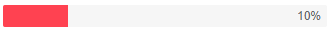

# Progress Bar Overview

The Progress Bar tracks the execution of operations and displays what portion of it is completed. For very long tasks, you can also make it [indeterminate]().


## Basic Progress Bar

To use the Telerik Progress Bar in your Blazor application:
* add the `<TelerikProgressBar>` tag.
* set its `Value` parameter to denote how much is completed.



````CSHTML
@*Set the maximum and the current values of the ProgressBar*@

<TelerikProgressBar Max="@MaxValue" Value="@PBValue" />

@code {
    public double MaxValue { get; set; } = 100;
    public double PBValue { get; set; } = 10;
}
````


>caption Component namespace and reference

````CSHTML
<TelerikProgressBar Max="@MaxValue" Value="@PBValue" @ref="MyProgressBar" />

@code {
    Telerik.Blazor.Components.TelerikProgressBar MyProgressBar { get; set; }
    
    public double MaxValue { get; set; } = 50;
    public double PBValue { get; set; } = 10;
}
````

## Features

The Progress Bar provides the following features:

* `Class` - the CSS class that will be rendered on the main wrapping element. You can use it to cascade styles more easily.
* `Max` - `double`, defaults to `100` - the maximum value of the Progress Bar. It must be greater than `0`.
* `Value` - `double` - the value of the Progress bar. This value indicates the progress of the tracked process. It is a fraction of the `Max`.
* `Orientation` - you can control the orientation of the Progress Bar, through the `ProgressBarOrientation` enum, with members:
    * `Horizontal` - this is the default value
    * `Vertical`
* `Indeterminate` - `bool`, defaults to `false` - see the [Indeterminate]() article for more information.
* `Label` - see the [Label]() article for more information. Shows the `Value` with a `%` sign by default

## Examples

### Responsive ProgressBar

>caption The progress bar will resize with the parent element dimensions when you set its width to 100%

````CSHTML
<div style="width: 50%; border: 1px solid red;">

    <style>
        .width-100 {
            width: 100%;
        }
    </style>

    <TelerikProgressBar Class="width-100" Value="44" />
</div>
````

### Use a Timer to simulate the completion of a task


````CSHTML
@using System.Timers
@implements IDisposable

<TelerikButton Primary="true" OnClick="@StartProgress">Start</TelerikButton>

<br />

<TelerikProgressBar Max="@MaxValue" Value="@PBValue" Indeterminate="@isIndeterminate">
</TelerikProgressBar>

@code {
    public double MaxValue { get; set; } = 100;
    public double PBValue { get; set; } = 10;
    public bool isIndeterminate { get; set; } = false;

    public Timer Timer { get; set; } = new Timer();

    public void Dispose()
    {
        StopProgress();
        Timer?.Close();
    }

    public void StartProgress()
    {
        if (Timer?.Enabled == false)
        {
            Timer.Interval = 200;
            Timer.Elapsed -= OnTimerElapsedEvent;
            Timer.Elapsed += OnTimerElapsedEvent;
            Timer.AutoReset = true;
            Timer.Start();
        }
    }

    public void OnTimerElapsedEvent(Object source, ElapsedEventArgs e)
    {
        if (PBValue < MaxValue)
        {
            UpdateProgress();
        }
        else
        {
            StopProgress();
        }
    }

    public void UpdateProgress()
    {
        PBValue += 5;

        InvokeAsync(StateHasChanged);
    }

    public void StopProgress()
    {
        Timer?.Stop();
        InvokeAsync(StateHasChanged);
    }
}
````

## See Also

  * [Live Demo: Progress Bar](https://demos.telerik.com/blazor-ui/TODO)
  * [Label]()
  * [Indeterminate state]()
  * [API Reference](https://docs.telerik.com/blazor-ui/api/Telerik.Blazor.Components.TelerikProgressBar)
   
