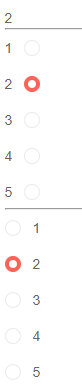

# RadioGroup Label Position

The Blazor Radio Button Group component lets you render the labels of the radio buttons before or after the buttons themselves.

By default, the labels are after the buttons, and you can change that through the `LabelPosition` parameter that takes a member of the `Telerik.Blazor.RadioGroupLabelPosition` enum.

>caption Labels before and after the radio buttons

````CSHTML
@SelectedValue
<hr />
<TelerikRadioGroup Data="@Data" @bind-Value="@SelectedValue" Layout="@Telerik.Blazor.RadioGroupLayout.Horizontal"></TelerikRadioGroup>
<hr />
<TelerikRadioGroup Data="@Data" @bind-Value="@SelectedValue" Layout="@Telerik.Blazor.RadioGroupLayout.Vertical"></TelerikRadioGroup>
@code{
    int SelectedValue { get; set; } = 2;
    IEnumerable<int> Data { get; set; } = Enumerable.Range(1, 5);
}
````




## See Also

  * [RadioGroup Overview]()
  * [RadioGroup Data Binding]()
  * [Live Demo: RadioGroup Customization](https://demos.telerik.com/blazor-ui//radiogroup/customization)

