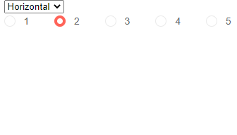
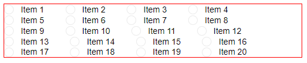

# RadioGroup Layout

The Blazor Radio Button Group component lets you render the list of options in a vertical or in a horizontal fashion.

By default, the list is vertical, and you can change that through the `Layout` parameter that takes a member of the `Telerik.Blazor.RadioGroupLayout` enum.

>caption Horizontal and Vertical layouts in the Telerik Blazor Button Group Component

````CSHTML
@* If you want a horizontal list, you can set the value directly to the parameter *@

<select @bind="@theLayout">
   <option value="@RadioGroupLayout.Horizontal">Horizontal</option>
   <option value="@RadioGroupLayout.Vertical">Vertical</option>
</select>
<br />
<TelerikRadioGroup Data="@Data" @bind-Value="@SelectedValue" Layout="@theLayout"></TelerikRadioGroup>
@code{
    RadioGroupLayout theLayout { get; set; } = RadioGroupLayout.Horizontal;

    int SelectedValue { get; set; } = 2;
    IEnumerable<int> Data { get; set; } = Enumerable.Range(1, 5);
}
````



In the `Horizontal` layout mode, the individual items do not create a layout and so they will flow with their container's dimensions.

>caption Items can fall on several lines in Horizontal layout when their container cannot fit them all

````CSHTML
@* This code just creates 20 items and puts them in a container with small width *@

<div style="width: 500px; border: 1px solid red;">
    <TelerikRadioGroup Data="@RadioButtonsList"
                      @bind-Value="@SelectedValue"
                      Layout="@RadioGroupLayout.Horizontal">
    </TelerikRadioGroup>
</div>

@code{
    List<string> RadioButtonsList { get; set; } = Enumerable.Range(1, 20).Select(x => $"Item {x}").ToList();
    string SelectedValue { get; set; }
}
````



## See Also

  * [RadioGroup Overview]()
  * [RadioGroup Data Binding]()
  * [Live Demo: RadioGroup Customization](https://demos.telerik.com/blazor-ui//radiogroup/customization)

