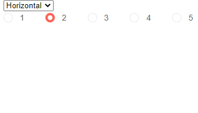
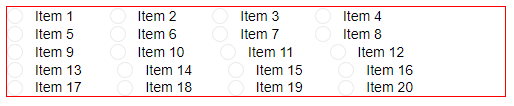

# RadioGroup Layout

The Blazor Radio Button Group component lets you render the list of options in a vertical or in a horizontal fashion.

By default, the list is vertical, and you can change that through the `Layout` parameter that takes a member of the `Telerik.Blazor.RadioGroupLayout` enum.

>caption Horizontal and Vertical layouts in the Telerik Blazor Button Group Component

<demo metaUrl="client/radiogroup/layout/example-2/" height="420"></demo>

In the `Horizontal` layout mode, the individual items do not create a layout and so they will flow with their container's dimensions.

>caption Items can fall on several lines in Horizontal layout when their container cannot fit them all

<demo metaUrl="client/radiogroup/layout/example-1/" height="420"></demo>

## See Also

* [RadioGroup Overview](slug:radiogroup-overview)
* [RadioGroup Data Binding](slug:radiogroup-databind)
* [Live Demo: RadioGroup Customization](https://demos.telerik.com/blazor-ui/radiogroup/customization)
