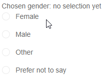

# RadioGroup Overview

The <a href="https://www.telerik.com/blazor-ui/radiogroup" target="_blank">Blazor RadioGroup</a> component allows the user to choose an option from a predefined set of choices presented in a list of radio buttons styled according to the Telerik [Theme](). You can also choose its [layout order]() and [label position]().

## Basics

To use a Telerik RadioGroup for Blazor

1. Add the `<TelerikRadioGroup>` tag.
1. Populate its `Data` property with the collection of items you want in the list.
1. Set the `TextField` and `ValueField` properties to point to the corresponding names of the model.

>caption Basic Radio Button Group with two-way value binding

````CSHTML
Chosen gender: @( ChosenGender == 0 ? "no selection yet" : ChosenGender.ToString() )
<br />

<TelerikRadioGroup Data="@GenderOptions"
                   @bind-Value="@ChosenGender"
                   ValueField="@nameof(GenderModel.GenderId)"
                   TextField="@nameof(GenderModel.GenderText)">
</TelerikRadioGroup>

@code{
    TelerikRadioGroup<GenderModel, int?> RadioGroupRef { get; set; }

    int ChosenGender { get; set; }

    List<GenderModel> GenderOptions { get; set; } = new List<GenderModel>
    {
        new GenderModel { GenderId = 1, GenderText = "Female" },
        new GenderModel { GenderId = 2, GenderText = "Male" },
        new GenderModel { GenderId = 3, GenderText = "Other" },
        new GenderModel { GenderId = 4, GenderText = "Prefer not to say" },
    };

    public class GenderModel
    {
        public int GenderId { get; set; }
        public string GenderText { get; set; }
    }
}
````

>caption The result from the code snippet above



>caption Component namespace and reference

See the [Component Reference](#component-reference) section in the Data Binding article for details and examples.


## Features

The RadioGroup provides the following features:

* `Class` - the CSS class that will be rendered on the main wrapping element of the component.

* `Data` - allows you to provide the data source. Required.

* `Enabled` - whether the component is enabled.

* `Id` - renders as the id attribute on the main wrapping `ul` element.

* `LabelPosition` - whether the labels render after or before the radio button itself.

* `Layout` - whether the buttons are rendered vertically or horizontally.

* `Name` - lets you choose your own `name` attribute for the underying `<input type=radio>` elements.

* `TItem` - the type of the model to which the component is bound. Required if you can't provide `Data` or `Value`. Determines the type of the reference object.

* `TValue` - the type of the value field from the model to which the component is bound. Required if you can't provide `Data` or `Value`. Determines the type of the reference object.

<!-- * `TabIndex` - the `tabindex` attribute rendered on the dropdown. -->

* `TextField` - the name of the field from the model that will be shown to the user. Defaults to `Text`.

* `ValueField` - the name of the field from the model that will populate the underlying `Value`. Defaults to `Value`.

* `Value` and `bind-Value`- get/set the value of the component, can be used for binding. If you set it to a value allowed by the model class value field, the corresponding item from the data collection will be pre-selected. Use the `@bind-Value` syntax for two-way binding, for example, to a variable of your own.

    The `Value` and `ValueField` can be of types:

    * `number` (such as `int`, `double` and so on)
    * `string`
    * `Guid`
    * `Enum`

* Validation - see the [Input Validation]() article for more details.


## See Also

  * [Data Binding]()
  * [Live Demo: RadioGroup](https://demos.telerik.com/blazor-ui/radiogroup/overview)
  * [API Reference](https://docs.telerik.com/blazor-ui/api/Telerik.Blazor.Components.TelerikRadioGroup-2)
