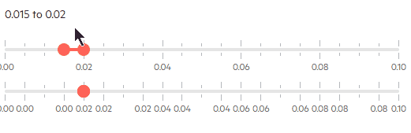

# Decimals

The RangeSlider uses this property to determine how many decimals to take and set to the value when calculating the differences between the min and max, and the steps. You can see an [example of wrong setup and the issue it can cause](#decimals-and-rounding-errors) below. Here is a simple example of the mathematical operation and how you can see unexpected floating numbers that could, at least to an extent, be avoided if you use high-precision number types such as decimal:

````C#.skip-repl
Math equation: 0.6 / 0.2 
Output: 2.9999999999999996

Math equation: 0.6 / 0.3
Output: 2
````

## Decimals and Rounding Errors

The first slider in this example has a sufficient precision (`Decimals`) to properly handle the values that it will have to render in its labels and set in its `Value`. The second slider does not have sufficient precision - the `Decimals` value is too low and thus the rounding in the labels texts and of the `StartValue` and `EndValue` will be off a little.

To see the difference in how rounding can have issues with insufficient precision, try changing the values from each slider - you will see that the second slider does not respond "correctly" and as expected.



````RAZOR
@TheStartValue to @TheEndValue
<br /><br />

@* Sufficient precision for the selected values and steps *@

<TelerikRangeSlider @bind-StartValue="@TheStartValue" @bind-EndValue="@TheEndValue" Decimals="3"
                    SmallStep="0.005m" LargeStep="0.02m" Min="0m" Max="0.1m" Width="500px">
</TelerikRangeSlider>

<br /><br />

@* Insufficient precision for the current values and steps
    the labels texts will be off and the value will not change every time you move the handle
    only when it reaches the threshold of the decimals which default to 2 for invariant and most cultures*@

<TelerikRangeSlider @bind-StartValue="@TheStartValue" @bind-EndValue="@TheEndValue" Decimals="2"
                    SmallStep="0.005m" LargeStep="0.02m" Min="0m" Max="0.1m" Width="500px">
</TelerikRangeSlider>

@code{
    decimal TheStartValue { get; set; } = 0.015m;
    decimal TheEndValue { get; set; } = 0.02m;
}
````
