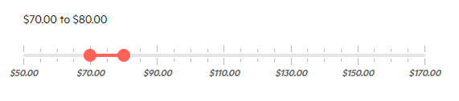
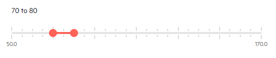
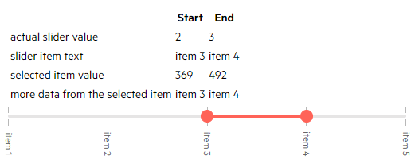

# Label Template

You can customize what the range slider labels render through the `LabelTemplate`.

The labels are shown on each major tick (`LargeStep`) and by default they render its value. The template receives that value as its `context`. 

>caption This article provides the following examples:


* [Basic Template](#basic-template)

* [Labels for Min and Max Only](#labels-for-min-and-max-only)

* [Show and Select Items](#show-and-select-items)

## Basic Template

This example shows how to use the current label value and to add styling and a currency symbol.



````CSHTML
@TheStartValue.ToString("C2") to @TheEndValue.ToString("C2")
<br /><br />

<TelerikRangeSlider @bind-StartValue="@TheStartValue"
                    @bind-EndValue="@TheEndValue"
                    Min="50.0m"
                    Max="170.0m"
                    SmallStep="5m"
                    LargeStep="20m"
                    Width="500px">
    <LabelTemplate>
        <span style="font-weight:bold; font-style: italic;">
            @context.ToString("C2")
        </span>
    </LabelTemplate>
</TelerikRangeSlider>

@code{
    decimal TheStartValue { get; set; } = 70m;
    decimal TheEndValue { get; set; } = 80m;
}
````

## Labels for Min and Max Only

This example shows how you can render text only for the min and max values of the slider.



````CSHTML
@TheStartValue to @TheEndValue
<br /><br />

<TelerikRangeSlider @bind-StartValue="@TheStartValue"
                    @bind-EndValue="@TheEndValue"
                    Min="@Min"
                    Max="@Max"
                    SmallStep="5m"
                    LargeStep="20m"
                    Width="500px">
    <LabelTemplate>
        @if (context == Min || context == Max)
        {
            @context
        }
    </LabelTemplate>
</TelerikRangeSlider>

@code{
    decimal TheStartValue { get; set; } = 70m;
    decimal TheEndValue { get; set; } = 80m;
    decimal Min { get; set; } = 50.0m;
    decimal Max { get; set; } = 170m;
}
````

## Show and Select Items

While the slider is a numeric input, you can use its values to match against indexes of a collection - with this you can extract a full model and also display complex content for the items. You can set the `SmallStep` and `LargeStep` to `1` so there are only major ticks that act as items for the user and so that they are integer indexes.



````CSHTML
@* scroll after the table to see the slider code *@

<table>
    <thead>
        <tr>
            <th></th>
            <th>Start</th>
            <th>End</th>
        </tr>
    </thead>
    <tr>
        <td>actual slider value</td>
        <td>@TheStartIndex</td>
        <td>@TheEndIndex</td>
    </tr>
    <tr>
        <td>slider item text</td>
        <td>@SliderItems[TheStartIndex].Text</td>
        <td>@SliderItems[TheEndIndex].Text</td>
    </tr>
    <tr>
        <td>selected item value</td>
        <td>@SliderItems[TheStartIndex].Value</td>
        <td>@SliderItems[TheEndIndex].Value</td>
    </tr>
    <tr>
        <td>more data from the selected item</td>
        <td>@SliderItems[TheStartIndex].Text</td>
        <td>@SliderItems[TheEndIndex].Text</td>
    </tr>
</table>


<TelerikRangeSlider @bind-StartValue="@TheStartIndex"
                    @bind-EndValue="@TheEndIndex"
               Min="@Min"
               Max="@Max"
               SmallStep="@Step"
               LargeStep="@Step"
               Width="500px">
    <LabelTemplate>
        <span class="rotatedText">@SliderItems[context].Text</span>
    </LabelTemplate>
</TelerikRangeSlider>

@code{
    int TheStartIndex { get; set; }
    int TheEndIndex { get; set; }
    int Min { get; set; } = 0;
    int Step { get; set; } = 1;
    int Max { get; set; }

    List<MySliderItem> SliderItems { get; set; }

    protected override async Task OnInitializedAsync()
    {
        SliderItems = Enumerable.Range(1, 5).Select(x => new MySliderItem
        {
            Value = 123 * x,
            Text = $"item {x}",
            MoreData = $"{x} lorem ipsum"
        }).ToList();

        Max = SliderItems.Count - 1;

        TheStartIndex = 2;
        TheEndIndex = 3;
    }

    public class MySliderItem
    {
        public int Value { get; set; }
        public string Text { get; set; }
        public string MoreData { get; set; }
    }
}
````

## See Also

* [RangeSlider Overview]()
* [Live Demo: RangeSlider Label Template](https://demos.telerik.com/blazor-ui/rangeslider/label-template)