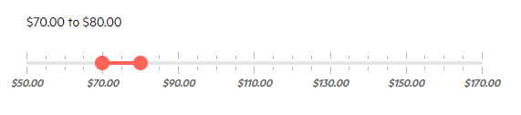
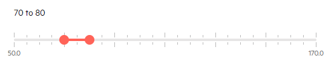
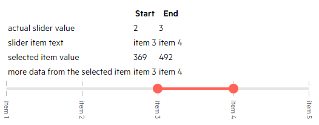

# Label Template

You can customize what the range slider labels render through the `LabelTemplate`.

The labels are shown on each major tick (`LargeStep`) and by default they render its value. The template receives that value as its `context`. 

>caption This article provides the following examples:

* [Basic Template](#basic-template)

* [Labels for Min and Max Only](#labels-for-min-and-max-only)

* [Show and Select Items](#show-and-select-items)

## Basic Template

This example shows how to use the current label value and to add styling and a currency symbol.

<demo metaUrl="client/rangeslider/label-template-basic/" height="300"></demo>

## Labels for Min and Max Only

This example shows how you can render text only for the min and max values of the slider.

<demo metaUrl="client/rangeslider/label-template-min-max-only/" height="300"></demo>

## Show and Select Items

While the slider is a numeric input, you can use its values to match against indexes of a collection - with this you can extract a full model and also display complex content for the items. You can set the `SmallStep` and `LargeStep` to `1` so there are only major ticks that act as items for the user and so that they are integer indexes.

<demo metaUrl="client/rangeslider/label-template-items/" height="400"></demo>

## See Also

* [RangeSlider Overview](slug:rangeslider-overview)
* [Live Demo: RangeSlider Label Template](https://demos.telerik.com/blazor-ui/rangeslider/label-template)