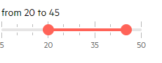
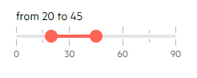

# Steps

The RangeSlider for Blazor requires values for its large and small ticks. You can control them through the corresponding parameters.

In this article:

* [LargeStep](#largestep)
* [SmallStep](#smallstep)
* [Examples](#examples)

## LargeStep

@[template](/_contentTemplates/slider/common.md#large-step)

## SmallStep

@[template](/_contentTemplates/slider/common.md#small-step)

## Examples

* [Matching Ticks Steps, Min, Max](#matching-ticks-steps-min-max)
* [Not Matching Ticks Steps, Min, Max](#not-matching-ticks-steps-min-max)

### Matching Ticks Steps, Min, Max

You can use a multiplier over the small step to set the large step, and to ensure that this can divide the difference between the min and max. This will provide the best possible appearance where ticks will be distributed evenly and you will be able to use the full range of the slider.

<demo metaUrl="client/rangeslider/steps/matching/" height="250"></demo>

### Not Matching Ticks Steps, Min, Max

In this example, the max value does not match the large step, small step and the min, so the max value is not rendered and the user can only go up to `90` instead of `100`. The small and large steps match in this example, however, the only "issue" is the `Max` value.

<demo metaUrl="client/rangeslider/steps/not-matching/" height="250"></demo>