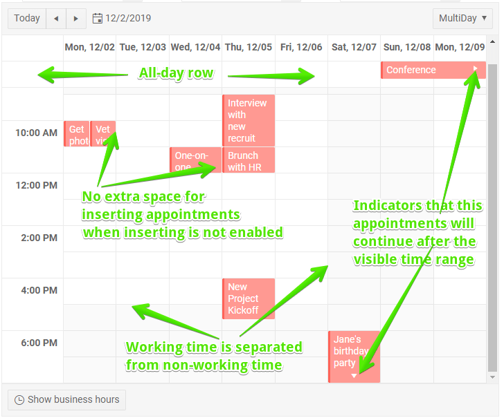
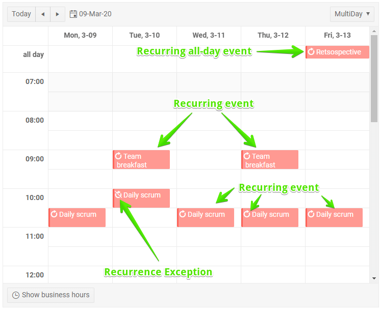

# Edit Appointments

The Scheduler component lets you edit appointments. This article will explain how to enable and use it.

This article contains the following sections:

* [Basics](#basics)
* [User Experience](#user-experience)
* [Example](#example)


## Basics

By default, the user can only view the appointments, because creating, updating and deleting them requires that you, the developer, implement the actual data storage. The following parameters control the editing behavior:

* `AllowCreate` - enables the user to insert new appointments. Requires that you implement a handler for the `OnCreate` event where you must update the current `Data` and your actual data source.
* `AllowDelete` - enables the user to delete existing appointments. Requires that you implement a handler for the `OnDelete` event where you must update the current `Data` and your actual data source.
* `AllowUpdate` - enables the user to modify existing appointments (including drag-and-drop and resizing). Requires that you implement a handler for the `OnUpdate` event where you must update the current `Data` and your actual data source.

>tip You can enable only certain editing features (for example, editing appointments) by enabling only their parameter. It is not required to enable all features.

Main events you need to implement so you can store the appointment information changed or created by the user:

* `OnCreate` - fires when the user saves a new appointment, including an exception for a recurring appointment.
* `OnUpdate` - fires when the user changes an existing appointment. Fires for the recurring appointment when an exception has been created for it.
* `OnDelete` - fires when the user deletes and appointment (including a recurring appointment).

There are two other events that you are not required to handle - you can use them to implement application logic:

* `OnEdit` - fires when the user is about to edit or create an appointment:
    * If the user is creating a new appointment the event handler arguments have their `IsNew` field set to `true` and the time slot the user clicked on is available in the `Start` and `End` of the event arguments object. If the user started insertion in the all-day row, the `IsAllDay` field of the event arguments is `true`.
    * You can cancel the event (set the `IsCancelled` field of the event arguments to `true`) to effectively make some appointments read-only or prevent appointment creation at certain time slots. If you do that, consider showing a messages to the user to notify them that the action was deliberately prevented.
    * You can also use it to implement a [custom edit/insert form](https://github.com/telerik/blazor-ui/tree/master/scheduler/custom-edit-form) to, for example, have more fields than the built-in ones, or implement custom validation. To do that, always cancel the event and implement the desired logic after that.
    * `OnEdit` does not fire when the user drags to resize or move appointments, it fires only for the advanced edit form (double clicks on the appointment).
* `OnCancel` - fires when the user clicks the `Cancel` button in the edit form or the `[x]` close button at the window titlebar to discard the changes they just made to an appointment.


## User Experience

>caption Some examples of the UX related to appointments, read more in the list after the figure



>caption Recurring appointments appearance and indicators




The UI for the scheduler provides the following options for interacting with the appointments collection:

* Double click (or double tap) on an empty slot starts the process of inserting a new appointment. The user can cancel it without committing the data.
    * If they double-click in the all-day row, the new appointment will start as an all-day appointment.
    * To ensure the user can add appointments at any time, there will be a small gap to the side of the appointments when inserting is allowed. If inserting isn't allowed, the appointments will take the full width of the slot.
    * An appointment that starts at 12AM on one day and ends at 12AM on the next day is considered an all-day appointment and so it will also render in the all-day slot.
    * To create an all-day appointment for a single day, the start and end dates must be the same. Selecting the next day in the end-time picker will result in a two-day appointment.
* Double click (or double tap) on an appointment opens it for editing. The user can cancel the changes through the Cancel button or the [x] close button on the window.
    * Changing a recurring appointment can create an exception or alter the entire series. The user is given a propmpt to choose which one to edit.
    * Editing an exception to an occurence does not provide the recurrence rules editor becaues an exception cannot have its own recurrence.
* Dragging an appointment to another slot (or day, or the all-day row) fires the `OnUpdate` event with the new times. 
    * The duration is preserved when dragging across the area of origin (for example, from the all-day slot to another day in the all-day slot). 
    * When dragging between different areas (for example, from the all-day slot to a particular day), the new duration is the default duration for the area (for example, one day for the all-day slot, or one `TimeSlot` for the time table).
    * If you drag the all-day portion of an appointment that has specific start and end times (that is, it is _not_ an all-day appointment), it will not become an all-day appointment.
    * Changing a recurring appointment can create an exception or alter the entire series. The user is given a propmpt to choose which one to edit. Dragging a recurring appointment to a new date/time will offset the entire series.
* Hovering an appointment shows resize handles that you can drag to change the appointment duration.
    * Resizing is allowed in directions where the appointment has a clear end. For example, if an all-day event continues after the current scheduler view, you won't be able to resize it in that direction. If an appointment starts or ends in a different day, or before/after the shown hours in the scheduler, resizing in that direction is not allowed.
* Clicking (or tapping) the [x] button on the appointment itself deletes it. The [x] button is shown when the appointment is hovered to conserve space.
    * Deleting a recurring appointment asks whether to delete the current one or the entire series.
* The built-in popup edit form implements validation logic that you can localize through your custom messages. The built-in logic works on the `IAppointment` that the scheduler uses internally, and if you want to implement custom validation, you need to implement a [custom edit form](https://github.com/telerik/blazor-ui/tree/master/scheduler/custom-edit-form). By default, a title, start and end time are required.
* Arrows on the appointments indicate that they continue in invisible time ranges. For example, an arrow pointing down in an appointment at the end of the visible day indicates it continues until a later hour or until the next day(s). If an all-day appointment starts before the currently visible time range, it will show an arrow pointing left.
    * An appointment that spans multiple days but is not marked as an all-day appointment shows up in the all-day slot for the days that it spans entirely. The first and last day would render in the day portions to denote the start and end time accurately.


## Example

The example below shows the signature of the event handlers so you can copy the proper arguments and start implementing your business logic and data storage operations. The example only updates the local collection of appointments used in the UI.

@[template](/_contentTemplates/common/general-info.md#event-callback-can-be-async)

>note It is up to the data access logic to save the data once it is changed in the data collection. The example below showcases when that happens and adds some code to provide a visual indication of the change. In a real application, the code for handling data updates may be entirely different.

>caption Example of handling the CUD events in a Scheduler.

````CSHTML
@* This sample implements only updates to the view model. Your app must also update the database in the CUD events.
    This example uses the default field names for data binding *@

<TelerikScheduler Data="@Appointments"
                  OnUpdate="@UpdateAppointment"
                  OnCreate="@AddAppointment"
                  OnDelete="@DeleteAppointment"
                  OnEdit="@EditHandler" OnCancel="@CancelHandler"
                  AllowCreate="true" AllowDelete="true" AllowUpdate="true"
                  @bind-Date="@StartDate" Height="600px" @bind-View="@CurrView">
    <SchedulerViews>
        <SchedulerDayView StartTime="@DayStart" />
        <SchedulerWeekView StartTime="@DayStart" />
        <SchedulerMultiDayView StartTime="@DayStart" NumberOfDays="10" />
    </SchedulerViews>
</TelerikScheduler>

@code {
    // Sample CUD operations over the local data
    // In a real case, carry the information over to the actual data source
    void UpdateAppointment(SchedulerUpdateEventArgs args)
    {
        SchedulerAppointment item = (SchedulerAppointment)args.Item;
        var matchingItem = Appointments.FirstOrDefault(a => a.Id == item.Id);
        if (matchingItem != null)
        {
            matchingItem.Title = item.Title;
            matchingItem.Description = item.Description;
            matchingItem.Start = item.Start;
            matchingItem.End = item.End;
            matchingItem.IsAllDay = item.IsAllDay;
            matchingItem.RecurrenceExceptions = item.RecurrenceExceptions;
            matchingItem.RecurrenceRule = item.RecurrenceRule;
        }

        // save to the actual data source here
    }

    void AddAppointment(SchedulerCreateEventArgs args)
    {
        SchedulerAppointment item = args.Item as SchedulerAppointment;
        Appointments.Add(item);

        // save to the actual data source here
    }

    void DeleteAppointment(SchedulerDeleteEventArgs args)
    {
        SchedulerAppointment item = (SchedulerAppointment)args.Item;
        Appointments.Remove(item);

        if(item.RecurrenceId != null)
        {
            // a recurrence exception was deleted, you may want to update
            // the actual data source - an item where theItem.Id == item.RecurrenceId
            // and remove the current exception date from the list of its RecurrenceExceptions
        }

        if (!string.IsNullOrEmpty(item.RecurrenceRule) && item.RecurrenceExceptions?.Count > 0)
        {
            // a recurring appointment was deleted that had exceptions, you may want to
            // delete or update any exceptions from the data source - look for
            // items where theItem.RecurrenceId == item.Id
        }

        // save to the actual data source here
    }

    //Handlers for application logic flexibility
    void EditHandler(SchedulerEditEventArgs args)
    {
        SchedulerAppointment item = args.Item as SchedulerAppointment;
        if (!args.IsNew) // an edit operation, otherwise - an insert operation
        {
            // you can prevent opening an item for editing based on a condition
            if (item.Title.Contains("vet", StringComparison.InvariantCultureIgnoreCase))
            {
                args.IsCancelled = true;
            }
        }
        else
        {
            // new appointment
            DateTime SlotStart = args.Start; // the start of the slot the user clicked
            DateTime SlotEnd = args.End; // the start of the slot the user clicked
            bool InsertInAllDay = args.IsAllDay; // whether the user started insertion in the All Day row
        }
    }

    void CancelHandler(SchedulerCancelEventArgs args)
    {
        // you can know when a user wanted to modify an appointment but decided not to
        // the model you get contains the new data from the edit form so you can see what they did
        SchedulerAppointment item = args.Item as SchedulerAppointment;
    }

    // sample data and scheduler settings
    public SchedulerView CurrView { get; set; } = SchedulerView.Week;
    public DateTime StartDate { get; set; } = new DateTime(2019, 12, 2);
    public DateTime DayStart { get; set; } = new DateTime(2000, 1, 1, 8, 0, 0); //the time portion is important

    List<SchedulerAppointment> Appointments = new List<SchedulerAppointment>()
    {
            new SchedulerAppointment
            {
                Title = "Board meeting",
                Description = "Q4 is coming to a close, review the details.",
                Start = new DateTime(2019, 12, 5, 10, 00, 0),
                End = new DateTime(2019, 12, 5, 11, 30, 0)
            },

            new SchedulerAppointment
            {
                Title = "Vet visit",
                Description = "The cat needs vaccinations and her teeth checked.",
                Start = new DateTime(2019, 12, 2, 11, 30, 0),
                End = new DateTime(2019, 12, 2, 12, 0, 0)
            },

            new SchedulerAppointment
            {
                Title = "Planning meeting",
                Description = "Kick off the new project.",
                Start = new DateTime(2019, 12, 6, 9, 30, 0),
                End = new DateTime(2019, 12, 6, 12, 45, 0)
            },

            new SchedulerAppointment
            {
                Title = "Trip to Hawaii",
                Description = "An unforgettable holiday!",
                IsAllDay = true,
                Start = new DateTime(2019, 11, 27),
                End = new DateTime(2019, 12, 05)
            },

            new SchedulerAppointment
            {
                Title = "Morning run",
                Description = "Some time to clear the head and exercise.",
                Start = new DateTime(2019, 11, 27, 9, 0, 0),
                End = new DateTime(2019, 11, 27, 9, 30, 0),
                RecurrenceRule = "FREQ=WEEKLY;BYDAY=MO,TU,WE,TH,FR"
            }
    };

    public class SchedulerAppointment
    {
        public Guid Id { get; set; }
        public string Title { get; set; }
        public string Description { get; set; }
        public DateTime Start { get; set; }
        public DateTime End { get; set; }
        public bool IsAllDay { get; set; }
        public string RecurrenceRule { get; set; }
        public List<DateTime> RecurrenceExceptions { get; set; }
        public Guid? RecurrenceId { get; set; }

        public SchedulerAppointment()
        {
            Id = Guid.NewGuid();
        }
    }
}
````


## See Also

  * [Data Binding]()
  * [Live Demo: Appointment Editing](https://demos.telerik.com/blazor-ui/scheduler/appointment-editing)
  
