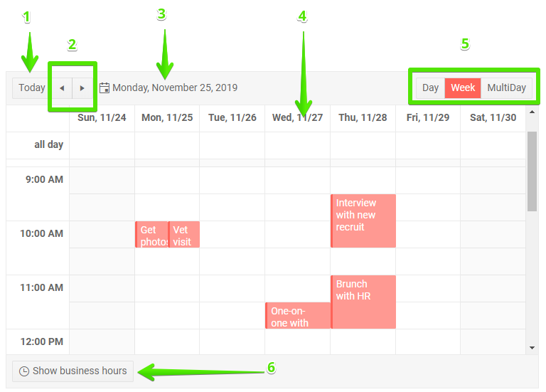

# Scheduler Navigation

This article explains how to browse the available dates, views and features of the scheduler - as a user and from code.

This article contains the following sections:

* [User Experience](#user-experience)
* [Navigation From Code](#navigation-from-code)

## User Experience

The UI of the scheduler provides several navigation features for the user so they can make their experience more comfortable and suitable to the task at hand:

1. `Today` - Clicking the Today button shows the user today's date. If the current view shows more than one day, today's date will be its start (note: some views don't start on the exact start date).
1. `Previous` and `Next` - these buttons navigate to the previous and the next sections (periods) in the scheduler, according to the current view (for example, the next week for the WeekView, or the previous set of X days for the MultiDay view).
1. `Calendar Picker` - shows the current view start date. You can click it to open a date picker to select a new start date.
1. `Day Header` - clicking the header of a day navigates you to the day view for this day.
1. `Views` - the list of available views shows the current view and lets you select a different one.
1. `Show business hours` - a toggle that lets you see only the business portion of the day instead of the entire day, and vice-versa. 

## Navigation From Code

You can alter the following scheduler parameters through code:

* Currently shown date
* Currently shown View

>tip Usually, you would use the `@bind-Date` and `@bind-View` syntax to prevent the parameters from resetting to the initial values upon re-rendering.

>caption Navigate the scheduler programmatically

<demo metaUrl="client/scheduler/navigation/example-1/" height="780"></demo>

## See Also

* [Scheduler Overview](slug:scheduler-overview)
* [Scheduler Views](slug:scheduler-views-overview)

