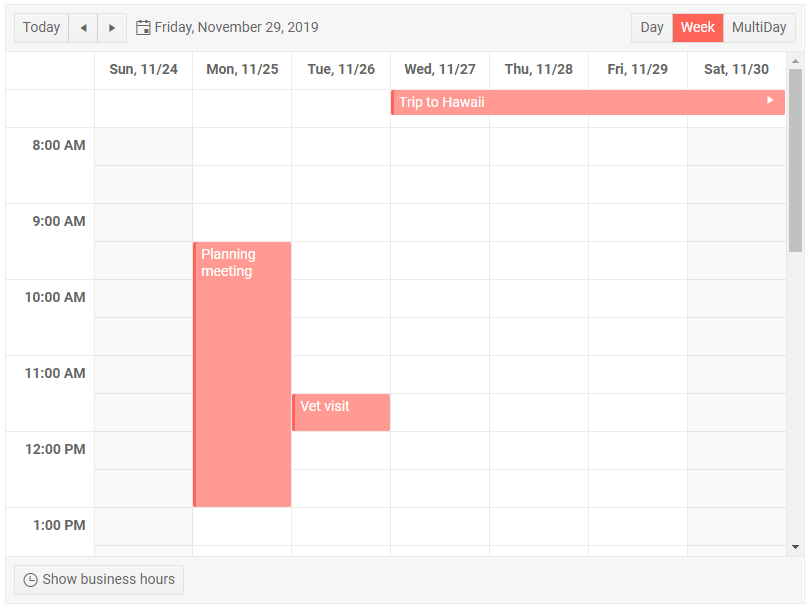

# Scheduler Overview

The Scheduler component lets the user see, edit and add appointments so they can plan their agenda and day.

The Scheduler offers different views, control over the workday start and end, appointment editing and various other features and settings.

To use a Telerik Scheduler for Blazor

1. add the `TelerikScheduler` tag
1. populate its `Data` property with the collection of appointments/events the user needs to see
1. set the `TitleField`, `StartField`, `EndField`, `DescriptionField` and `IsAllDayField` properties to point to the corresponding names of the model

>caption Scheduler first look and main features

````CSHTML
FIRST LOOK SAMPLE
````

>caption The result from the code snippet above



>caption Component namespace and reference

The Scheduler is a generic component and its type is determined by the type of the appointments model you pass to it.

````CSHTML
SCHEDULER REFERENCE
````

>caption The Scheduler provides the following features:

date and view binding, navigation (consider whether they are to be separate features,aritcles, snippets). Maybe Slots explanations and control over the available views go here (see also views overview). 

## See Also

  * [Appointment Options]()
  * [Live Demo: Scheduler](https://demos.telerik.com/blazor-ui/scheduler/overview)

