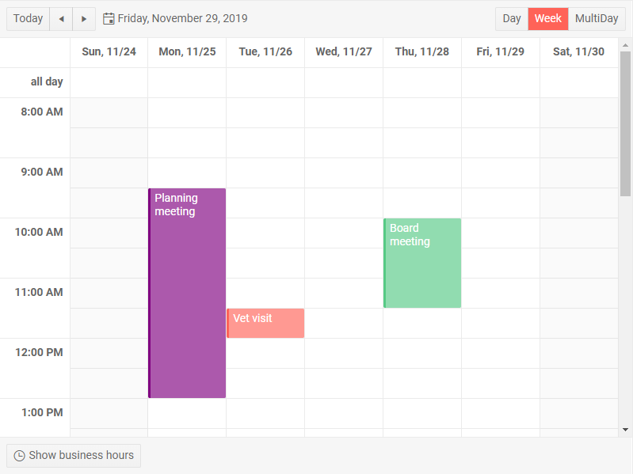
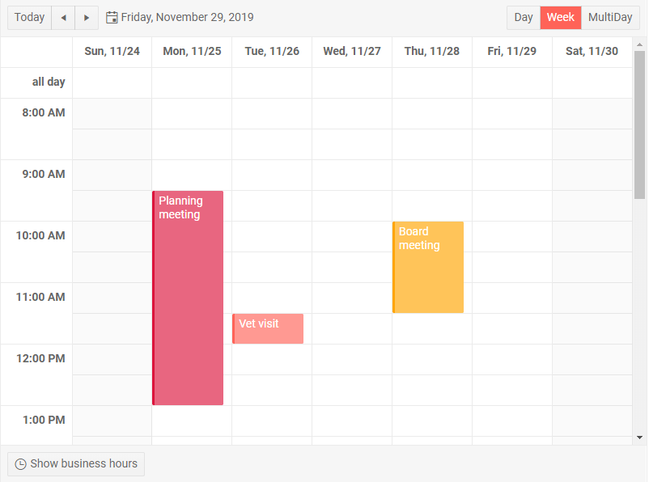

# Scheduler Resources

The Scheduler lets you associate appointments with a shared resource (such as meeting rooms, people, pieces of equipment) and shows the appointment in the corresponding color.

This article contains the following sections

* [Basics](#basics)
* [Define Resources](#define-resources)
* [Examples](#examples)
	* [One Resource](#one-resource)
	* [Multiple Resources](#multiple-resources)

## Basics

Resources are not required, so you can define no resources, one type of resource, or more than one type of resource. 

The color of the appointment is determined by the first matched resource, so the order in which you declare the collections of resources is important. 

If resources are used, all appointments must be associated with a resource, so if it is not required, you should add a "None" item to the resource list that will be the default, whose `Value` is an empty string and its color is also an empty string so the default theme color is used by the appointment.

When the user opens an appointment for editing, they will have a dropdown for each type of resource so they can choose. The order of declaration of the resource types also determines the order in which their editors show up.

## Define Resources

To use resources:

1. Under the `SchedulerResources` tag, define a `SchedulerResource` for each type of resource you will be using.
    * Set its `Field` parameter to a string that will point to the name of the field in the appointment that associated appointments with the resource type.
    * The `Title` parameter defines the text shown for its dropdown in the [edit form]().
1. Provide a collection of resource entries for each type of resource you will use to the `Data` parameter of the resource.
    * The `ColorField`, `ValueField` and `TextField` let you specify fields in the resource model that contain the data. These fields must all be of type `string`. The default values are `Value`, `Text`, `Color` respectively.
1. Define appointments [as usual](). Add a `string` field to them for each resources type they will require. The name of this field must match the value of the `Field` parameter of the resource declaration.
    * If you are using multiple resource types, you will need a field for each resource.
1. Populate the appointment field that matches the resource name with the corresponding `Value` of the resource that you want associated with it.
    * If you don't want any resource in the appointment, define a resource with empty strings in its `Value` and `Color` fields, and a suitable `Text`.


## Examples

The two examples below showcase [single resource](#one-resource) and [multiple resources](#multiple-resource) respectively. For brevity, they use hardcoded data, but you can populate the corresponding collections dynamically from your actual data service, and you can also use `async` methods to do so (our [live demo](https://demos.telerik.com/blazor-ui/scheduler/resources) shows an example of that).

### One Resource

>caption The result from the example below



>caption Single Resource type in the scheduler

````CSHTML
@* This example shows how to declare a resource and to match it to appointments, and how to have an appointment that is not associated with that resource.
Actual CRUD operations are not implemented for brevity, just the UX is enabled so you can see how the edit form looks like.*@

<TelerikScheduler Data="@Appointments" @bind-Date="@StartDate" @bind-View="@CurrView" Height="600px" Width="800px"
                  AllowUpdate="true" AllowCreate="true">
    <SchedulerResources>
        <SchedulerResource Field="ManagerName" Title="Manager Name" Data="@Managers" />
    </SchedulerResources>
    <SchedulerViews>
        <SchedulerDayView StartTime="@DayStart" />
        <SchedulerWeekView StartTime="@DayStart" />
        <SchedulerMultiDayView StartTime="@DayStart" NumberOfDays="10" />
    </SchedulerViews>
</TelerikScheduler>

@code {
    public DateTime StartDate { get; set; } = new DateTime(2019, 11, 29);
    public SchedulerView CurrView { get; set; } = SchedulerView.Week;
    public DateTime DayStart { get; set; } = new DateTime(2000, 1, 1, 8, 0, 0);//the time portion is important
    List<SchedulerAppointment> Appointments = new List<SchedulerAppointment>()
    {
        new SchedulerAppointment
        {
            ManagerName = "", //this appointment does not need a manager
            Title = "Vet visit",
            Description = "The cat needs vaccinations and her teeth checked.",
            Start = new DateTime(2019, 11, 26, 11, 30, 0),
            End = new DateTime(2019, 11, 26, 12, 0, 0)
        },

        new SchedulerAppointment
        {
            ManagerName = "1", // matches the Value field of the corresponding resource
            Title = "Planning meeting",
            Description = "Kick off the new project.",
            Start = new DateTime(2019, 11, 25, 9, 30, 0),
            End = new DateTime(2019, 11, 25, 12, 45, 0)
        },

        new SchedulerAppointment
        {
            ManagerName = "3",
            Title = "Board meeting",
            Description = "Q4 is coming to a close, review the details.",
            Start = new DateTime(2019, 11, 28, 10, 00, 0),
            End = new DateTime(2019, 11, 28, 11, 30, 0)
        },
    };

    List<SchedulerResource> Managers { get; set; } = new List<SchedulerResource>()
    {
        new SchedulerResource // empty resource for appointments that don't require one
        {
            Text = "Noone", // can say anything you like, it's just another resource entry
            Value = "",
            Color = ""
        },

        new SchedulerResource
        {
            Text = "Alex",
            Value = "1",
            Color = "purple"
        },
        new SchedulerResource
        {
            Text = "Bob",
            Value = "2",
            Color = "#51a0ed"
        },
        new SchedulerResource
        {
            Text = "Sarah",
            Value = "3",
            Color = "#56ca85"
        }
    };

    public class SchedulerResource
    {
        // these are the default field names
        public string Text { get; set; }
        public string Value { get; set; }
        public string Color { get; set; } // must be a valid CSS string
    }

    public class SchedulerAppointment
    {
        public string ManagerName { get; set; } //field that matches the resource declaration Field
        public string Title { get; set; }
        public string Description { get; set; }
        public DateTime Start { get; set; }
        public DateTime End { get; set; }
        public bool IsAllDay { get; set; }
    }
}
````


### Multiple Resources

>caption The result of the example below



>caption Declare multiple resources

````CSHTML
@* This example shows how to declare multiple resources and how their order is importnat when their are being matched with appointments, both for the edit form, and for the appointment color.
Actual CRUD operations are not implemented for brevity, just the UX is enabled so you can see how the edit form looks like. *@

<TelerikScheduler Data="@Appointments" @bind-Date="@StartDate" @bind-View="@CurrView" Height="600px" Width="800px"
                  AllowUpdate="true" AllowCreate="true">
    <SchedulerResources>
        <SchedulerResource Field="RoomId" Title="Meeting Room" Data="@Rooms" />
        <SchedulerResource Field="ManagerName" Title="Manager Name" Data="@Managers" />
    </SchedulerResources>
    <SchedulerViews>
        <SchedulerDayView StartTime="@DayStart" />
        <SchedulerWeekView StartTime="@DayStart" />
        <SchedulerMultiDayView StartTime="@DayStart" NumberOfDays="10" />
    </SchedulerViews>
</TelerikScheduler>

@code {
    public DateTime StartDate { get; set; } = new DateTime(2019, 11, 29);
    public SchedulerView CurrView { get; set; } = SchedulerView.Week;
    public DateTime DayStart { get; set; } = new DateTime(2000, 1, 1, 8, 0, 0);//the time portion is important
    List<SchedulerAppointment> Appointments = new List<SchedulerAppointment>()
    {
        new SchedulerAppointment
        {
            // this appointment does not need any resources
            ManagerName = "",
            RoomId = "",

            Title = "Vet visit",
            Description = "The cat needs vaccinations and her teeth checked.",
            Start = new DateTime(2019, 11, 26, 11, 30, 0),
            End = new DateTime(2019, 11, 26, 12, 0, 0)
        },

        new SchedulerAppointment
        {
            // matches the Value field of the corresponding resource
            ManagerName = "3",
            RoomId = "2",

            Title = "Planning meeting",
            Description = "Kick off the new project.",
            Start = new DateTime(2019, 11, 25, 9, 30, 0),
            End = new DateTime(2019, 11, 25, 12, 45, 0)
        },

        new SchedulerAppointment
        {
            ManagerName = "", // not all resources need to be matched or used
            RoomId = "1",
            
            Title = "Board meeting",
            Description = "Q4 is coming to a close, review the details.",
            Start = new DateTime(2019, 11, 28, 10, 00, 0),
            End = new DateTime(2019, 11, 28, 11, 30, 0)
        },
    };

    List<SchedulerResource> Managers { get; set; } = new List<SchedulerResource>()
    {
        new SchedulerResource // empty resource for appointments that don't require one
        {
            Text = "Noone", // can say anything you like, it's just another resource entry
            Value = "",
            Color = ""
        },

        new SchedulerResource
        {
            Text = "Alex",
            Value = "1",
            Color = "purple"
        },
        new SchedulerResource
        {
            Text = "Bob",
            Value = "2",
            Color = "#51a0ed"
        },
        new SchedulerResource
        {
            Text = "Sarah",
            Value = "3",
            Color = "#56ca85"
        }
    };

    List<SchedulerResource> Rooms { get; set; } = new List<SchedulerResource>()
    {
        new SchedulerResource // empty resource for appointments that don't require one
        {
            Text = "None", // can say anything you like, it's just another resource entry
            Value = "",
            Color = ""
        },

        // we will see these colors first because the rooms resource is declared first
        new SchedulerResource
        {
            Text = "Big Room",
            Value = "1",
            Color = "orange"
        },
        new SchedulerResource
        {
            Text = "Small Room",
            Value = "2",
            Color = "crimson"
        },
    };

    public class SchedulerResource
    {
        // these are the default field names
        public string Text { get; set; }
        public string Value { get; set; }
        public string Color { get; set; } // must be a valid CSS string
    }

    public class SchedulerAppointment
    {
        // fields that match the resource declaration Field
        public string ManagerName { get; set; }
        public string RoomId { get; set; }
        // the rest of the standard appointment fields
        public string Title { get; set; }
        public string Description { get; set; }
        public DateTime Start { get; set; }
        public DateTime End { get; set; }
        public bool IsAllDay { get; set; }
    }
}
````


## See Also

* [Live Demo: Scheduler Resources](https://demos.telerik.com/blazor-ui/scheduler/resources)
* [Scheduler Overview]()
* [Scheduler Data Binding]()
* [Scheduler Appointment Editing]()

