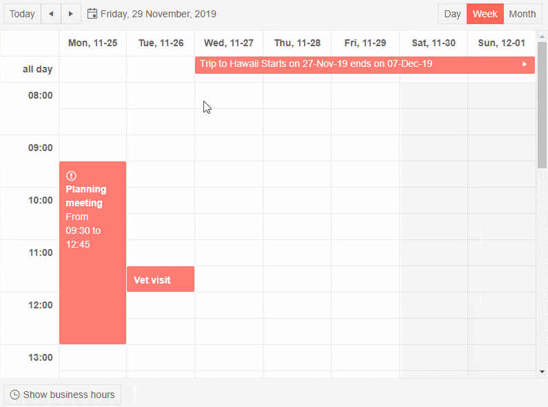

# Appointment Templates

You can change the contents that render in the appointment of the scheduler through its appointment template. This lets you change the default display of the title of the event and add more information for your users such as icons, buttons, start and end time, and custom fields.

There are two templates:

* `ItemTemplate` - controls the rendering of the regular appointments that are within the limits of one day.

* `AllDayItemTemplate` - controls the rendering of all-day appointments in the All-Day row. It is not applicable for the Month view because this view does not differentiate appointments based on that, but you can render different things for such appointments in the custom template.

The appointment template lets you control the rendering of the appointment content, but it keeps the other built-in appointment features - such as drag and resize handles, delete icon, arrows indicating if the appointment spans more than a day.

You can set a template for the entire scheduler, or you can also set templates per [view](). If a template is set on the particular view, it will take precedence over the shared template for the whole scheduler.

The `context` of the template is the item that it will display. You can cast it to the model type you use.

You can also style the entire appointments by adding a class to their wrapping element by using the [ItemRender event](#itemrender).

>caption Example of using appointment templates and all-day appointment templates in the scheduler. The Month view uses a different template than the other views

````CSHTML
@* A few sample customizations for the appointments that are overriden in the Month view where real estate is small *@

<TelerikScheduler Data="@Appointments" @bind-Date="@StartDate" @bind-View="@CurrView" Height="600px" Width="800px">
    <ItemTemplate>
        <div style="padding: 10px;">
            @{
                var appointment = context as SchedulerAppointment;
                @if (!string.IsNullOrEmpty(appointment.Icon))
                {
                    <TelerikIcon Icon="@appointment.Icon" />
                }
                <strong>@appointment.Title</strong>
                // sample logic that determines if the appointment is large enough to accommodate more text
                // this relies on the current slot size to render extra content for long appointments
                @if ((appointment.End - appointment.Start).TotalMinutes > 60)
                {
                    <div>From @appointment.Start.ToShortTimeString() to @appointment.End.ToShortTimeString()</div>
                }
            }
        </div>
    </ItemTemplate>
    <AllDayItemTemplate>
        @{
            var appointment = context as SchedulerAppointment;
            @appointment.Title
            <span>
                Starts on @appointment.Start.Date.ToShortDateString()
                ends on @appointment.End.Date.ToShortDateString()
            </span>
        }
    </AllDayItemTemplate>
    <SchedulerViews>
        <SchedulerDayView StartTime="@DayStart" />
        <SchedulerWeekView StartTime="@DayStart" />
        <SchedulerMonthView>
            <ItemTemplate>
                @{
                    var appointment = context as SchedulerAppointment;
                    // the month view does not have a dedicated all-day template because there is no dedicaded rendering slot for such events
                    // this template shows one way to make them look different/special in the month view from the rest of the events
                    if (appointment.IsAllDay)
                    {
                        <span>@appointment.Title</span>
                    }
                    else
                    {
                        <div title="@appointment.Title" style="font-size: small">
                            @appointment.Start.ToShortTimeString() to @appointment.End.ToShortTimeString()
                        </div>
                    }
                }
            </ItemTemplate>
        </SchedulerMonthView>
    </SchedulerViews>
</TelerikScheduler>

@code {
    public DateTime StartDate { get; set; } = new DateTime(2019, 11, 29);
    public SchedulerView CurrView { get; set; } = SchedulerView.Week;
    public DateTime DayStart { get; set; } = new DateTime(2000, 1, 1, 8, 0, 0);//the time portion is important
    List<SchedulerAppointment> Appointments = new List<SchedulerAppointment>()
    {
            new SchedulerAppointment
            {
                Title = "Vet visit",
                Description = "The cat needs vaccinations and her teeth checked.",
                Start = new DateTime(2019, 11, 26, 11, 30, 0),
                End = new DateTime(2019, 11, 26, 12, 0, 0)
            },

            new SchedulerAppointment
            {
                Title = "Planning meeting",
                Description = "Kick off the new project.",
                Start = new DateTime(2019, 11, 25, 9, 30, 0),
                End = new DateTime(2019, 11, 25, 12, 45, 0),
                Icon = IconName.Warning
            },

            new SchedulerAppointment
            {
                Title = "Trip to Hawaii",
                Description = "An unforgettable holiday!",
                IsAllDay = true,
                Start = new DateTime(2019, 11, 27),
                End = new DateTime(2019, 12, 07)
            }
    };

    public class SchedulerAppointment
    {
        public string Title { get; set; }
        public string Description { get; set; }
        public DateTime Start { get; set; }
        public DateTime End { get; set; }
        public bool IsAllDay { get; set; }

        public string Icon { get; set; }
    }
}
````

>caption The result from the code snippet above



## See Also

 * [Live Demo: Scheduler Templates](https://demos.telerik.com/blazor-ui/scheduler/templates)

