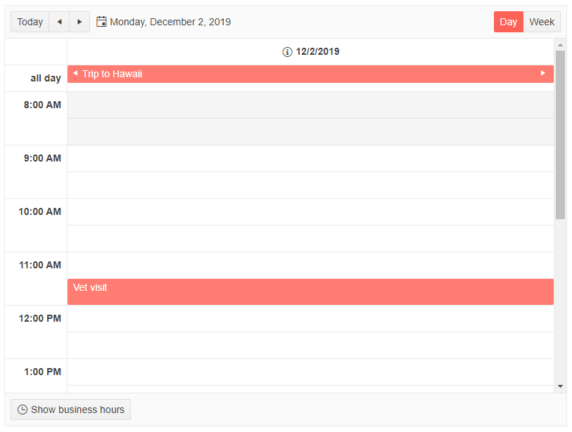

# DateHeader Templates

You can change the contents that render in the date header cells of the Scheduler. This allows you to change the date format, add custom icons or other HTML elements.

The `DateHeaderTemplate` can be defined for each Scheduler [view](). It receives as `context` a `DateTime` object. 

>caption Example of using the DateHeaderTemplate

````CSHTML
@* Change the format of the date in the header cells of the scheduler and add a custom icon *@

<TelerikScheduler Data="@Appointments" @bind-Date="@StartDate" Height="600px" Width="800px">
    <SchedulerViews>
        <SchedulerDayView StartTime="@DayStart" EndTime="@DayEnd" WorkDayStart="@WorkDayStart" WorkDayEnd="@WorkDayEnd">
            <DateHeaderTemplate>
                <div>
                    <TelerikIcon Icon="info-circle"></TelerikIcon>
                    @context.ToShortDateString()
                </div>
            </DateHeaderTemplate>
        </SchedulerDayView>
        <SchedulerWeekView StartTime="@DayStart" EndTime="@DayEnd" WorkDayStart="@WorkDayStart" WorkDayEnd="@WorkDayEnd">
            <DateHeaderTemplate>
                <div>
                    <TelerikIcon Icon="info-circle"></TelerikIcon>
                    @context.ToShortDateString()
                </div>
            </DateHeaderTemplate>
        </SchedulerWeekView>
    </SchedulerViews>
</TelerikScheduler>

@code {
    public DateTime StartDate { get; set; } = new DateTime(2019, 12, 2);
    //the time portions are important
    public DateTime DayStart { get; set; } = new DateTime(2000, 1, 1, 8, 0, 0);
    public DateTime DayEnd { get; set; } = new DateTime(2000, 1, 1, 20, 0, 0);
    public DateTime WorkDayStart { get; set; } = new DateTime(2000, 1, 1, 9, 0, 0);
    public DateTime WorkDayEnd { get; set; } = new DateTime(2000, 1, 1, 17, 0, 0);
    List<SchedulerAppointment> Appointments = new List<SchedulerAppointment>()
{
            new SchedulerAppointment
            {
                Title = "Board meeting",
                Description = "Q4 is coming to a close, review the details.",
                Start = new DateTime(2019, 12, 5, 10, 00, 0),
                End = new DateTime(2019, 12, 5, 11, 30, 0)
            },

            new SchedulerAppointment
            {
                Title = "Vet visit",
                Description = "The cat needs vaccinations and her teeth checked.",
                Start = new DateTime(2019, 12, 2, 11, 30, 0),
                End = new DateTime(2019, 12, 2, 12, 0, 0)
            },

            new SchedulerAppointment
            {
                Title = "Planning meeting",
                Description = "Kick off the new project.",
                Start = new DateTime(2019, 12, 6, 9, 30, 0),
                End = new DateTime(2019, 12, 6, 12, 45, 0)
            },

            new SchedulerAppointment
            {
                Title = "Trip to Hawaii",
                Description = "An unforgettable holiday!",
                IsAllDay = true,
                Start = new DateTime(2019, 11, 27),
                End = new DateTime(2019, 12, 05)
            }
    };

    public class SchedulerAppointment
    {
        public string Title { get; set; }
        public string Description { get; set; }
        public DateTime Start { get; set; }
        public DateTime End { get; set; }
        public bool IsAllDay { get; set; }
    }
}
````

>caption The result from the code snippet above



## See Also

 * [Live Demo: Scheduler Templates](https://demos.telerik.com/blazor-ui/scheduler/templates)

