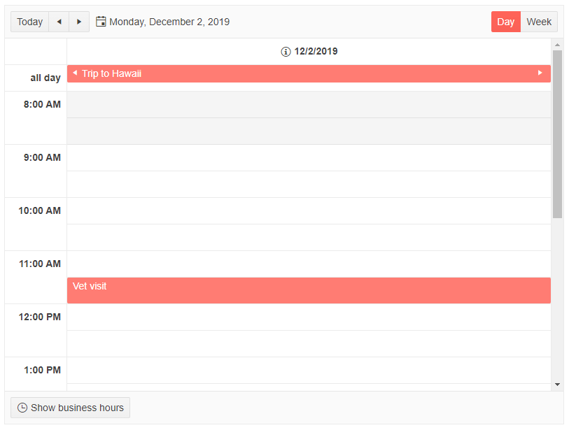

# DateHeader Templates

You can use the `DateHeaderTemplate` to customize the rendering of the Scheduler date header cells. This allows you to change the date format, add custom icons or other HTML elements.

The `DateHeaderTemplate` can be defined for the [day and week Scheduler views](slug:scheduler-views-overview). It receives as `context` a `DateTime` object.

>caption Example of using the DateHeaderTemplate

<demo metaUrl="client/scheduler/dateheader/example-1/" height="780"></demo>

>caption The result from the code snippet above

## See Also

* [Live Demo: Scheduler Templates](https://demos.telerik.com/blazor-ui/scheduler/templates)

