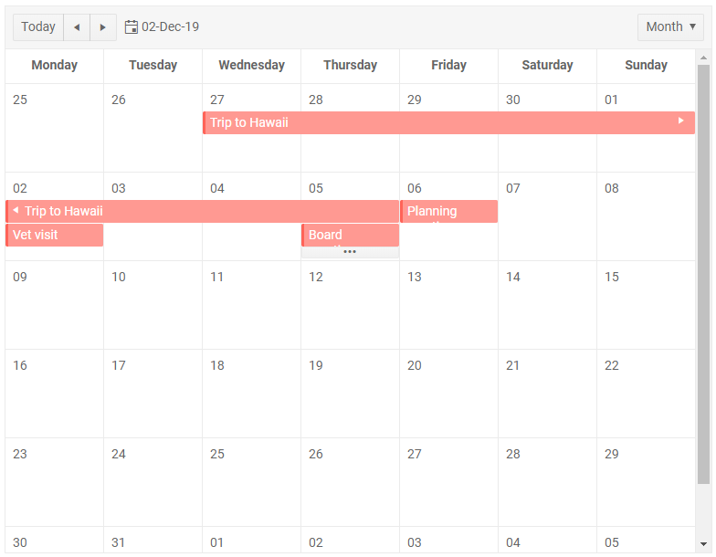

# Month View

The Month view of the Scheduler for Blazor shows the entire month to the user.

The `Date` parameter of the scheduler controls which month is displayed - the one containing the date.

A day shows up to two events and if there are more - an ellipsis button provides access to the DayView for the specific day so the user can see the needed details. This avoids cluttering and ugly rendering. You can also access the day view from the day number. Of course, you must also define a day view so the use can see it.

In this article:

* [Example](#example)
* [Resource Grouping](#resource-grouping)

>caption Figure: Month View in the scheduler



## Example

>caption Declare the Month and Day Views in the markup

>tip You can declare other views as well, this example adds only the month and day views for brevity.

````CSHTML
@* Define the month view. The screenshot above is the result from this code snippet
    This example also shows how to add a day view so the user can see details for busy days with more than 2 events*@

<TelerikScheduler Data="@Appointments" @bind-Date="@StartDate" @bind-View="@selectedView" Height="600px">
    <SchedulerViews>
        <SchedulerMonthView />
        <SchedulerDayView StartTime="@( new DateTime(2000, 1, 1, 8, 0, 0) )" />
    </SchedulerViews>
</TelerikScheduler>

@code {
    public DateTime StartDate { get; set; } = new DateTime(2019, 12, 2);
    SchedulerView selectedView { get; set; } = SchedulerView.Month;

    List<SchedulerAppointment> Appointments = new List<SchedulerAppointment>()
    {
            new SchedulerAppointment
            {
                Title = "Board meeting",
                Description = "Q4 is coming to a close, review the details.",
                Start = new DateTime(2019, 12, 5, 10, 00, 0),
                End = new DateTime(2019, 12, 5, 11, 30, 0)
            },

            new SchedulerAppointment
            {
                Title = "Dentist Appointment",
                Description = "Get that cavity fixed.",
                Start = new DateTime(2019, 12, 5, 13, 00, 0),
                End = new DateTime(2019, 12, 5, 13, 30, 0)
            },

            new SchedulerAppointment
            {
                Title = "Vet visit",
                Description = "The cat needs vaccinations and her teeth checked.",
                Start = new DateTime(2019, 12, 2, 11, 30, 0),
                End = new DateTime(2019, 12, 2, 12, 0, 0)
            },

            new SchedulerAppointment
            {
                Title = "Planning meeting",
                Description = "Kick off the new project.",
                Start = new DateTime(2019, 12, 6, 9, 30, 0),
                End = new DateTime(2019, 12, 6, 12, 45, 0)
            },

            new SchedulerAppointment
            {
                Title = "Trip to Hawaii",
                Description = "An unforgettable holiday!",
                IsAllDay = true,
                Start = new DateTime(2019, 11, 27),
                End = new DateTime(2019, 12, 05)
            }
    };

    public class SchedulerAppointment
    {
        public string Title { get; set; }
        public string Description { get; set; }
        public DateTime Start { get; set; }
        public DateTime End { get; set; }
        public bool IsAllDay { get; set; }
    }
}
````
## Resource Grouping

You can configure the Month view to display events that are [grouped]() by a resource.

>caption The result from the code snippet below.


>caption Resource Grouping in a Month view.

@[template for an example of a resource grouping by one resource in different views](/_contentTemplates/scheduler/views.md#code-snippet)

## See Also

  * [Views]()
  * [Navigation]()
  * [Live Demo: Scheduler Month View](https://demos.telerik.com/blazor-ui/scheduler/month-view)
  
