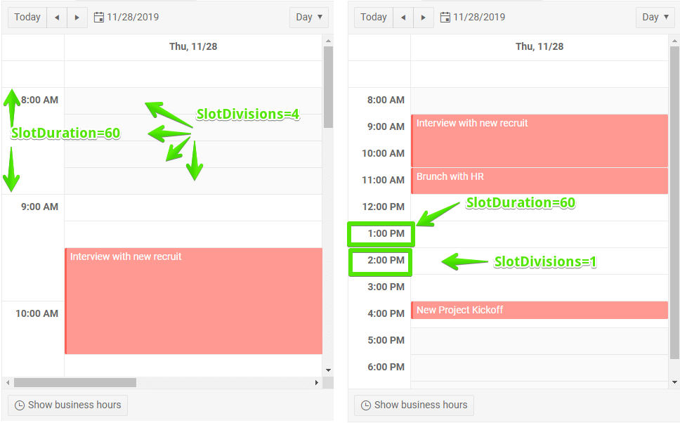

# Scheduler Views

The Scheduler component provides several different modes of display to fit different user preferences and needs.

In this article:

* [Define Available Views](#define-available-views)
* [Common View Properties](#common-view-properties)
	* [Slots](#slots)


## Define Available Views

You can choose which views the user can switch between. To do that, declare the desired views in the `SchedulerViews` tag (conditional markup is allowed).

You can also control which is the default one through the `View` parameter. You should usually use it in the `@bind-View` syntax to prevent it from resetting to its initial view when re-rendering happens.

You can read more about this in the [Navigation]() article.

The available views are:

* [Scheduler**Day**View]()
* [Scheduler**MultiDay**View]()
* [Scheduler**Week**View]()

>caption Allow the user to navigate between Day and Week views only by defining only them. Example how to choose starting View (Week) and Date (29 Nov 2019).

````CSHTML
@* The user can only choose the Day and Week views - the MultiDay view, for example, is not defined *@

<TelerikScheduler Data="@Appointments" @bind-Date="@StartDate" Height="600px" @bind-View="@CurrView"
                  StartField="@(nameof(SchedulerAppointment.StartTime))"
                  EndField="@(nameof(SchedulerAppointment.EndTime))"
                  TitleField="@(nameof(SchedulerAppointment.Title))"
                  DescriptionField="@(nameof(SchedulerAppointment.Description))"
                  IsAllDayField="@(nameof(SchedulerAppointment.IsAllDay))">
    <SchedulerViews>
        <SchedulerDayView StartTime="@DayStart" EndTime="@DayEnd" WorkDayStart="@WorkDayStart" WorkDayEnd="@WorkDayEnd" />
        <SchedulerWeekView StartTime="@DayStart" EndTime="@DayEnd" WorkDayStart="@WorkDayStart" WorkDayEnd="@WorkDayEnd" />
    </SchedulerViews>
</TelerikScheduler>

@code {
    public DateTime StartDate { get; set; } = new DateTime(2019, 11, 29);
    public SchedulerView CurrView { get; set; } = SchedulerView.Week;
    //the time portions are important
    public DateTime DayStart { get; set; } = new DateTime(2000, 1, 1, 8, 0, 0);
    public DateTime DayEnd { get; set; } = new DateTime(2000, 1, 1, 20, 0, 0);
    public DateTime WorkDayStart { get; set; } = new DateTime(2000, 1, 1, 9, 0, 0);
    public DateTime WorkDayEnd { get; set; } = new DateTime(2000, 1, 1, 17, 0, 0);
    List<SchedulerAppointment> Appointments = new List<SchedulerAppointment>()
    {
            new SchedulerAppointment
            {
                Title = "Vet visit",
                Description = "The cat needs vaccinations and her teeth checked.",
                StartTime = new DateTime(2019, 11, 26, 11, 30, 0),
                EndTime = new DateTime(2019, 11, 26, 12, 0, 0)
            },

            new SchedulerAppointment
            {
                Title = "Planning meeting",
                Description = "The cat needs vaccinations and her teeth checked.",
                StartTime = new DateTime(2019, 11, 25, 9, 30, 0),
                EndTime = new DateTime(2019, 11, 25, 12, 45, 0)
            },

            new SchedulerAppointment
            {
                Title = "Trip to Hawaii",
                Description = "An unforgettable holiday!",
                IsAllDay = true,
                StartTime = new DateTime(2019, 11, 27),
                EndTime = new DateTime(2019, 12, 07)
            }
    };

    public class SchedulerAppointment
    {
        public string Title { get; set; }
        public string Description { get; set; }
        public DateTime StartTime { get; set; }
        public DateTime EndTime { get; set; }
        public bool IsAllDay { get; set; }
    }
}
````


## Common View Properties

Generally, the views are designed around the timeframe that they show and they share some common properties that you will likely have to set to provide a good user experience for the user:

* `StartTime` - this is the first hour that is shown in the view. Defaults to midnight, so if you do not set it to a value close to the start of the working day, the user is likely to see blank spaces only before they scroll.

* `WorkDayStart` - this is when the working day starts. The work hours have a different background than non-working hours so the user can distinguish them easily. This parameter also influences the "Show Business Hours" toggle.

* `EndTime` - the counterpart to `StartTime` - defines when the full day ends. Defaults to midnight. If you have the day end earlier you can reduce the amount of elements that render, but the user may not see all late appointments.

* `WorkDayStart` - the counterpart to `WorkDayStart` - defines when the working day ends.

If there are appointments outside of the defined visible time the user will not be able to see them. For most cases where the working day is subject to scheduling this may not be a problem, but if your users need to manage night shifts or irregular work hours, you may want to have a longer day rendered, or to bind the value to a time picker so the user can alter it themselves.

### Slots

Views that show hours let you control their precision through the `SlotDuration` and `SlotDivisions` parameters:

1. `SlotDuration` - the time between the hour markers.
1. `SlotDivisions` - how many partitions each time between the hour markers is separated into.

>caption Figure: Slots explanation




## See Also

  * [Live Demo: Scheduler Views](https://demos.telerik.com/blazor-ui/sceduler/views)
  * [Day View]()

