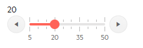
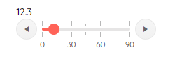
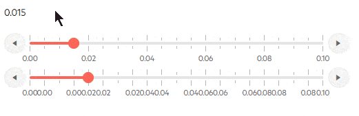

# Slider Overview

The <a href="https://www.telerik.com/blazor-ui/slider" target="_blank">Blazor Slider component</a> allows the user to select a value by dragging its handle along the track, or by clicking the side arrow buttons. It provides templates, various configuration options, validation and keyboard navigation.

#### To use a Telerik Slider for Blazor

1. Add the `TelerikSlider` tag.
1. Provide the `Value` (one-way data binding) or `bind-Value` (two-way data binding) property.
1. Choose the `Min`, `Max`, `SmallStep` and `LargeStep` settings to define the appearance and behavior of the slider.


>caption Basic setup of the Telerik Slider using two-way data binding

````CSHTML
@* The user can choose integers with a step of 1 and every 20 there will be a major tick *@

@Volume
<br />
<TelerikSlider @bind-Value="@Volume"
               Min="0"
               Max="100"
               SmallStep="1"
               LargeStep="20"
               Width="400px">
</TelerikSlider>

@code{
    int Volume { get; set; } = 33;
}
````

>caption The result from the code snippet above


>caption Component namespace and reference

The Slider is a generic component that takes the type of the `Value` which can be e numerical type.

````CSHTML
@TheValue
<br />
<TelerikSlider @bind-Value="@TheValue" SmallStep="0.5m" LargeStep="5m" Min="0m" Max="20m" @ref="@TheSlider">
</TelerikSlider>

@code{
    Telerik.Blazor.Components.TelerikSlider<decimal> TheSlider { get; set; }

    decimal TheValue { get; set; } = 12.3m;
}
````


## Features

The Slider provides the following features:

@[template](/_contentTemplates/slider/common.md#base-slider-features)

* `ShowButtons` - whether there will be increase and decrase buttons at the ends of the slider. Defaults to `true`.

* `Value` and `bind-Value`- the value of the slider. Can be a numerical type (such as `int`, `decimal`, `double` and so on). 
    
    * When the user moves the drag handle of the slider, it changes with the `SmallStep`, but you can set a value programmatically that will land the handle between the ticks and between those steps.

* Events - see the [Slider events]() article for more information and examples.


## Examples

This section provides the following examples to showcase some of the slider features and their behavior:

* [Matching Ticks Steps, Min, Max](#matching-ticks-steps-min-max)
* [Not Matching Ticks Steps, Min, Max](#not-matching-ticks-steps-min-max)
* [Vertical Slider Without Buttons](#vertical-slider-without-buttons)
* [Decimals and Rounding Errors](#decimals-and-rounding-errors)

### Matching Ticks Steps, Min, Max

You can use a multiplier over the small step to set the large step, and to ensure that this can divide the difference between the min and max. This will provide the best possible appearance where ticks will be distributed evenly and you will be able to use the full range of the slider.



````CSHTML
@TheValue
<br />
<TelerikSlider @bind-Value="@TheValue" SmallStep="5m" LargeStep="15m" Min="5m" Max="50m">
</TelerikSlider>

@code{
    decimal TheValue { get; set; } = 20m;
}
````

### Not Matching Ticks Steps, Min, Max

In this example, the max value does not match the large step, small step and the min, so the max value is not rendered and the user can only go up to `90` instead of `100`. The small and large steps match in this example, however, the only "issue" is the `Max` value.



````CSHTML
@TheValue
<br />
<TelerikSlider @bind-Value="@TheValue" SmallStep="15m" LargeStep="30m" Min="0m" Max="100m">
</TelerikSlider>

@code{
    decimal TheValue { get; set; } = 12.3m;
}
````

### Vertical Slider Without Buttons

This example shows how to make the slider vertical and how to remove the increase/decrease buttons. You can use these settings separately, of course.

````CSHTML
@TheValue
<br /><br />
<TelerikSlider Orientation="@SliderOrientation.Vertical" ShowButtons="false"
               @bind-Value="@TheValue" SmallStep="10" LargeStep="20" Min="0" Max="100">
</TelerikSlider>

@code{
    int TheValue { get; set; } = 30;
}
````


### Decimals and Rounding Errors

The first slider in this example has a sufficient precision (`Decimals`) to properly handle the values that it will have to render in its labels and set in its `Value`. The second slider does not have sufficient precision - the `Decimals` value is too low and thus the rounding in the labels texts and of the `Value` will be off a little.

To see the difference in how rounding can have issues with insufficient precision, try changing the values from each slider - you will see that the second slider does not respond "correctly" and as expected.



````CSHTML
@TheValue
<br /><br />

@* Sufficient precision for the selected values and steps *@

<TelerikSlider @bind-Value="@TheValue" Decimals="3"
               SmallStep="0.005m" LargeStep="0.02m" Min="0m" Max="0.1m" Width="500px">
</TelerikSlider>

<br /><br />

@* Insufficient precision for the current values and steps
    the labels texts will be off and the value will not change every time you move the handle
    only when it reaches the threshold of the decimals which default to 2 for invariant and most cultures*@

<TelerikSlider @bind-Value="@TheValue" Decimals="2"
               SmallStep="0.005m" LargeStep="0.02m" Min="0m" Max="0.1m" Width="500px">
</TelerikSlider>

@code{
    decimal TheValue { get; set; } = 0.015m;
}
````


## See Also

* [Live Demo: Slider](https://demos.telerik.com/blazor-ui/slider/overview)
* [Live Demo: Slider Settings](https://demos.telerik.com/blazor-ui/slider/customization)
* [Slider Events]()

