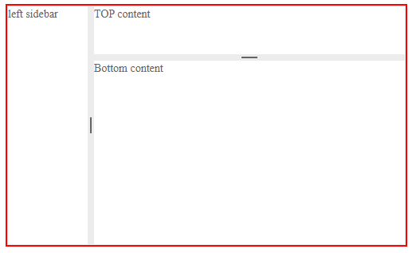

# Splitter Overview

The <a href="https://www.telerik.com/blazor-ui/splitter" target="_blank">Blazor Splitter component</a> lets you divide a portion of the page into several pieces that the user can resize and collapse. This provides real estate management for the app and the end user so they can focus on the content that is important in their current task. You can also [save and load its state](), and respond to [events]().

#### In This Article

* [Basics](#basics)
* [Features](#features)
	* [Splitter](#splitter)
	* [Pane](#pane)
* [Splitter Size](#splitter-size)
* [Nested Splitters](#nested-splitters)

## Basics

#### To use a Telerik Splitter for Blazor

1. Declare the `<TelerikSplitter>` tag and set its `Width` and `Height` parameters to the desired values.

    * You can use values in percent (setting them to `100%` is very common) so that the splitter will take up the entire size of its container. See the [Dimensions]() article for more details on what units you can use and how dimensions in percent work.

1. Inside the `<SplitterPanes>` child tag, add the desired `<SplitterPane>` tags to create the sections of content.

1. Inside each `<SplitterPane>`, add the desired content - be that HTML or components.

1. Optionally, set the desired settings for the individual panes - such as initial, min and max size, whether the user can collapse and resize the pane.

>caption Splitter that takes 100% of its container and shows the main features of its panes

````CSHTML
This example shows how the splitter can fill up the entire container (marked with a red border) and the main features of the component and its panes.

<div style="width: 500px; height: 300px; border: 1px solid red;">

    <TelerikSplitter Width="100%" Height="100%" Orientation="@SplitterOrientation.Horizontal">
        <SplitterPanes>
        
            <SplitterPane Size="100px" Min="50px" Max="150px" Collapsible="true">
                <div>left sidebar. Can be collapsed and can be resized between 50px and 150px.</div>
            </SplitterPane>
            
            <SplitterPane Collapsible="false">
                <div>right hand side pane - content. You cannot collapse this pane so it is always visible.</div>
            </SplitterPane>
            
            <SplitterPane Collapsed="true" Collapsible="true" Resizable="false" Size="100px">
                <div>Third pane that is initially collapsed and is not resizable.</div>
            </SplitterPane>
            
        </SplitterPanes>
    </TelerikSplitter>
    
</div>
````

>caption Splitter functionality in action


>caption Component namespace and reference

````CSHTML
<TelerikSplitter Width="400px" Height="200px" @ref="@SplitterRef">
    <SplitterPanes>
        <SplitterPane>
            <div>left sidebar</div>
        </SplitterPane>
        <SplitterPane>
            <div>right hand side pane - content.</div>
        </SplitterPane>
    </SplitterPanes>
</TelerikSplitter>

@code {
    Telerik.Blazor.Components.TelerikSplitter SplitterRef { get; set; }
}
````


## Features

The main container is the Splitter component and its tag defines the size and layout direction of the individual sections. Each Pane (section) controls its own behaviors such as the ability to change its size and collapse.

### Splitter

The main tag of the splitter offers the following core features of the component:

* `Class` - the CSS class that renders on the main wrapping element of the component.

* `Height` - takes a CSS unit that determines how tall the splitter is. See the [Dimensions]() article for more details on what units you can use and how dimensions in percent work.

* `Orientation` - whether the content will be split up (how the panes will stack) horizontally or vertically. Takes a member of the `SplitterOrientation` enum and defaults to `Horizontal`.

* `Width`- takes a CSS unit that determines how wide the splitter is. See the [Dimensions]() article for more details on what units you can use and how dimensions in percent work.

* Several [events]().

### Pane

Each individual splitter pane (section) offers the following features:

* `ChildContent` - the standard `RenderFragment` for Blazor that lets you define your content directly between the opening and closing tags of the pane.

* `Class` - the CSS class that renders on the top element of the pane. Lets you apply styling such as changing the `overflow` for the content.

* `Collapsed` - whether the pane will be collapsed (not visible). Defaults to `false`.

* `Collapsible` - whether the user can collapse (hide) the pane to provide more room for other panes. When enabled, the adjacent splitbar (the drag handle between the panes) will offer a collapse button for the pane. Defaults to `false`.

* `Max` - a CSS unit with the maximum size the pane can have. When it is reached, the user cannot expand its size further.

* `Min` -  CSS unit with the minimum size the pane can have. When it is reached, the user cannot reduce its size further.

* `Resizable` - whether the user can resize the pane by dragging the resize handle (splitbar) between two panes. Resizing means that the adjacent pane will take up the difference in size. Defaults to `true`.

* `Size` - a CSS unit that determines the size of the pane. Must be between `Min` and `Max`.

## Splitter and Pane Size

The splitter respects the dimensions you set to its `Width` and `Height` parameters, and distributes the available space according to the `Size` set to individual panes inside.

If you set the `Width` and `Height` in percent, make sure that the parent element provides the desires dimensions and layout first.

The individual panes use the <a href="https://developer.mozilla.org/en-US/docs/Web/CSS/flex-basis" target="_blank">CSS flex-basis</a> to set their dimensions and by default they have `flex: 1 1 auto` so they distribute the space evenly if there are no other settings.

>tip You must leave at least one `SplitterPane` *without* a set `Size`. This pane will absorb size changes from other panes when the user resizes them and provides you with some flexibility when defining strict sizes for the other panes so that you don't have to keep track of all the pane sizes, their sum and the container size.


## Nested Splitters

Sometimes you need to create a more complex layout that includes both horizontal and vertical panes. To do that, you can nest Telerik Splitter components inside the panes of other splitters. When you do that, set the `Class` parameter of the nested splitter to `k-pane-flex`.

>caption Nested splitters that create a complex layout with both horizontal and vertical panes

````CSHTML
<div style="width: 500px; height: 300px; border: 2px solid red;">

    <TelerikSplitter Width="100%" Height="100%">
        <SplitterPanes>
            <SplitterPane Size="100px">
                <div>left sidebar</div>
            </SplitterPane>
            <SplitterPane>

                <TelerikSplitter Class="k-pane-flex"
                                 Width="100%" Height="100%"
                                 Orientation="@SplitterOrientation.Vertical">
                    <SplitterPanes>
                        <SplitterPane Size="20%">
                            <div>TOP content</div>
                        </SplitterPane>
                        <SplitterPane>
                            <div>Bottom content</div>
                        </SplitterPane>
                    </SplitterPanes>
                </TelerikSplitter>

            </SplitterPane>
        </SplitterPanes>
    </TelerikSplitter>

</div>
````

>caption The result from the code snippet above



## See Also

  * [Live Demo: Splitter](https://demos.telerik.com/blazor-ui/splitter/overview)
  * [Splitter API Reference](https://docs.telerik.com/blazor-ui/api/Telerik.Blazor.Components.TelerikSplitter)
  * [SplitterPane API Reference](https://docs.telerik.com/blazor-ui/api/Telerik.Blazor.Components.TelerikSplitterPane)
