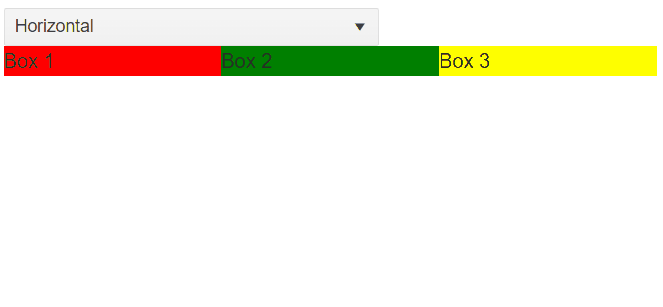
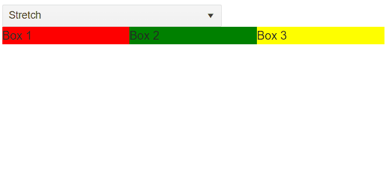

# Layout

The StackLayout component provides the following parameters that control its appearance:

* [Orientation](#orientation)

* [Spacing](#spacing)

* [HorizontalAlign](#horizontalalign)

* [VerticalAlign](#verticalalign)


## Orientation

The `Orientation` parameter controls whether the items nested inside the `TelereikStackLayout` will be aligned horizontally or vertically. It takes a member of the `StackLayoutOrientation` enum:

* `Horizontal` - by default the items will be aligned horizontally.

* `Vertical`

>caption Change the orientation of the StackLayout from the DropDownList

````RAZOR
@* Observe the behavior of the StackLayout in its different orientation options *@

<style>
    .red {
        background-color: red;
    }

    .green {
        background-color: green;
    }

    .yellow {
        background-color: yellow;
    }
</style>

<TelerikDropDownList @bind-Value="@orientation" 
                     Data="@stackLayoutOrientationOptions">
</TelerikDropDownList>

<TelerikStackLayout Orientation="@orientation" Width="30%">
    <div class="red">
        Box 1
    </div>
    <div class="green">
        Box 2
    </div>
    <div class="yellow">
        Box 3
    </div>
</TelerikStackLayout>

@code {
    public StackLayoutOrientation orientation { get; set; }

    public List<StackLayoutOrientation> stackLayoutOrientationOptions { get; set; } = new List<StackLayoutOrientation>() {
        StackLayoutOrientation.Horizontal,
        StackLayoutOrientation.Vertical
    };
}
````

>caption The result from the code snippet above



## Spacing

The `Spacing` parameter controls the spacing of the elements nested inside the `TelerikStackLayout`. That parameter is mapped to the <a href="https://css-tricks.com/almanac/properties/g/gap/">gap</a> CSS rule and accepts each value you can pass to the `gap` CSS rule.

>caption Use the NumericTextBox to alter the Spacing parameter

````RAZOR
@* Use the NumericTextBox to alter the Spacing parameter *@

<style>
    .red {
        background-color: red;
    }

    .green {
        background-color: green;
    }

    .yellow {
        background-color: yellow;
    }
</style>

<TelerikNumericTextBox @bind-Value="@SpacingValue"></TelerikNumericTextBox>

<TelerikStackLayout Spacing="@($"{SpacingValue}px")" Width="30%">
    <div class="red">
        Box 1
    </div>
    <div class="green">
        Box 2
    </div>
    <div class="yellow">
        Box 3
    </div>
</TelerikStackLayout>

@code {
    public int SpacingValue { get; set; }
}
````

>caption The result from the code snippet above


## HorizontalAlign

The `HorizontalAlign` parameter controls the alignment of the items in the `TelerikStackLayout` based on the X axis. Takes a member of the `StackLayoutHorizontalAlign` enum:

* `Left`

* `Right`

* `Center`

* `Stretch` - by default the items will be stretched, which means that they will take all the available space. 

>caption Change the alignment of the StackLayout from the DropDownList

````RAZOR
@* Observe the behavior of the StackLayout in its different horizontal alignment options *@

<style>
    .red {
        background-color: red;
    }

    .green {
        background-color: green;
    }

    .yellow {
        background-color: yellow;
    }
</style>

<TelerikDropDownList @bind-Value="@align"
                     Data="@stackLayoutOrientationOptions">
</TelerikDropDownList>

<TelerikStackLayout HorizontalAlign="@align" Width="30%">
    <div class="red">
        Box 1
    </div>
    <div class="green">
        Box 2
    </div>
    <div class="yellow">
        Box 3
    </div>
</TelerikStackLayout>

@code {
    public StackLayoutHorizontalAlign align { get; set; }

    public List<StackLayoutHorizontalAlign> stackLayoutOrientationOptions { get; set; } = new List<StackLayoutHorizontalAlign>() {
        StackLayoutHorizontalAlign.Left,
        StackLayoutHorizontalAlign.Right,
        StackLayoutHorizontalAlign.Center,
        StackLayoutHorizontalAlign.Stretch
    };
}
````

>caption The result from the code snippet above



## VerticalAlign

The `VerticalAlign` parameter controls the alignment of the items in the `TelerikStackLayout` based on the Y axis. Takes a member of the `StackLayoutVerticalAlign` enum:

* `Top`

* `Bottom`

* `Center`

* `Stretch` - by default the items will be stretched, which means that they will take all the available space. 

>caption Change the alignment of the StackLayout from the DropDownList

````RAZOR
@* Observe the behavior of the StackLayout in its different vertical alignment options *@

<style>
    .red {
        background-color: red;
    }

    .green {
        background-color: green;
    }

    .yellow {
        background-color: yellow;
    }
</style>

<TelerikDropDownList @bind-Value="@align"
                     Data="@stackLayoutOrientationOptions">
</TelerikDropDownList>

<TelerikStackLayout VerticalAlign="@align"
                    Orientation="@StackLayoutOrientation.Vertical"
                    Width="30%"
                    Height="400px">
    <div class="red">
        Box 1
    </div>
    <div class="green">
        Box 2
    </div>
    <div class="yellow">
        Box 3
    </div>
</TelerikStackLayout>

@code {
    public StackLayoutVerticalAlign align { get; set; }

    public List<StackLayoutVerticalAlign> stackLayoutOrientationOptions { get; set; } = new List<StackLayoutVerticalAlign>() {
        StackLayoutVerticalAlign.Top,
        StackLayoutVerticalAlign.Bottom,
        StackLayoutVerticalAlign.Center,
        StackLayoutVerticalAlign.Stretch
    };
}
````

>caption The result from the code snippet above


## See Also

  * [Overview](slug:stacklayout-overview)