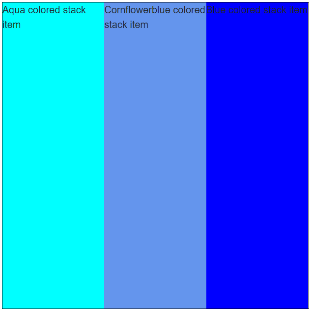

# StackLayout Overview

The <a href="https://www.telerik.com/blazor-ui/stacklayout" target="_blank">Blazor StackLayout component</a> allows you to easily align multiple elements in a vertical or horizontal order. 

#### In This Article


* [Basics](#basics)
* [Features](#features)
* [Nested StackLayouts](#nested-stacklayouts)

## Basics

#### To use a Telerik StackLayout for Blazor

1. Declare the `<TelerikStackLayout>` tag 

1. Inside the `<TelerikStackLayout>` tag, add the desired elements.

>caption StackLayout with its most common features

````CSHTML
@* This example showcases how the StackLayout fills the entire parent container and some of its core features. *@

<style>
    .parent-container {
        height: 500px;
        width: 500px;
        border: 1px solid black;
    }
</style>

<div class="parent-container">
    <TelerikStackLayout Orientation="@StackLayoutOrientation.Horizontal" 
                        Width="100%" 
                        Height="100%">
        <div style="background-color: aqua;">
            Aqua colored stack item
        </div>
        <div style="background-color: cornflowerblue;">
            Cornflowerblue colored stack item
        </div>
        <div style="background-color: blue;">
            Blue colored stack item
        </div>
    </TelerikStackLayout>
</div>
````

>caption The result from the code snippet above




>caption Component namespace and reference

````CSHTML
<TelerikStackLayout Orientation="@StackLayoutOrientation.Horizontal"
                    Width="100%"
                    Height="100%"
                    @ref="StackLayoutRef">
    <div style="background-color: aqua;">
        Aqua colored stack item
    </div>
    <div style="background-color: cornflowerblue;">
        Cornflowerblue colored stack item
    </div>
    <div style="background-color: blue;">
        Blue colored stack item
    </div>
</TelerikStackLayout>

@code {
    Telerik.Blazor.Components.TelerikStackLayout StackLayoutRef { get; set; }
}
````


## Features

The StackLayout offers the following features:

* `Class` - the CSS class that renders on the main wrapping element of the component.

* `Height` - takes a CSS unit that determines how tall the StackLayout is. See the [Dimensions]() article for more details on what units you can use and how dimensions in percent work.

* `Width`- takes a CSS unit that determines how wide the StackLayout is. See the [Dimensions]() article for more details on what units you can use and how dimensions in percent work.

* `Orientation` - whether the content will be aligned horizontally or vertically. Takes a member of the `StackLayoutOrientation` enum and defaults to `Horizontal`. See the [Appearance]() article for more information.

* `Spacing` - the space between the elements in the StackLayout. See the [Appearance]() article for more information.

* `HorizontalAlign` - controls the alignment of the items in the StackLayout based on the X axis. Takes a member of the `StackLayoutHorizontalAlign` enum. See the [Appearance]() article for more information.

* `VerticalAlign` - controls the alignment of the items in the StackLayout based on the Y axis. Takes a member of the `StackLayoutVerticalAlign` enum. See the [Appearance]() article for more information.

## Nested StackLayouts

Sometimes you need to create a more complex layout that includes both horizontal and vertical items. To do that, you can nest TelerikStackLayout components inside one another.

>caption Use nested StackLayout to create a page layout

````CSHTML
<TelerikStackLayout Orientation="StackLayoutOrientation.Vertical" Height="100%">
    <div class="red">
        Header
    </div>
    <TelerikStackLayout Orientation="StackLayoutOrientation.Horizontal">
        <div class="green">
            Navigation
        </div>
        <div class="yellow">
            Content
        </div>
        <div class="orange">
            Right side content
        </div>
    </TelerikStackLayout>
    <div class="purple">
        Footer
    </div>
</TelerikStackLayout>

<style>
    .red {
        background-color: #dc3545;
    }

    .green {
        background-color: #198754;
    }

    .yellow {
        background-color: #ffc107;
    }

    .orange {
        background-color: #fd7e14;
    }

    .purple {
        background-color: #6f42c1;
    }

    body, html {
        height: 100%;
    }

    app {
        display: initial !important;
    }
</style>
````

>caption The result from the code snippet above


## See Also

  * [Live Demo: StackLayout](https://demos.telerik.com/blazor-ui/stacklayout/overview)
  * [Appearance]()
  * [StackLayout API Reference](https://docs.telerik.com/blazor-ui/api/Telerik.Blazor.Components.TelerikStackLayout)