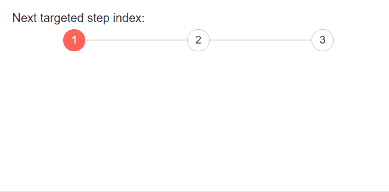

# Stepper Events

This article explains the events available in the Telerik Stepper for Blazor:

* [OnChange](#onchange)
* [ValueChanged](#valuechanged)

## OnChange

The `OnChange` event is triggered on the current step and fires before the step has changed. The handler receives an object of type `StepperStepChangeEventArgs` which exposes the following fields:

* `TargetIndex` - contains the index of the targeted new step.
* `IsCancelled` - specifies whether the event is canceled and the built-in action is prevented.

>caption Handle the `OnChange` event of the first and second steps. The result from the snippet below.




````CSHTML
@* Handle the OnChange event of the steps *@

Next targeted step index: @TargetIndex

<div style="width:500px">
    <TelerikStepper>
        <StepperSteps>
            <StepperStep Text="1" OnChange="@OnChangeHandler1" ></StepperStep>
            <StepperStep Text="2" OnChange="@OnChangeHandler2"></StepperStep>
            <StepperStep Text="3"></StepperStep>
        </StepperSteps>
    </TelerikStepper>
</div>

@code{
    public int? TargetIndex { get; set; } = null;

    async Task OnChangeHandler1(StepperStepChangeEventArgs args)
    {
        TargetIndex = args.TargetIndex;
    }

    async Task OnChangeHandler2(StepperStepChangeEventArgs args)
    {
        args.IsCancelled = true;

        await Dialog.AlertAsync("Please complete step 2 first", "You cannot proceed");

    }

    [CascadingParameter]
    public DialogFactory Dialog { get; set; }
}
````


## ValueChanged

The Telerik Stepper for Blazor supports ValueChanged event. It fires upon every change of the CurrentStepIndex.

<br/>

>caption Handle the ValueChanged event. The result from the snippet.


````CSHTML
@* Handle ValueChanged event of the Stepper *@

@Result

<TelerikStepper ValueChanged="@ValueChangeHandler">
    <StepperSteps>
        <StepperStep Text="1" Label="Step 1"></StepperStep>
        <StepperStep Text="2" Label="Step 2"></StepperStep>
        <StepperStep Text="3" Label="Step 3"></StepperStep>
    </StepperSteps>
</TelerikStepper>

@code{
    public string Result { get; set; }

    public void ValueChangeHandler(int index)
    {
        Result = "Step index changed. Current step index is: " + index;
    }
}
````

## See Also

  * [Live Demo: Stepper Events](https://demos.telerik.com/blazor-ui/stepper/events)