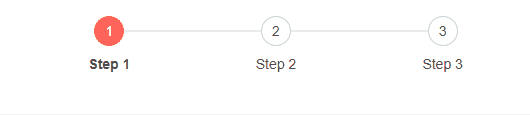

# Stepper Events

This article explains the events available in the Telerik Stepper for Blazor


## ValueChanged

The Telerik Stepper for Blazor supports ValueChanged event. It fires upon every change of the CurrentStepIndex.

<br/>

>caption Handle the ValueChanged event. The result from the snippet.



````CSHTML
@* Handle ValueChanged event of the Stepper *@

@Result

    <TelerikStepper ValueChanged="@ValueChangeHandler">
        <StepperSteps>
            <StepperStep Text="1" Label="Step 1"></StepperStep>
            <StepperStep Text="2" Label="Step 2"></StepperStep>
            <StepperStep Text="3" Label="Step 3"></StepperStep>
        </StepperSteps>
    </TelerikStepper>

@code{
    public string Result { get; set; }

    public void ValueChangeHandler(int index)
    {
        Result = "Step index changed. Current step index is: " + index;
    }
}
````

## See Also

  * [Live Demo: Stepper Events](https://demos.telerik.com/blazor-ui/stepper/events)