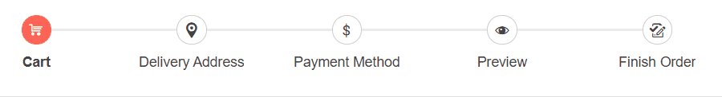

# Linear Flow

Linear flow property of the Stepper component allows you to configure it, so that completion of the previous step is required before proceeding to the next step. The user will be able to go one step at a time (back or forth).

To enable Linear flow of the Stepper, set its `Linear` parameter to `true`. By default its value is `false`.

>caption Enable the Linear Flow of the Stepper. The result from the snippet.



````CSHTML
@* Stepper with Linear Flow enabled *@

<TelerikStepper Linear="true">
    <StepperSteps>
        <StepperStep Icon="cart" Label="Cart"></StepperStep>
        <StepperStep Icon="marker-pin-target" Label="Delivery Address"></StepperStep>
        <StepperStep Icon="dollar" Label="Payment Method"></StepperStep>
        <StepperStep Icon="preview" Label="Preview"></StepperStep>
        <StepperStep Icon="track-changes-accept" Label="Finish Order"></StepperStep>
    </StepperSteps>
</TelerikStepper>
````


## See Also

  * [Live Demo: Stepper Template](https://demos.telerik.com/blazor-ui/stepper/configuration)