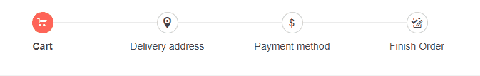

# Steps Validation

The Stepper component allows you to set validation logic for each step. You can configure it through the `Valid` parameter of the `StepperStep` which accepts `bool?`.

Step validation serves as a visual indication whether a step is valid or not. It does not prevent the users from navigating between steps.

You can toggle the `Valid` parameter value based on your application logic to accordingly render success or error icon. You can then use the `Valid` parameter value to perform logic for any further desired operations (for example preventing the user from navigating to the next step if the current one is invalid).

Depending on the [display mode]() the Stepper is using, validation icons will be displayed either in the step indicator or as part of the step label.


In this article:

* [Validation in Stepper with Display mode: Steps](#validation-in-stepper-with-display-mode:-steps)
* [Validation in Stepper with Display mode: Labels](#validation-in-stepper-with-display-mode:-labels)

## Validation in Stepper with Display mode: Steps

If the Stepper uses the default display mode ([`Steps`](#steps)), the validation icons will be displayed in the step indicator regardless of whether or not a label is defined for every step.

When validation icons are rendered inside the indicators, they will override the content of the step indicator (text, icon etc). They have priority over the step indicator content in order to notify whether the corresponding step is valid or not.

>caption Setup Steps validation in a Stepper with Display mode: Steps. The result from the snippet.



````CSHTML
@* Set validation in Stepper with display mode Steps(default) *@

<div style="width:700px">
    <TelerikStepper Linear="true" Value="@StepperValue" ValueChanged="@HandleValueChanged">
        <StepperSteps>
            <StepperStep Valid="@ValidStep" Label="Cart" Icon="cart" ></StepperStep>
            <StepperStep Valid="@InvalidStep" Label="Delivery address" Icon="marker-pin-target"></StepperStep>
            <StepperStep Valid="@ValidStep2" Label="Payment method" Icon="dollar"></StepperStep>
            <StepperStep Label="Finish Order" Icon="track-changes-accept"></StepperStep>
        </StepperSteps>
    </TelerikStepper>
</div>

@code {
    public bool? ValidStep { get; set; }
    public bool? ValidStep2 { get; set; }
    public bool? InvalidStep { get; set; }

    public int StepperValue { get; set; }

    public void HandleValueChanged(int index)
    {
        StepperValue = index;

        if (index == 1)
        {
            ValidStep = true;
        }
        if (index == 2)
        {
            InvalidStep = false;
        }
        if (index == 3)
        {
            ValidStep2 = true;
        }
    }
}
````

## Validation in Stepper with Display mode: Labels

If the Stepper uses the [`Labels`](#labels)display mode, the validation icons will be displayed as part of the step label.

>caption Setup Steps validation in a Stepper with Display mode: Labels. The result from the snippet.


````CSHTML
@* Set validation in Stepper with display mode Labels *@

<div style="width:700px">
    <TelerikStepper StepType="@StepperStepType.Labels" Linear="true" 
                    Value="@StepperValue" ValueChanged="@HandleValueChanged" >
        <StepperSteps>
            <StepperStep Valid="@ValidStep"  Label="Personal Info" Icon="user"></StepperStep>
            <StepperStep Valid="@InvalidStep" Label="Education" Icon="dictionary-add"></StepperStep>
            <StepperStep Valid="@ValidStep2" Label="Experience" Icon="flip-vertical"></StepperStep>
            <StepperStep Label="Attachments" Icon="attachment"></StepperStep>
        </StepperSteps>
    </TelerikStepper>
</div>

@code {
    public bool? ValidStep { get; set; }
    public bool? ValidStep2 { get; set; }
    public bool? InvalidStep { get; set; }

    public int StepperValue { get; set; }

    public void HandleValueChanged(int index)
    {
        StepperValue = index;

        if (index == 1)
        {
            ValidStep = true;
        }
        if (index == 2)
        {
            InvalidStep = false;
        }
        if (index == 3)
        {
            ValidStep2 = true;
        }
    }
}
````


## See Also

  * [Live Demo: Stepper Validation](https://demos.telerik.com/blazor-ui/stepper/validation)