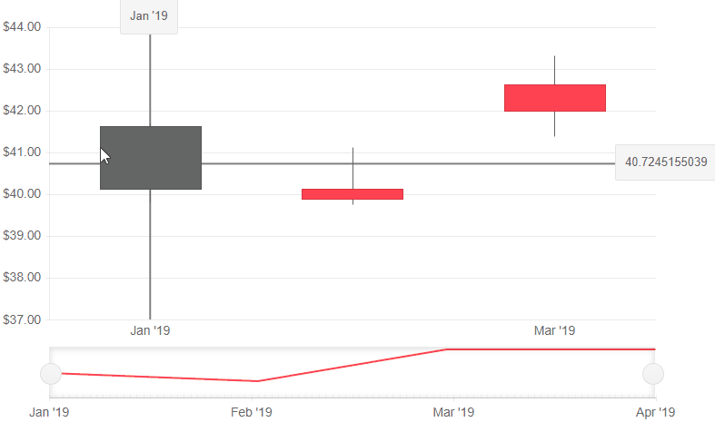
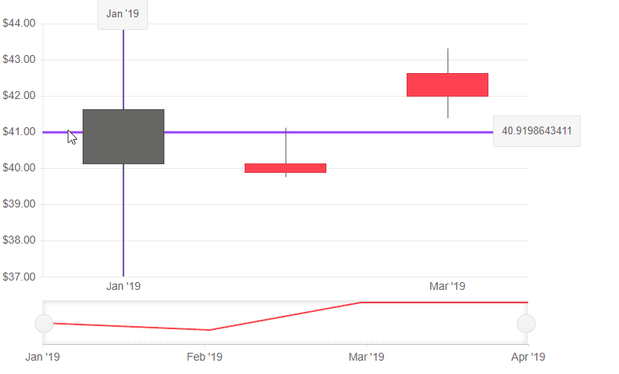
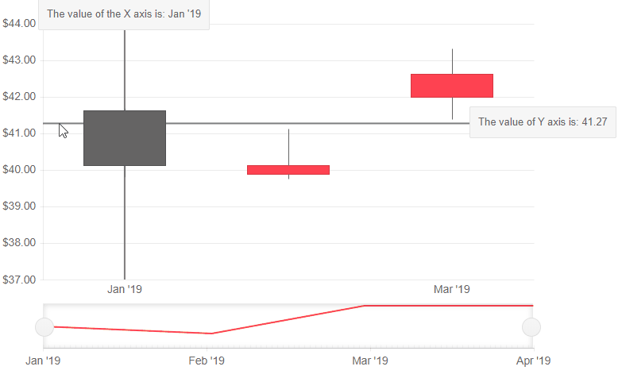

# Stock Chart Crosshairs

The Crosshairs are lines perpendicular to the axes that allow the user to see the exact value of a point at the current cursor position.

To enable the Crosshairs for the `Category` and/or the `Value` axis:

1. Inside the `<StockChartCategoryAxis>` include the the `<StockChartCategoryAxisCrosshair>`, for the `<StockChartValueAxis>`, include  `<StockChartValueAxisCrosshair>` tag.
1. Set its `Visible` parameter to `true`.
1. (optional) To enable tooltips for the crosshair add the `<StockChartCategoryAxisCrosshairTooltip>` for the `Category` axis and `StockChartValueAxisCrosshairTooltip` for the `Value` axis, and set its `Visible` parameter to `true`.

>caption Basic configuration of the Crosshairs of the Stock Chart and the result of the code snippet below.




````CSHTML
@* Enable the crosshairs for the StockChart *@

<TelerikStockChart Height="450px"
                   Width="750px"
                   DateField="@nameof(StockDataPoint.Date)">

    <StockChartCategoryAxes>
        <StockChartCategoryAxis BaseUnit="@ChartCategoryAxisBaseUnit.Months">
            <StockChartCategoryAxisCrosshair Visible="true">
                <StockChartCategoryAxisCrosshairTooltip Visible="true" />
            </StockChartCategoryAxisCrosshair>
        </StockChartCategoryAxis>
    </StockChartCategoryAxes>

    <StockChartValueAxes>
        <StockChartValueAxis>
            <StockChartValueAxisCrosshair Visible="true">
                <StockChartValueAxisCrosshairTooltip Visible="true" />
            </StockChartValueAxisCrosshair>
        </StockChartValueAxis>
    </StockChartValueAxes>

    <StockChartSeriesItems>
        <StockChartSeries Type="StockChartSeriesType.Candlestick"
                          Name="Product 1"
                          Data="@StockChartProduct1Data"
                          OpenField="@nameof(StockDataPoint.Open)"
                          CloseField="@nameof(StockDataPoint.Close)"
                          HighField="@nameof(StockDataPoint.High)"
                          LowField="@nameof(StockDataPoint.Low)">
        </StockChartSeries>
    </StockChartSeriesItems>

    <StockChartNavigator>
        <StockChartNavigatorSeriesItems>
            <StockChartNavigatorSeries Type="StockChartSeriesType.Line"
                                       Name="Product 1"
                                       Data="@StockChartProduct1Data"
                                       Field="@(nameof(StockDataPoint.High))"
                                       CategoryField="@(nameof(StockDataPoint.Date))">
            </StockChartNavigatorSeries>
        </StockChartNavigatorSeriesItems>
    </StockChartNavigator>

</TelerikStockChart>

@code {
    public List<StockDataPoint> StockChartProduct1Data { get; set; }

    protected override async Task OnInitializedAsync()
    {
        await GenerateChartData();
    }

    public async Task GenerateChartData()
    {
        StockChartProduct1Data = new List<StockDataPoint>()
        {
            new StockDataPoint(new DateTime(2019, 1, 1), 41.62m, 40.12m, 41.69m, 39.81m, 2632000),
            new StockDataPoint(new DateTime(2019, 2, 1), 39.88m, 40.12m, 41.12m, 39.75m, 3584700),
            new StockDataPoint(new DateTime(2019, 3, 1), 42m, 42.62m, 43.31m, 41.38m, 7631700),
            new StockDataPoint(new DateTime(2019, 4, 1), 42.25m, 43.06m, 43.31m, 41.12m, 4922200)
        };

        await Task.FromResult(StockChartProduct1Data);
    }

    public class StockDataPoint
    {
        public StockDataPoint() { }

        public StockDataPoint(DateTime date, decimal open, decimal close, decimal high, decimal low, int volume)
        {
            Date = date;
            Open = open;
            Close = close;
            High = high;
            Low = low;
            Volume = volume;
        }
        public DateTime Date { get; set; }

        public decimal Open { get; set; }

        public decimal Close { get; set; }

        public decimal High { get; set; }

        public decimal Low { get; set; }

        public int Volume { get; set; }
    }
}
````

## Crosshair Appearance Settings

You can control the appearance of the crosshair by setting the following properties of the `<StockChart*AxisName*AxisCrosshair>`:

* `Color` - set the `Color` property to a valid CSS color.
* `Opacity` - set the `Opacity` of the crosshair.
* `Width` - set the `Width` of the crosshair.

>caption Customize the appearance of the crosshairs

````CSHTML
@* Use the axis settings to control the appearance of the crosshairs *@

<TelerikStockChart Height="450px"
                   Width="700px"
                   DateField="@nameof(StockDataPoint.Date)">

    <StockChartCategoryAxes>
        <StockChartCategoryAxis BaseUnit="@ChartCategoryAxisBaseUnit.Months">
            <StockChartCategoryAxisCrosshair Visible="true" Color="#00008B" Opacity="0.7" Width="2">
                <StockChartCategoryAxisCrosshairTooltip Visible="true" />
            </StockChartCategoryAxisCrosshair>
        </StockChartCategoryAxis>
    </StockChartCategoryAxes>

    <StockChartValueAxes>
        <StockChartValueAxis>
            <StockChartValueAxisCrosshair Visible="true" Color="#0000FF" Opacity="0.7" Width="3">
                <StockChartValueAxisCrosshairTooltip Visible="true" />
            </StockChartValueAxisCrosshair>
        </StockChartValueAxis>
    </StockChartValueAxes>

    <StockChartSeriesItems>
        <StockChartSeries Type="StockChartSeriesType.Candlestick"
                          Name="Product 1"
                          Data="@StockChartProduct1Data"
                          OpenField="@nameof(StockDataPoint.Open)"
                          CloseField="@nameof(StockDataPoint.Close)"
                          HighField="@nameof(StockDataPoint.High)"
                          LowField="@nameof(StockDataPoint.Low)">
        </StockChartSeries>
    </StockChartSeriesItems>

</TelerikStockChart>

@code {
    public List<StockDataPoint> StockChartProduct1Data { get; set; }

    protected override async Task OnInitializedAsync()
    {
        await GenerateChartData();
    }

    public async Task GenerateChartData()
    {
        StockChartProduct1Data = new List<StockDataPoint>()
        {
            new StockDataPoint(new DateTime(2019, 1, 1), 41.62m, 40.12m, 41.69m, 39.81m, 2632000),
            new StockDataPoint(new DateTime(2019, 2, 1), 39.88m, 40.12m, 41.12m, 39.75m, 3584700),
            new StockDataPoint(new DateTime(2019, 3, 1), 42m, 42.62m, 43.31m, 41.38m, 7631700),
            new StockDataPoint(new DateTime(2019, 4, 1), 42.25m, 43.06m, 43.31m, 41.12m, 4922200)
        };

        await Task.FromResult(StockChartProduct1Data);
    }

    public class StockDataPoint
    {
        public StockDataPoint() { }

        public StockDataPoint(DateTime date, decimal open, decimal close, decimal high, decimal low, int volume)
        {
            Date = date;
            Open = open;
            Close = close;
            High = high;
            Low = low;
            Volume = volume;
        }
        public DateTime Date { get; set; }

        public decimal Open { get; set; }

        public decimal Close { get; set; }

        public decimal High { get; set; }

        public decimal Low { get; set; }

        public int Volume { get; set; }
    }
}
````



## Crosshair Tooltip Template

The crosshair tooltip provides a `<Template>` where you can control the rendering of the tooltip. The `context` gives information of the `FormattedValue` which maps to the default rendering of the tooltip and is formatted as a string. 

For the `Value` axis you can parse that value to the type in your model (`decimal`, `double`, etc.).

For the `Category` axis the `FormattedValue` represents the labels of the category axis.

>caption Use the Crosshair Tooltip template to customize the value

````CSHTML
@* Use the Crosshair Tooltip template to customize the value *@

<TelerikStockChart Height="450px"
                   Width="700px"
                   DateField="@nameof(StockDataPoint.Date)">

    <StockChartCategoryAxes>
        <StockChartCategoryAxis BaseUnit="@ChartCategoryAxisBaseUnit.Months">
            <StockChartCategoryAxisCrosshair Visible="true">
                <StockChartCategoryAxisCrosshairTooltip Visible="true">
                    <Template>
                        The value of the X axis is: @context.FormattedValue
                    </Template>
                </StockChartCategoryAxisCrosshairTooltip>
            </StockChartCategoryAxisCrosshair>
        </StockChartCategoryAxis>
    </StockChartCategoryAxes>

    <StockChartValueAxes>
        <StockChartValueAxis>
            <StockChartValueAxisCrosshair Visible="true">
                <StockChartValueAxisCrosshairTooltip Visible="true">
                    <Template>
                        <div>
                            The value of Y axis is: @(Decimal.Parse(context.FormattedValue).ToString("#.##"))
                        </div>
                    </Template>
                </StockChartValueAxisCrosshairTooltip>
            </StockChartValueAxisCrosshair>
        </StockChartValueAxis>
    </StockChartValueAxes>

    <StockChartSeriesItems>
        <StockChartSeries Type="StockChartSeriesType.Candlestick"
                          Name="Product 1"
                          Data="@StockChartProduct1Data"
                          OpenField="@nameof(StockDataPoint.Open)"
                          CloseField="@nameof(StockDataPoint.Close)"
                          HighField="@nameof(StockDataPoint.High)"
                          LowField="@nameof(StockDataPoint.Low)">
        </StockChartSeries>
    </StockChartSeriesItems>

</TelerikStockChart>

@code {
    public List<StockDataPoint> StockChartProduct1Data { get; set; }

    protected override async Task OnInitializedAsync()
    {
        await GenerateChartData();
    }

    public async Task GenerateChartData()
    {
        StockChartProduct1Data = new List<StockDataPoint>()
    {
            new StockDataPoint(new DateTime(2019, 1, 1), 41.62m, 40.12m, 41.69m, 39.81m, 2632000),
            new StockDataPoint(new DateTime(2019, 2, 1), 39.88m, 40.12m, 41.12m, 39.75m, 3584700),
            new StockDataPoint(new DateTime(2019, 3, 1), 42m, 42.62m, 43.31m, 41.38m, 7631700),
            new StockDataPoint(new DateTime(2019, 4, 1), 42.25m, 43.06m, 43.31m, 41.12m, 4922200)
        };

        await Task.FromResult(StockChartProduct1Data);
    }

    public class StockDataPoint
    {
        public StockDataPoint() { }

        public StockDataPoint(DateTime date, decimal open, decimal close, decimal high, decimal low, int volume)
        {
            Date = date;
            Open = open;
            Close = close;
            High = high;
            Low = low;
            Volume = volume;
        }
        public DateTime Date { get; set; }

        public decimal Open { get; set; }

        public decimal Close { get; set; }

        public decimal High { get; set; }

        public decimal Low { get; set; }

        public int Volume { get; set; }
    }
}

````



## See Also

  * [Live Demos: Stock Chart](https://demos.telerik.com/blazor-ui/stockchart/overview)
