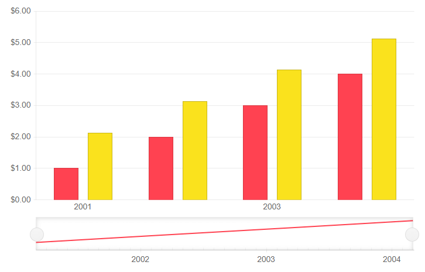
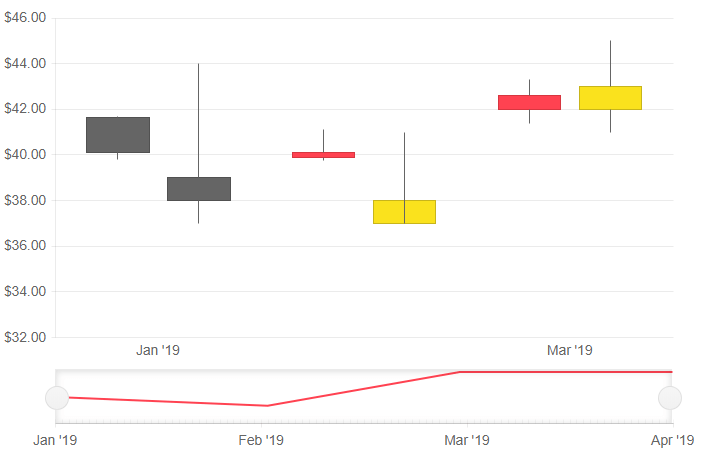

# Stock Chart Data Binding

This article explains how to provide data to a Stock Chart component, the properties related to data binding and their results.

In this article:

* [Attach Series Items to Their Categories](#attach-series-items-to-their-categories)
* [Examples](#examples)

## Attach Series Items to Their Categories

You can provide a `List<object>` to the `Data` property of a series that contains both its data points, and its x-axis categories. Then, set the following parameters based on the type of the chart:

* `Column`, `Area` and `Line` - `Field` and `CategoryField` to the corresponding fields in the model that carry the values
* `OHLC` and `Candlestick` - `OpenField`, `ClosedField`, `HighField` and `LowField` properties to the corresponding fields in the model that carry the values. Set the `DateField` parameter of the `<TelerikStockChart>` to the `DateTime` property from the model that will be used for the x-axis.

With this, the items from the series will be matched to the items (categories) on the x-axis. Each series will add its own categories to the x-axis in order of appearance, and the series items will appear above them only.

>tip This approach lets you define the `CategoryField` for only one series and the rest of the series will match the categories by their index. In such a case, you can provide a single data collection to the chart that holds all data points and x-axis categories.

## Examples

>caption Bind a Column Stock Chart to a model

````CSHTML
@* Bind a Column Chart to a model *@ 

<TelerikStockChart Height="450px"
                   Width="700px">

    <StockChartCategoryAxes>
        <StockChartCategoryAxis BaseUnit="@ChartCategoryAxisBaseUnit.Years">
        </StockChartCategoryAxis>
    </StockChartCategoryAxes>

    <StockChartSeriesItems>
        <StockChartSeries Type="StockChartSeriesType.Column"
                          Name="Product 1"
                          Data="@Data"
                          Field="@nameof(ChartSeriesData.Product1Sales)"
                          CategoryField="@nameof(ChartSeriesData.Year)">
        </StockChartSeries>

        <StockChartSeries Type="StockChartSeriesType.Column"
                          Name="Product 1"
                          Data="@Data"
                          Field="@nameof(ChartSeriesData.Product2Sales)"
                          CategoryField="@nameof(ChartSeriesData.Year)">
        </StockChartSeries>
    </StockChartSeriesItems>

</TelerikStockChart>

@code {
    public List<ChartSeriesData> Data { get; set; }

    protected override void OnInitialized()
    {
        Data = ChartSeriesData.GenerateData();
    }

    public class ChartSeriesData
    {
        public int Product1Sales { get; set; }
        public double Product2Sales { get; set; }
        public DateTime Year { get; set; }
        public string SegmentName { get; set; }

        public static List<ChartSeriesData> GenerateData()
        {
            List<ChartSeriesData> data = new List<ChartSeriesData>();

            for (int i = 1; i <= 4; i++)
            {
                var dataItem = new ChartSeriesData
                {
                    Product1Sales = i,
                    Product2Sales = i + 1.123,
                    Year = new DateTime(2000 + i, 3, i),
                    SegmentName = $"{i * 100}"
                };

                data.Add(dataItem);
            }

            return data;
        }
    }
}
````

>caption The result from the code snippet above



>caption Bind an Candlestick Stock Chart to a model

````CSHTML

@* Bind an Candlestick Stock Chart to a model *@

<TelerikStockChart Width="700px"
                   Height="450px"
                   DateField="@nameof(StockDataPoint.Date)">

    <StockChartCategoryAxes>
        <StockChartCategoryAxis BaseUnit="@ChartCategoryAxisBaseUnit.Months"></StockChartCategoryAxis>
    </StockChartCategoryAxes>

    <StockChartSeriesItems>
        <StockChartSeries Type="StockChartSeriesType.Candlestick"
                          Name="Product 1"
                          Data="@StockChartProduct1Data"
                          OpenField="@nameof(StockDataPoint.Open)"
                          CloseField="@nameof(StockDataPoint.Close)"
                          HighField="@nameof(StockDataPoint.High)"
                          LowField="@nameof(StockDataPoint.Low)">
        </StockChartSeries>

        <StockChartSeries Type="StockChartSeriesType.Candlestick"
                          Name="Product 2"
                          Data="@StockChartProduct2Data"
                          OpenField="@nameof(StockDataPoint.Open)"
                          CloseField="@nameof(StockDataPoint.Close)"
                          HighField="@nameof(StockDataPoint.High)"
                          LowField="@nameof(StockDataPoint.Low)">
        </StockChartSeries>
    </StockChartSeriesItems>

</TelerikStockChart>


@code {

    public List<StockDataPoint> StockChartProduct1Data { get; set; }
    public List<StockDataPoint> StockChartProduct2Data { get; set; }

    protected override async Task OnInitializedAsync()
    {
        await GenerateChartData();
    }

    public async Task GenerateChartData()
    {
        StockChartProduct1Data = new List<StockDataPoint>()
        {
            new StockDataPoint(new DateTime(2019, 1, 1), 41.62m, 40.12m, 41.69m, 39.81m, 2632000),
            new StockDataPoint(new DateTime(2019, 2, 1), 39.88m, 40.12m, 41.12m, 39.75m, 3584700),
            new StockDataPoint(new DateTime(2019, 3, 1), 42m, 42.62m, 43.31m, 41.38m, 7631700),
            new StockDataPoint(new DateTime(2019, 4, 1), 42.25m, 43.06m, 43.31m, 41.12m, 4922200)
        };

        StockChartProduct2Data = new List<StockDataPoint>()
        {   
            new StockDataPoint(new DateTime(2019, 1, 1), 39m, 38m, 44m, 37m, 26320),
            new StockDataPoint(new DateTime(2019, 2, 1), 37m, 38m, 41m, 40m, 35847),
            new StockDataPoint(new DateTime(2019, 3, 1), 42m, 43m, 45m, 41m, 76317),
            new StockDataPoint(new DateTime(2019, 4, 1), 40m, 42m, 43m, 42m, 49222)
        };

        await Task.FromResult(StockChartProduct1Data);
        await Task.FromResult(StockChartProduct2Data);
    }

    public class StockDataPoint
    {
        public StockDataPoint() { }

        public StockDataPoint(DateTime date, decimal open, decimal close, decimal high, decimal low, int volume)
        {
            Date = date;
            Open = open;
            Close = close;
            High = high;
            Low = low;
            Volume = volume;
        }
        public DateTime Date { get; set; }

        public decimal Open { get; set; }

        public decimal Close { get; set; }

        public decimal High { get; set; }

        public decimal Low { get; set; }

        public int Volume { get; set; }
    }
}

````

>caption The result from the code snippet above




## See Also

  * [Live Demos: Chart](https://demos.telerik.com/blazor-ui/stockchart/overview)
