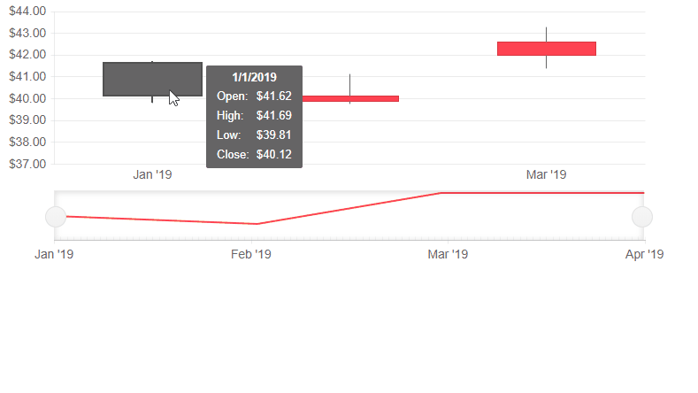

# Stock Chart Events

This article explains the available events for the Telerik Stock Chart for Blazor:

* [OnSeriesClick](#onseriesclick)


## OnSeriesClick

The `OnSeriesClick` event fires as a response to the user click on a `<StockChartSeries>`.

Below you can find:

* [Event Arguments](#event-arguments)
* [Examples](#examples):
	* [Basic Click Handler](#basic-click-handler)
	* [Get The Data Model For The Clicked Series](#get-the-data-model-for-the-clicked-series)


### Event Arguments

The event handler receives a `ChartSeriesClickEventArgs` object which provides the following data:

* `DataItem` - provides the data model of the current series item. You need to cast it to the type from your data source, which needs to be serializable.
    * For [`OHLC`]() and [`Candlestick`]() chart types the `DataItem` will contain the information mapped to the `OpenField`, `CloseField`, `HighField` and `LowField` properties.
    * For [`Line`](), [`Area`]() and [`Column`]() the `DataItem` will contain the information mapped to the `Field` properties.
    * The `DataItem` will contain an aggregated value for the date, so in order to get it you can use the `Category` and parse it to `DateTime`.

* `Category` - provides information on the category the data point is located in. Since the Stock Chart has a date X axis the `Category` should be cast to `DateTime`.

* `SeriesIndex` - provides the index of the `<StockChartSeries>` the data point belongs to.

* `Percentage` - for the Stock Chart the value will always be `0`.

* `SeriesName` - bound to the Name parameter of the `<StockChartSeries>` the data point belongs to.

* `SeriesColor` - shows the RGB color of the Series the data point belongs to.

* `CategoryIndex` - shows the index of the data point's x-axis category.

### Examples

These examples showcase the different applications of the `OnSeriesClick` event.

* [Basic Click Handler](#basic-click-handler)
* [Get The Data Model For The Clicked Series](#get-the-data-model-for-the-clicked-series)

### Basic Click Handler

````CSHTML
@* Get the Category from which the user clicked. *@

<TelerikStockChart Width="750px"
                   Height="450px"
                   DateField="@nameof(StockDataPoint.Date)"
                   OnSeriesClick="@OnSeriesClickHandler">

    <StockChartCategoryAxes>
        <StockChartCategoryAxis BaseUnit="@ChartCategoryAxisBaseUnit.Months"></StockChartCategoryAxis>
    </StockChartCategoryAxes>

    <StockChartSeriesItems>
        <StockChartSeries Type="StockChartSeriesType.Candlestick"
                          Name="Product 1"
                          Data="@StockChartProduct1Data"
                          OpenField="@nameof(StockDataPoint.Open)"
                          CloseField="@nameof(StockDataPoint.Close)"
                          HighField="@nameof(StockDataPoint.High)"
                          LowField="@nameof(StockDataPoint.Low)">
        </StockChartSeries>
    </StockChartSeriesItems>

    <StockChartNavigator>
        <StockChartNavigatorSeriesItems>
            <StockChartNavigatorSeries Type="StockChartSeriesType.Line"
                                       Name="Product 1"
                                       Data="@StockChartProduct1Data"
                                       Field="@(nameof(StockDataPoint.High))"
                                       CategoryField="@(nameof(StockDataPoint.Date))">
            </StockChartNavigatorSeries>
        </StockChartNavigatorSeriesItems>
    </StockChartNavigator>

</TelerikStockChart>

<div>
    Clicked from: @logger
</div>

@code {
    public string logger { get; set; } = String.Empty;

    void OnSeriesClickHandler(ChartSeriesClickEventArgs args)
    {
        DateTime category = DateTime.Parse(args.Category.ToString());
        logger = category.ToShortDateString();
    }

    public List<StockDataPoint> StockChartProduct1Data { get; set; }

    protected override async Task OnInitializedAsync()
    {
        await GenerateChartData();
    }

    public async Task GenerateChartData()
    {
        StockChartProduct1Data = new List<StockDataPoint>()
        {
            new StockDataPoint(new DateTime(2019, 1, 1), 41.62m, 40.12m, 41.69m, 39.81m, 2632000),
            new StockDataPoint(new DateTime(2019, 2, 1), 39.88m, 40.12m, 41.12m, 39.75m, 3584700),
            new StockDataPoint(new DateTime(2019, 3, 1), 42m, 42.62m, 43.31m, 41.38m, 7631700),
            new StockDataPoint(new DateTime(2019, 4, 1), 42.25m, 43.06m, 43.31m, 41.12m, 4922200)
        };

        await Task.FromResult(StockChartProduct1Data);
    }

    public class StockDataPoint
    {
        public StockDataPoint() { }

        public StockDataPoint(DateTime date, decimal open, decimal close, decimal high, decimal low, int volume)
        {
            Date = date;
            Open = open;
            Close = close;
            High = high;
            Low = low;
            Volume = volume;
        }
        public DateTime Date { get; set; }

        public decimal Open { get; set; }

        public decimal Close { get; set; }

        public decimal High { get; set; }

        public decimal Low { get; set; }

        public int Volume { get; set; }
    }
}
````

>caption The result from the code snippet above


### Get The Data Model For The Clicked Series

````CSHTML
@* Receive the data model based on the series the user clicked on *@

<TelerikStockChart Width="750px"
                   Height="300px"
                   DateField="@nameof(StockDataPoint.Date)"
                   OnSeriesClick="@OnSeriesClickHandler">

    <StockChartCategoryAxes>
        <StockChartCategoryAxis BaseUnit="@ChartCategoryAxisBaseUnit.Months"></StockChartCategoryAxis>
    </StockChartCategoryAxes>

    <StockChartSeriesItems>
        <StockChartSeries Type="StockChartSeriesType.Candlestick"
                          Name="Product 1"
                          Data="@StockChartProduct1Data"
                          OpenField="@nameof(StockDataPoint.Open)"
                          CloseField="@nameof(StockDataPoint.Close)"
                          HighField="@nameof(StockDataPoint.High)"
                          LowField="@nameof(StockDataPoint.Low)">
        </StockChartSeries>
    </StockChartSeriesItems>

    <StockChartNavigator>
        <StockChartNavigatorSeriesItems>
            <StockChartNavigatorSeries Type="StockChartSeriesType.Line"
                                       Name="Product 1"
                                       Data="@StockChartProduct1Data"
                                       Field="@(nameof(StockDataPoint.High))"
                                       CategoryField="@(nameof(StockDataPoint.Date))">
            </StockChartNavigatorSeries>
        </StockChartNavigatorSeriesItems>
    </StockChartNavigator>

</TelerikStockChart>

@if (dataModel != null)
{
    <div>
        <div>Clicked from: @SeriesName</div>
        <div>Open Value: @dataModel.Open</div>
        <div>Close Value: @dataModel.Close</div>
        <div>High Value: @dataModel.High</div>
        <div>Low Value: @dataModel.Low</div>
        <div>Date: @dataModel.Date.ToShortDateString()</div>
    </div>
}


@code {
    public StockDataPoint dataModel { get; set; }
    public string SeriesName { get; set; }

    void OnSeriesClickHandler(ChartSeriesClickEventArgs args)
    {
        DateTime category = DateTime.Parse(args.Category.ToString());
        string seriesName = args.SeriesName;

        dataModel = StockChartProduct1Data.Where(x => x.Date == category).FirstOrDefault();
        SeriesName = seriesName;
    }

    public List<StockDataPoint> StockChartProduct1Data { get; set; }

    protected override async Task OnInitializedAsync()
    {
        await GenerateChartData();
    }

    public async Task GenerateChartData()
    {
        StockChartProduct1Data = new List<StockDataPoint>()
        {
            new StockDataPoint(new DateTime(2019, 1, 1), 41.62m, 40.12m, 41.69m, 39.81m, 2632000),
            new StockDataPoint(new DateTime(2019, 2, 1), 39.88m, 40.12m, 41.12m, 39.75m, 3584700),
            new StockDataPoint(new DateTime(2019, 3, 1), 42m, 42.62m, 43.31m, 41.38m, 7631700),
            new StockDataPoint(new DateTime(2019, 4, 1), 42.25m, 43.06m, 43.31m, 41.12m, 4922200)
        };

        await Task.FromResult(StockChartProduct1Data);
    }

    public class StockDataPoint
    {
        public StockDataPoint() { }

        public StockDataPoint(DateTime date, decimal open, decimal close, decimal high, decimal low, int volume)
        {
            Date = date;
            Open = open;
            Close = close;
            High = high;
            Low = low;
            Volume = volume;
        }
        public DateTime Date { get; set; }

        public decimal Open { get; set; }

        public decimal Close { get; set; }

        public decimal High { get; set; }

        public decimal Low { get; set; }

        public int Volume { get; set; }
    }
}
````

>caption The result from the code snippet above



## See Also

* [Live Demo: Stock Chart Events](https://demos.telerik.com/blazor-ui/stockchart/events)
