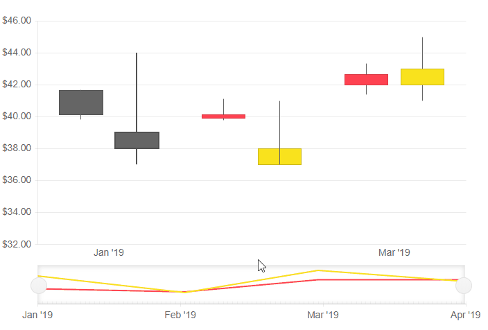

# Navigator

The Navigator allows the user to zoom or scroll through the data over a certain period of time. The Navigator can be used will all types of stock charts.

To enable data navigation you have to:

1. set up a [`<TelerikStockChart>`]()
1. add a `<StockChartNavigator>` inside the main `<TelerikStockChart>`
1. add a `<StockChartNavigatorSeries>` to the `<StockChartNavigatorSeriesItems>` collection.
1. set its `Type` property to one of the following:
* `StockChartSeriesType.Column`
* `StockChartSeriesType.Area`
* `StockChartSeriesType.Line`
* `StockChartSeriesType.Candlestick`
* `StockChartSeriesType.OHCL`
5. provide a data model collection to its `Data` property. The data source should be the same as the one used for the `<StockChartSeries>`.
1. set the following properties depending on what `Type` the Navigator is:
* `Column`, `Area` and `Line` - `Field` and `CategoryField` to the corresponding fields in the model that carry the values
* `OHLC` and `Candlestick` - `OpenField`, `ClosedField`, `HighField` and `LowField` properties to the corresponding fields in the model that carry the values.

>tip The Navigator should be used with an adjacent `<TelerikStockChart>`.

>caption Basic configuration on the Navigator

````CSHTML

<TelerikStockChart Width="100%"
                   Height="450px"
                   DateField="@nameof(StockDataPoint.Date)">

    <StockChartCategoryAxes>
        <StockChartCategoryAxis BaseUnit="@ChartCategoryAxisBaseUnit.Months"></StockChartCategoryAxis>
    </StockChartCategoryAxes>

    <StockChartSeriesItems>
        <StockChartSeries Type="StockChartSeriesType.Candlestick"
                          Name="Product 1"
                          Data="@StockChartProduct1Data"
                          OpenField="@nameof(StockDataPoint.Open)"
                          CloseField="@nameof(StockDataPoint.Close)"
                          HighField="@nameof(StockDataPoint.High)"
                          LowField="@nameof(StockDataPoint.Low)">
            <StockChartSeriesTooltip Visible="false"></StockChartSeriesTooltip>
        </StockChartSeries>

        <StockChartSeries Type="StockChartSeriesType.Candlestick"
                          Name="Product 2"
                          Data="@StockChartProduct2Data"
                          OpenField="@nameof(StockDataPoint.Open)"
                          CloseField="@nameof(StockDataPoint.Close)"
                          HighField="@nameof(StockDataPoint.High)"
                          LowField="@nameof(StockDataPoint.Low)">
            <StockChartSeriesTooltip Visible="false"></StockChartSeriesTooltip>
        </StockChartSeries>
    </StockChartSeriesItems>

    <StockChartNavigator>
        <StockChartNavigatorSeriesItems>
            <StockChartNavigatorSeries Type="StockChartSeriesType.Candlestick"
                                       Name="Product 1"
                                       Data="@StockChartProduct1Data"
                                       OpenField="@nameof(StockDataPoint.Open)"
                                       CloseField="@nameof(StockDataPoint.Close)"
                                       HighField="@nameof(StockDataPoint.High)"
                                       LowField="@nameof(StockDataPoint.Low)">
            </StockChartNavigatorSeries>

            <StockChartNavigatorSeries Type="StockChartSeriesType.Candlestick"
                                       Name="Product 2"
                                       Data="@StockChartProduct2Data"
                                       OpenField="@nameof(StockDataPoint.Open)"
                                       CloseField="@nameof(StockDataPoint.Close)"
                                       HighField="@nameof(StockDataPoint.High)"
                                       LowField="@nameof(StockDataPoint.Low)">
            </StockChartNavigatorSeries>
        </StockChartNavigatorSeriesItems>

    </StockChartNavigator>
</TelerikStockChart>


@code {
    public List<StockDataPoint> StockChartProduct1Data { get; set; }
    public List<StockDataPoint> StockChartProduct2Data { get; set; }

    protected override async Task OnInitializedAsync()
    {
        await GenerateChartData();
    }

    public async Task GenerateChartData()
    {
        StockChartProduct1Data = new List<StockDataPoint>()
{
            new StockDataPoint(new DateTime(2019, 1, 1), (decimal)41.62, (decimal)40.12, (decimal)41.69, (decimal)39.81, 2632000),
            new StockDataPoint(new DateTime(2019, 2, 1), (decimal)39.88, (decimal)40.12, (decimal)41.12, (decimal)39.75, 3584700),
            new StockDataPoint(new DateTime(2019, 3, 1), (decimal)42, (decimal)42.62, (decimal)43.31, (decimal)41.38, 7631700),
            new StockDataPoint(new DateTime(2019, 4, 1), (decimal)42.25, (decimal)43.06, (decimal)43.31, (decimal)41.12, 4922200),
        };

        StockChartProduct2Data = new List<StockDataPoint>()
        {
            new StockDataPoint(new DateTime(2019, 1, 1), (decimal)39, (decimal)38, (decimal)44, (decimal)37, 26320),
            new StockDataPoint(new DateTime(2019, 2, 1), (decimal)37, (decimal)38, (decimal)41, (decimal)40, 35847),
            new StockDataPoint(new DateTime(2019, 3, 1), (decimal)42, (decimal)43, (decimal)45, (decimal)41, 76317),
            new StockDataPoint(new DateTime(2019, 4, 1), (decimal)40, (decimal)42, (decimal)43, (decimal)42, 49222),
        };

        await Task.FromResult(StockChartProduct1Data);
        await Task.FromResult(StockChartProduct2Data);
    }

    public class StockDataPoint
    {
        public StockDataPoint() { }

        public StockDataPoint(DateTime date, decimal open, decimal close, decimal high, decimal low, int volume)
        {
            Date = date;
            Open = open;
            Close = close;
            High = high;
            Low = low;
            Volume = volume;
        }
        public DateTime Date { get; set; }

        public decimal Open { get; set; }

        public decimal Close { get; set; }

        public decimal High { get; set; }

        public decimal Low { get; set; }

        public int Volume { get; set; }
    }
}

````

>caption The result from the code snippet above


 


## See Also

* [Live Demo: Stock Chart Overview](https://demos.telerik.com/blazor-ui/todo)
