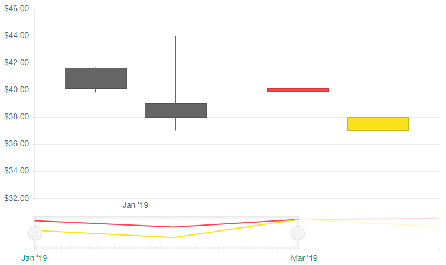

# Navigator

The Navigator allows the user to zoom or scroll through the data over a certain period of time. The Navigator can be used will all types of stock charts.

In this article you will find:
* [Basics](#basics)
* [Navigator Settings](#navigator-settings)

## Basics

To enable data navigation you have to:

1. set up a [`<TelerikStockChart>`]()
1. add a `<StockChartNavigator>` inside the main `<TelerikStockChart>`
1. add a `<StockChartNavigatorSeries>` to the `<StockChartNavigatorSeriesItems>` collection.
1. set its `Type` property to one of the following:
    * `StockChartSeriesType.Column`
    * `StockChartSeriesType.Area`
    * `StockChartSeriesType.Line`
    * `StockChartSeriesType.Candlestick`
    * `StockChartSeriesType.OHCL`
5. provide a data model collection to its `Data` property. The data source should be the same as the one used for the `<StockChartSeries>`.
1. set the following properties depending on what `Type` the Navigator is:
* `Column`, `Area` and `Line` - `Field` and `CategoryField` to the corresponding fields in the model that carry the values
* `OHLC` and `Candlestick` - `OpenField`, `ClosedField`, `HighField` and `LowField` properties to the corresponding fields in the model that carry the values.


>caption Data Navigation in a stock chart. Results from the first code snippet below.


````CSHTML
@* Navigator basic setup *@

<TelerikStockChart Width="700px"
                   Height="450px"
                   DateField="@nameof(StockDataPoint.Date)">

    <StockChartNavigator>
        <StockChartNavigatorSeriesItems>
            <StockChartNavigatorSeries Type="StockChartSeriesType.Candlestick"
                                       Name="Product 1"
                                       Data="@StockChartProduct1Data"
                                       OpenField="@nameof(StockDataPoint.Open)"
                                       CloseField="@nameof(StockDataPoint.Close)"
                                       HighField="@nameof(StockDataPoint.High)"
                                       LowField="@nameof(StockDataPoint.Low)">
            </StockChartNavigatorSeries>

            <StockChartNavigatorSeries Type="StockChartSeriesType.Candlestick"
                                       Name="Product 2"
                                       Data="@StockChartProduct2Data"
                                       OpenField="@nameof(StockDataPoint.Open)"
                                       CloseField="@nameof(StockDataPoint.Close)"
                                       HighField="@nameof(StockDataPoint.High)"
                                       LowField="@nameof(StockDataPoint.Low)">
            </StockChartNavigatorSeries>
        </StockChartNavigatorSeriesItems>

    </StockChartNavigator>

    <StockChartCategoryAxes>
        <StockChartCategoryAxis BaseUnit="@ChartCategoryAxisBaseUnit.Months"></StockChartCategoryAxis>
    </StockChartCategoryAxes>

    <StockChartSeriesItems>
        <StockChartSeries Type="StockChartSeriesType.Candlestick"
                          Name="Product 1"
                          Data="@StockChartProduct1Data"
                          OpenField="@nameof(StockDataPoint.Open)"
                          CloseField="@nameof(StockDataPoint.Close)"
                          HighField="@nameof(StockDataPoint.High)"
                          LowField="@nameof(StockDataPoint.Low)">
            <StockChartSeriesTooltip Visible="false"></StockChartSeriesTooltip>
        </StockChartSeries>

        <StockChartSeries Type="StockChartSeriesType.Candlestick"
                          Name="Product 2"
                          Data="@StockChartProduct2Data"
                          OpenField="@nameof(StockDataPoint.Open)"
                          CloseField="@nameof(StockDataPoint.Close)"
                          HighField="@nameof(StockDataPoint.High)"
                          LowField="@nameof(StockDataPoint.Low)">
            <StockChartSeriesTooltip Visible="false"></StockChartSeriesTooltip>
        </StockChartSeries>
    </StockChartSeriesItems>

</TelerikStockChart>

@code {
    public List<StockDataPoint> StockChartProduct1Data { get; set; }
    public List<StockDataPoint> StockChartProduct2Data { get; set; }

    protected override async Task OnInitializedAsync()
    {
        await GenerateChartData();
    }

    public async Task GenerateChartData()
    {
        StockChartProduct1Data = new List<StockDataPoint>()
        {
            new StockDataPoint(new DateTime(2019, 1, 1), 41.62m, 40.12m, 41.69m, 39.81m, 2632000),
            new StockDataPoint(new DateTime(2019, 2, 1), 39.88m, 40.12m, 41.12m, 39.75m, 3584700),
            new StockDataPoint(new DateTime(2019, 3, 1), 42m, 42.62m, 43.31m, 41.38m, 7631700),
            new StockDataPoint(new DateTime(2019, 4, 1), 42.25m, 43.06m, 43.31m, 41.12m, 4922200)
        };

        StockChartProduct2Data = new List<StockDataPoint>()
        {
            new StockDataPoint(new DateTime(2019, 1, 1), 39m, 38m, 44m, 37m, 26320),
            new StockDataPoint(new DateTime(2019, 2, 1), 37m, 38m, 41m, 40m, 35847),
            new StockDataPoint(new DateTime(2019, 3, 1), 42m, 43m, 45m, 41m, 76317),
            new StockDataPoint(new DateTime(2019, 4, 1), 40m, 42m, 43m, 42m, 49222)
        };

        await Task.FromResult(StockChartProduct1Data);
        await Task.FromResult(StockChartProduct2Data);
    }

    public class StockDataPoint
    {
        public StockDataPoint() { }

        public StockDataPoint(DateTime date, decimal open, decimal close, decimal high, decimal low, int volume)
        {
            Date = date;
            Open = open;
            Close = close;
            High = high;
            Low = low;
            Volume = volume;
        }
        public DateTime Date { get; set; }

        public decimal Open { get; set; }

        public decimal Close { get; set; }

        public decimal High { get; set; }

        public decimal Low { get; set; }

        public int Volume { get; set; }
    }
}
````

>caption The result from the code snippet above


## Navigator Settings
 
The Navigator is defined closely to the way the charts are. As such you can use the nested tags settings to apply different customizations.

To programatically set a time interval to the `Navigator` upon initialization use the `From` and `To` parameters of the `<StockChartNavigatorSelect>` and pass valid `DateTime` values according to your data.

You can control from which side (or both) the data navigation with shorten the time interval when the users cursor is located inside Navigator and is using the mouse wheel. To set it use the `Zoom` parameter of the `<StockChartNavigatorSelectMousewheel>`, child of `<StockChartNavigatorSelect>` to a member of the `ChartMousewheelZoom` enum:
 * `ChartMousewheelZoom.Left`
 * `ChartMousewheelZoom.Right`
 * `ChartMousewheelZoom.Both`

>caption Common settings for the Navigator

````CSHTML
@* This example shows how to set a specific range of the Navigation upon initialization, allow the slider to be from both sides on mouse wheel rotation and customize the labels *@

<TelerikStockChart Width="750px"
                   Height="450px"
                   DateField="@nameof(StockDataPoint.Date)">

    <StockChartNavigator>

        <StockChartNavigatorCategoryAxis>
            <StockChartNavigatorCategoryAxisLabels Color="#008B8B" Step="2">
            </StockChartNavigatorCategoryAxisLabels>
        </StockChartNavigatorCategoryAxis>

        <StockChartNavigatorSeriesItems>
            <StockChartNavigatorSeries Type="StockChartSeriesType.Column"
                                       Name="Product 1"
                                       Data="@StockChartProduct1Data"
                                       Field="@nameof(StockDataPoint.Open)"
                                       CategoryField="@nameof(StockDataPoint.Date)">
            </StockChartNavigatorSeries>

            <StockChartNavigatorSeries Type="StockChartSeriesType.Column"
                                       Name="Product 2"
                                       Data="@StockChartProduct2Data"
                                       Field="@nameof(StockDataPoint.Open)"
                                       CategoryField="@nameof(StockDataPoint.Date)">
            </StockChartNavigatorSeries>
        </StockChartNavigatorSeriesItems>

        <StockChartNavigatorSelect From="@(StockChartProduct1Data.FirstOrDefault().Date)" To="@(StockChartProduct1Data[2].Date)">
            <StockChartNavigatorSelectMousewheel Zoom="@ChartMousewheelZoom.Left" />
        </StockChartNavigatorSelect>
        <StockChartNavigatorHint Visible="true" Format="From {0:d} To: {1:d}" />

    </StockChartNavigator>

    <StockChartCategoryAxes>
        <StockChartCategoryAxis BaseUnit="@ChartCategoryAxisBaseUnit.Months"></StockChartCategoryAxis>
    </StockChartCategoryAxes>

    <StockChartSeriesItems>
        <StockChartSeries Type="StockChartSeriesType.Candlestick"
                          Name="Product 1"
                          Data="@StockChartProduct1Data"
                          OpenField="@nameof(StockDataPoint.Open)"
                          CloseField="@nameof(StockDataPoint.Close)"
                          HighField="@nameof(StockDataPoint.High)"
                          LowField="@nameof(StockDataPoint.Low)">
            <StockChartSeriesTooltip Visible="false"></StockChartSeriesTooltip>
        </StockChartSeries>

        <StockChartSeries Type="StockChartSeriesType.Candlestick"
                          Name="Product 2"
                          Data="@StockChartProduct2Data"
                          OpenField="@nameof(StockDataPoint.Open)"
                          CloseField="@nameof(StockDataPoint.Close)"
                          HighField="@nameof(StockDataPoint.High)"
                          LowField="@nameof(StockDataPoint.Low)">
            <StockChartSeriesTooltip Visible="false"></StockChartSeriesTooltip>
        </StockChartSeries>
    </StockChartSeriesItems>

</TelerikStockChart>

@code {
    public List<StockDataPoint> StockChartProduct1Data { get; set; }
    public List<StockDataPoint> StockChartProduct2Data { get; set; }

    protected override async Task OnInitializedAsync()
    {
        await GenerateChartData();
    }

    public async Task GenerateChartData()
    {
        StockChartProduct1Data = new List<StockDataPoint>()
        {
            new StockDataPoint(new DateTime(2019, 1, 1), 41.62m, 40.12m, 41.69m, 39.81m, 2632000),
            new StockDataPoint(new DateTime(2019, 2, 1), 39.88m, 40.12m, 41.12m, 39.75m, 3584700),
            new StockDataPoint(new DateTime(2019, 3, 1), 42m, 42.62m, 43.31m, 41.38m, 7631700),
            new StockDataPoint(new DateTime(2019, 4, 1), 42.25m, 43.06m, 43.31m, 41.12m, 4922200)
        };

        StockChartProduct2Data = new List<StockDataPoint>()
        {
            new StockDataPoint(new DateTime(2019, 1, 1), 39m, 38m, 44m, 37m, 26320),
            new StockDataPoint(new DateTime(2019, 2, 1), 37m, 38m, 41m, 40m, 35847),
            new StockDataPoint(new DateTime(2019, 3, 1), 42m, 43m, 45m, 41m, 76317),
            new StockDataPoint(new DateTime(2019, 4, 1), 40m, 42m, 43m, 42m, 49222)
        };

        await Task.FromResult(StockChartProduct1Data);
        await Task.FromResult(StockChartProduct2Data);
    }

    public class StockDataPoint
    {
        public StockDataPoint() { }

        public StockDataPoint(DateTime date, decimal open, decimal close, decimal high, decimal low, int volume)
        {
            Date = date;
            Open = open;
            Close = close;
            High = high;
            Low = low;
            Volume = volume;
        }
        public DateTime Date { get; set; }

        public decimal Open { get; set; }

        public decimal Close { get; set; }

        public decimal High { get; set; }

        public decimal Low { get; set; }

        public int Volume { get; set; }
    }
}
````

>caption The result from the code snippet above




## See Also

  * [Live Demos: Chart](https://demos.telerik.com/blazor-ui/stockchart/overview)
