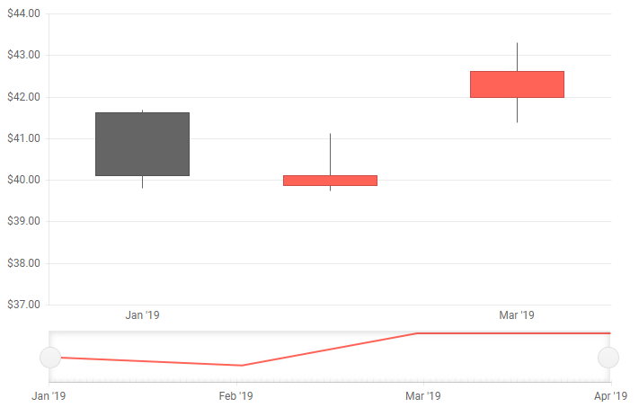

# Stock Chart Overview

The Blazor Stock Chart allows you to visualize the deviation of a financial unit over a period of time to the user in a meaningful way so they can draw conclusions. You can use a variety of chart types and control all aspects of the chart's appearance - from colors and fonts, to paddings, margins, tooltips and templates.

The Telerik Stock Chart provides a [Navigator]() to widen or shorten the defined period of time and zoom on particular part of the chart; and a [crosshair]() to see precise values in data-dense charts.

#### To use the Telerik Stock Chart for Blazor: 

1. add the `TelerikStockChart` tag
2. for [`OHLC`]() and [`Candlestick`]() set the `DateField` parameter of the `TelerikStockChart` to the corresponding property of the model.
3. provide data to the series as described in the [Data binding article]()
4. (optional) enable the [navigator]() by including its `StockChartNavigator` tag and adding a series that mirrors the main chart data to it.

>caption Basic configuration of a Stock Chart with common settings

````CSHTML
@* Basic Stock Chart with common settings and a navigator *@

<TelerikStockChart Width="700px"
                    Height="450px"
                    DateField="@nameof(StockDataPoint.Date)">

    <StockChartCategoryAxes>
        <StockChartCategoryAxis BaseUnit="@ChartCategoryAxisBaseUnit.Months"></StockChartCategoryAxis>
    </StockChartCategoryAxes>

    <StockChartSeriesItems>
        <StockChartSeries Type="StockChartSeriesType.Candlestick"
                            Name="Product 1"
                            Data="@StockChartProduct1Data"
                            OpenField="@nameof(StockDataPoint.Open)"
                            CloseField="@nameof(StockDataPoint.Close)"
                            HighField="@nameof(StockDataPoint.High)"
                            LowField="@nameof(StockDataPoint.Low)">
        </StockChartSeries>
    </StockChartSeriesItems>

    <StockChartNavigator>
        <StockChartNavigatorSeriesItems>
            <StockChartNavigatorSeries Type="StockChartSeriesType.Line"
                                        Name="Product 1"
                                        Data="@StockChartProduct1Data"
                                        Field="@(nameof(StockDataPoint.High))"
                            CategoryField="@(nameof(StockDataPoint.Date))">
            </StockChartNavigatorSeries>
        </StockChartNavigatorSeriesItems>
    </StockChartNavigator>

</TelerikStockChart>

@code {
    public List<StockDataPoint> StockChartProduct1Data { get; set; }

    protected override async Task OnInitializedAsync()
    {
        await GenerateChartData();
    }

    public async Task GenerateChartData()
    {
        StockChartProduct1Data = new List<StockDataPoint>()
        {
            new StockDataPoint(new DateTime(2019, 1, 1), 41.62m, 40.12m, 41.69m, 39.81m, 2632000),
            new StockDataPoint(new DateTime(2019, 2, 1), 39.88m, 40.12m, 41.12m, 39.75m, 3584700),
            new StockDataPoint(new DateTime(2019, 3, 1), 42m, 42.62m, 43.31m, 41.38m, 7631700),
            new StockDataPoint(new DateTime(2019, 4, 1), 42.25m, 43.06m, 43.31m, 41.12m, 4922200),
        };

        await Task.FromResult(StockChartProduct1Data);
    }

    public class StockDataPoint
    {
        public StockDataPoint() { }

        public StockDataPoint(DateTime date, decimal open, decimal close, decimal high, decimal low, int volume)
        {
            Date = date;
            Open = open;
            Close = close;
            High = high;
            Low = low;
            Volume = volume;
        }
        public DateTime Date { get; set; }

        public decimal Open { get; set; }

        public decimal Close { get; set; }

        public decimal High { get; set; }

        public decimal Low { get; set; }

        public int Volume { get; set; }
    }
}
````

>caption The result from the code snippet above




@[template](/_contentTemplates/stockchart/link-to-basics.md#configurable-nested-chart-settings)

>caption Component namespace and reference

````CSHTML
@using Telerik.Blazor.Components

<TelerikStockChart @ref="myStockChartRef">
</TelerikStockChart>

@code {
	Telerik.Blazor.Components.TelerikStockChart myStockChartRef { get; set; }
}
````

## Stock Chart Size

To control the chart size, use its `Width` and `Height` properties. You can read more on how they work in the [Dimensions]() article.

You can also set the chart size in percentage values so it occupies its container when it renderes. If the parent container size changes, you must call the chart's `Refresh()` C# method after the DOM has been redrawn and the new container dimensions are rendered. You can do this when you explicitly change container sizes (like in the example below), or from code that gets called by events like `window.resize`. You can find an example of making charts redraw on `window.resize` in the [Responsive Chart](https://github.com/telerik/blazor-ui/tree/master/chart/responsive-chart) sample.


>caption Change the 100% chart size dynamically to have a responsive chart

````CSHTML
You can make a responsive chart

<TelerikButton OnClick="@ResizeChart">Resize the container and redraw the chart</TelerikButton>

<div style="border: 1px solid red;width:@ContainerWidth; height: @ContainerHeight">

    <TelerikStockChart Width="100%"
                       Height="450px"
                       DateField="@nameof(StockDataPoint.Date)"
                       @ref="myStockChartRef">

        <StockChartCategoryAxes>
            <StockChartCategoryAxis BaseUnit="@ChartCategoryAxisBaseUnit.Months"></StockChartCategoryAxis>
        </StockChartCategoryAxes>

        <StockChartSeriesItems>
            <StockChartSeries Type="StockChartSeriesType.Candlestick"
                              Name="Product 1"
                              Data="@StockChartProduct1Data"
                              OpenField="@nameof(StockDataPoint.Open)"
                              CloseField="@nameof(StockDataPoint.Close)"
                              HighField="@nameof(StockDataPoint.High)"
                              LowField="@nameof(StockDataPoint.Low)">
            </StockChartSeries>
        </StockChartSeriesItems>

        <StockChartNavigator>
            <StockChartNavigatorSeriesItems>
                <StockChartNavigatorSeries Type="StockChartSeriesType.Line"
                                           Name="Product 1"
                                           Data="@StockChartProduct1Data"
                                           Field="@(nameof(StockDataPoint.High))"
                                           CategoryField="@(nameof(StockDataPoint.Date))">
                </StockChartNavigatorSeries>
            </StockChartNavigatorSeriesItems>
        </StockChartNavigator>

    </TelerikStockChart>

</div>

@code {
    Telerik.Blazor.Components.TelerikStockChart myStockChartRef { get; set; }

    string ContainerWidth { get; set; } = "400px";
    string ContainerHeight { get; set; } = "300px";

    public List<StockDataPoint> StockChartProduct1Data { get; set; }

    async Task ResizeChart()
    {
        ContainerHeight = "500px";
        ContainerWidth = "800px";

        await Task.Delay(20);

        myStockChartRef.Refresh();
    }

    protected override async Task OnInitializedAsync()
    {
        await GenerateChartData();
    }

    public async Task GenerateChartData()
    {
        StockChartProduct1Data = new List<StockDataPoint>()
    {
            new StockDataPoint(new DateTime(2019, 1, 1), 41.62m, 40.12m, 41.69m, 39.81m, 2632000),
            new StockDataPoint(new DateTime(2019, 2, 1), 39.88m, 40.12m, 41.12m, 39.75m, 3584700),
            new StockDataPoint(new DateTime(2019, 3, 1), 42m, 42.62m, 43.31m, 41.38m, 7631700),
            new StockDataPoint(new DateTime(2019, 4, 1), 42.25m, 43.06m, 43.31m, 41.12m, 4922200)
        };

        await Task.FromResult(StockChartProduct1Data);
    }

    public class StockDataPoint
    {
        public StockDataPoint() { }

        public StockDataPoint(DateTime date, decimal open, decimal close, decimal high, decimal low, int volume)
        {
            Date = date;
            Open = open;
            Close = close;
            High = high;
            Low = low;
            Volume = volume;
        }
        public DateTime Date { get; set; }

        public decimal Open { get; set; }

        public decimal Close { get; set; }

        public decimal High { get; set; }

        public decimal Low { get; set; }

        public int Volume { get; set; }
    }
}
````

## See Also

  * [Data Binding]()
  * [Crosshair]()
  * [Navigator]()
  * [Live Demos: Stock Chart](https://demos.telerik.com/blazor-ui/stockchart/overview)
  * [API Reference](https://docs.telerik.com/blazor-ui/api/Telerik.Blazor.Components.TelerikStockChart)
