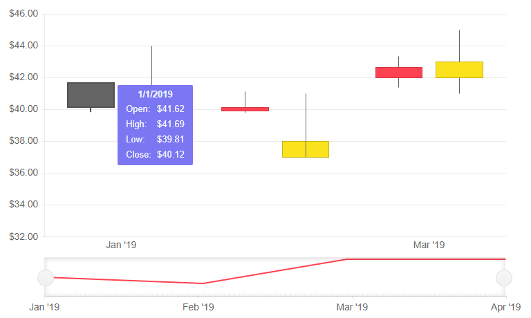
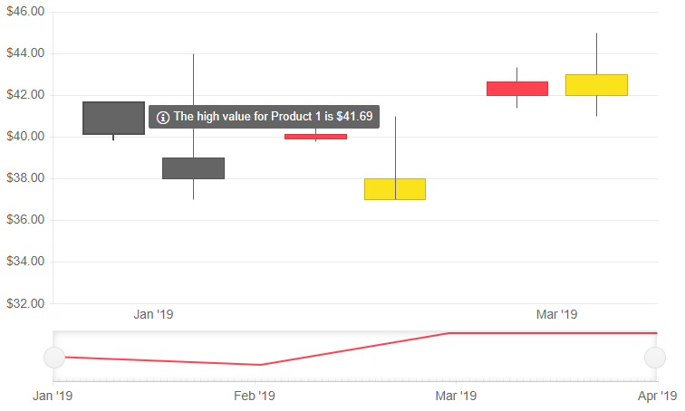

# Tooltip for Telerik Blazor Stock Chart

The Telerik Stock Chart provides a tooltip for its data points. You can have settings specific to each `<StockChartSeries>`, common tooltip settings for all series, or a [shared](slug:stockchart-tooltip-shared) tooltip for all categories.

In this article:

* [Basics](#basics)
* [Common Tooltip](#common-tooltip)
* [Customization](#customization)
	* [Parameter Settings](#parameter-settings)
	* [Template](#template)

## Basics

By default the value of the point will be presented when hovered over.

By default the tooltip for the data points of the Stock Chart are enabled.

To setup tooltips for the data points of each individual series:

1. Inside the `<StockChartSeries>`, include the `<StockChartSeriesTooltip>` tag.
1. Set its `Visible` parameter to `true` or `false`.

>caption Disable the tooltip for a specific series and leave the rest enabled

<demo metaUrl="client/stockchart/tooltip/overview/example-1/" height="520"></demo>

## Common Tooltip

The Chart allows you to enable and define common tooltip settings for all series at once. It looks like the individual tooltips (the value of the point will be presented when hovered over), but you declare it only once.

A tooltip set to a specific `<StockChartSeries>` will take precedence over the common tooltip settings.

To enable the same tooltip for all series:

1. Inside the `<TelerikStockChart>`, add the `<StockChartTooltip>`.
1. Set its `Visible` parameter to `true`.

>caption Set a Common Tooltip for all series at once

<demo metaUrl="client/stockchart/tooltip/overview/example-2/" height="520"></demo>

## Customization

There are two types of customizations you can do for the tooltips:

* [Parameter Settings](#parameter-settings) - lets you alter cosmetic settings such as borders, colors and padding through simple parameters
* [Template](#template) - lets you control the entire content

### Parameter Settings

You can customize the appearance of the individual series tooltip by using:

* `Background` - control the background color by applying a CSS color string, including HEX and RGB. By default the it will match the color for the category.

* `Color` - control the text color by applying a CSS color string, including HEX and RGB.

* Use the [Template](#template) to take control over what is rendered in the tooltip.

>caption Configuration of the tooltips with applied customization settings

<demo metaUrl="client/stockchart/tooltip/overview/example-3/" height="520"></demo>

>caption The result from the code snippet above

#### Common Tooltip Settings

In a similar fashion, you can declare these settings in the common tooltip section:

@[template](/_contentTemplates/stockchart/chart-tooltip-context-templates.md#shared-tooltip-parameter-settings)

* Use the [Template](#template) to take control over what is rendered in the tooltip - the tag name and data it provides is the same as for the specific tooltip, but it affects all series at once.

### Template

The `Template` allows you to take control over the rendering of the tooltip and include additional information to the user.

In the template you can:

* Use business logic and render HTML

* Use the `context` parameter that provides information about the current data point.

The available series data point information in the `context` is:

@[template](/_contentTemplates/stockchart/chart-tooltip-context-templates.md#context-parameter-information)

>caption Use the Tooltip Template and use the DataItem to get the value of the point and add additional information

<demo metaUrl="client/stockchart/tooltip/overview/example-4/" height="520"></demo>

>caption The result from the code snippet above

## See Also

* [Stock Chart Overview](slug:stockchart-overview)
* [Stock Chart Shared Tooltip](slug:stockchart-tooltip-shared)
