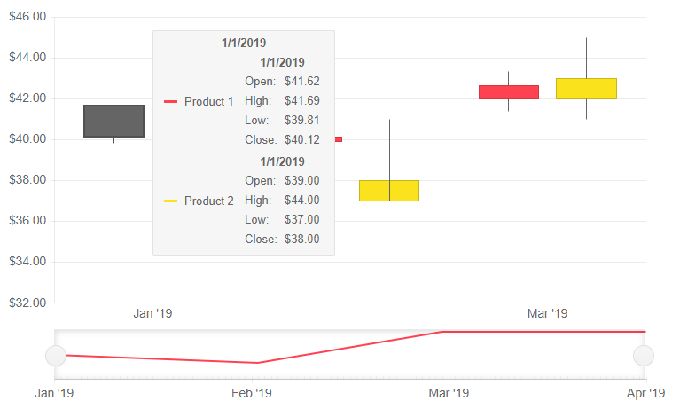
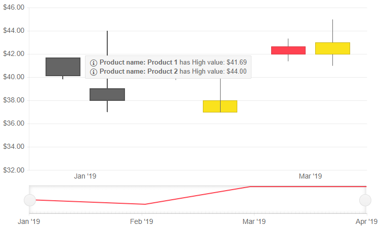

# Shared Tooltip for Telerik Blazor Stock Chart

The Telerik Stock Chart allows you to show a unified tooltip for all categories in the Chart.

In this article:
* [Basics](#basics)
* [Customization](#customization)
 * [Parameter Settings](#parameter-settings)
 * [Shared Template](#shared-template)


## Basics

The shared tooltip provides summarized information of all data points from the hovered category. This tooltip will take precedence over tooltip settings defined for a specific series.

To enable the shared tooltip:

1. Inside the `<TelerikStockChart>` tag, add the `<StockChartTooltip>` tag.
1. Set its `Visible` parameter to `true`.
1. Set its `Shared` parameter to `true`.

>caption Basic configuration of a Stock Chart with Shared Tooltip

````CSHTML
@* This example shows how to enable a Shared Tooltip *@

<TelerikStockChart Width="750px"
                   Height="450px"
                   DateField="@nameof(StockDataPoint.Date)">

    <StockChartTooltip Visible="true" Shared="true"></StockChartTooltip>

    <StockChartCategoryAxes>
        <StockChartCategoryAxis BaseUnit="@ChartCategoryAxisBaseUnit.Months"></StockChartCategoryAxis>
    </StockChartCategoryAxes>

    <StockChartSeriesItems>
        <StockChartSeries Type="StockChartSeriesType.Candlestick"
                          Name="Product 1"
                          Data="@StockChartProduct1Data"
                          OpenField="@nameof(StockDataPoint.Open)"
                          CloseField="@nameof(StockDataPoint.Close)"
                          HighField="@nameof(StockDataPoint.High)"
                          LowField="@nameof(StockDataPoint.Low)">
        </StockChartSeries>

        <StockChartSeries Type="StockChartSeriesType.Candlestick"
                          Name="Product 2"
                          Data="@StockChartProduct2Data"
                          OpenField="@nameof(StockDataPoint.Open)"
                          CloseField="@nameof(StockDataPoint.Close)"
                          HighField="@nameof(StockDataPoint.High)"
                          LowField="@nameof(StockDataPoint.Low)">
        </StockChartSeries>
    </StockChartSeriesItems>

    <StockChartNavigator>
        <StockChartNavigatorSeriesItems>
            <StockChartNavigatorSeries Type="StockChartSeriesType.Line"
                                       Name="Product 1"
                                       Data="@StockChartProduct1Data"
                                       Field="@(nameof(StockDataPoint.High))"
                                       CategoryField="@(nameof(StockDataPoint.Date))">
            </StockChartNavigatorSeries>
        </StockChartNavigatorSeriesItems>
    </StockChartNavigator>

</TelerikStockChart>


@code {
    public List<StockDataPoint> StockChartProduct1Data { get; set; }
    public List<StockDataPoint> StockChartProduct2Data { get; set; }

    protected override async Task OnInitializedAsync()
    {
        await GenerateChartData();
    }

    public async Task GenerateChartData()
    {
        StockChartProduct1Data = new List<StockDataPoint>()
{
            new StockDataPoint(new DateTime(2019, 1, 1), 41.62m, 40.12m, 41.69m, 39.81m, 2632000),
            new StockDataPoint(new DateTime(2019, 2, 1), 39.88m, 40.12m, 41.12m, 39.75m, 3584700),
            new StockDataPoint(new DateTime(2019, 3, 1), 42m, 42.62m, 43.31m, 41.38m, 7631700),
            new StockDataPoint(new DateTime(2019, 4, 1), 42.25m, 43.06m, 43.31m, 41.12m, 4922200)
        };

        StockChartProduct2Data = new List<StockDataPoint>()
{
            new StockDataPoint(new DateTime(2019, 1, 1), 39m, 38m, 44m, 37m, 26320),
            new StockDataPoint(new DateTime(2019, 2, 1), 37m, 38m, 41m, 40m, 35847),
            new StockDataPoint(new DateTime(2019, 3, 1), 42m, 43m, 45m, 41m, 76317),
            new StockDataPoint(new DateTime(2019, 4, 1), 40m, 42m, 43m, 42m, 49222)
        };

        await Task.FromResult(StockChartProduct1Data);
        await Task.FromResult(StockChartProduct2Data);
    }

    public class StockDataPoint
    {
        public StockDataPoint() { }

        public StockDataPoint(DateTime date, decimal open, decimal close, decimal high, decimal low, int volume)
        {
            Date = date;
            Open = open;
            Close = close;
            High = high;
            Low = low;
            Volume = volume;
        }
        public DateTime Date { get; set; }

        public decimal Open { get; set; }

        public decimal Close { get; set; }

        public decimal High { get; set; }

        public decimal Low { get; set; }

        public int Volume { get; set; }
    }
}
````
>caption The result from the code snippet above



## Customization

There are two types of customizations you can do for the tooltips:

* [Parameter Settings](#parameter-settings) - lets you alter cosmetic settings such as borders, colors and padding through simple parameters
* [Shared Template](#shared-template) - lets you control the entire content

### Parameter Settings
You can customize the rendering of the `Shared` tooltip by using:

@[template](/_contentTemplates/stockchart/chart-tooltip-context-templates.md#shared-tooltip-parameter-settings)


### Shared Template

The `SharedTemplate` allows you to control the rendering of the shared tooltip.

In the template you can:

* Use business logic and render HTML

* Use the `context` parameter that provides information about the current category and all data points in it.

The `context` contains the following information:

* `Category` - renders the name of the Category.

* `Points` - a collection of data for each series data point in this category.


Each `Point` contains the following data:

@[template](/_contentTemplates/stockchart/chart-tooltip-context-templates.md#context-parameter-information)


>caption Usage of the SharedTemplate

````CSHTML
@* This example shows how to use the SharedTemplate and extract information on the data points value and get the series name from the context *@

<TelerikStockChart Width="750px"
                   Height="450px"
                   DateField="@nameof(StockDataPoint.Date)">

    <StockChartTooltip Visible="true" Shared="true">
        <SharedTemplate>
            @{
                var points = context.Points;

                foreach (var point in points)
                {
                    <div>
                        <TelerikIcon Icon="@IconName.Information" />
                        <strong>Product name: @point.SeriesName</strong> has
                        High value: @(((point.DataItem as StockDataPoint).High).ToString("C2"))
                    </div>
                }
            }
        </SharedTemplate>
    </StockChartTooltip>

    <StockChartCategoryAxes>
        <StockChartCategoryAxis BaseUnit="@ChartCategoryAxisBaseUnit.Months"></StockChartCategoryAxis>
    </StockChartCategoryAxes>

    <StockChartSeriesItems>
        <StockChartSeries Type="StockChartSeriesType.Candlestick"
                          Name="Product 1"
                          Data="@StockChartProduct1Data"
                          OpenField="@nameof(StockDataPoint.Open)"
                          CloseField="@nameof(StockDataPoint.Close)"
                          HighField="@nameof(StockDataPoint.High)"
                          LowField="@nameof(StockDataPoint.Low)">
        </StockChartSeries>

        <StockChartSeries Type="StockChartSeriesType.Candlestick"
                          Name="Product 2"
                          Data="@StockChartProduct2Data"
                          OpenField="@nameof(StockDataPoint.Open)"
                          CloseField="@nameof(StockDataPoint.Close)"
                          HighField="@nameof(StockDataPoint.High)"
                          LowField="@nameof(StockDataPoint.Low)">
        </StockChartSeries>
    </StockChartSeriesItems>

    <StockChartNavigator>
        <StockChartNavigatorSeriesItems>
            <StockChartNavigatorSeries Type="StockChartSeriesType.Line"
                                       Name="Product 1"
                                       Data="@StockChartProduct1Data"
                                       Field="@(nameof(StockDataPoint.High))"
                                       CategoryField="@(nameof(StockDataPoint.Date))">
            </StockChartNavigatorSeries>
        </StockChartNavigatorSeriesItems>
    </StockChartNavigator>

</TelerikStockChart>

@code {
    public List<StockDataPoint> StockChartProduct1Data { get; set; }
    public List<StockDataPoint> StockChartProduct2Data { get; set; }

    protected override async Task OnInitializedAsync()
    {
        await GenerateChartData();
    }

    public async Task GenerateChartData()
    {
        StockChartProduct1Data = new List<StockDataPoint>()
        {
            new StockDataPoint(new DateTime(2019, 1, 1), 41.62m, 40.12m, 41.69m, 39.81m, 2632000),
            new StockDataPoint(new DateTime(2019, 2, 1), 39.88m, 40.12m, 41.12m, 39.75m, 3584700),
            new StockDataPoint(new DateTime(2019, 3, 1), 42m, 42.62m, 43.31m, 41.38m, 7631700),
            new StockDataPoint(new DateTime(2019, 4, 1), 42.25m, 43.06m, 43.31m, 41.12m, 4922200)
        };

        StockChartProduct2Data = new List<StockDataPoint>()
        {
            new StockDataPoint(new DateTime(2019, 1, 1), 39m, 38m, 44m, 37m, 26320),
            new StockDataPoint(new DateTime(2019, 2, 1), 37m, 38m, 41m, 40m, 35847),
            new StockDataPoint(new DateTime(2019, 3, 1), 42m, 43m, 45m, 41m, 76317),
            new StockDataPoint(new DateTime(2019, 4, 1), 40m, 42m, 43m, 42m, 49222)
        };

        await Task.FromResult(StockChartProduct1Data);
        await Task.FromResult(StockChartProduct2Data);
    }

    public class StockDataPoint
    {
        public StockDataPoint() { }

        public StockDataPoint(DateTime date, decimal open, decimal close, decimal high, decimal low, int volume)
        {
            Date = date;
            Open = open;
            Close = close;
            High = high;
            Low = low;
            Volume = volume;
        }
        public DateTime Date { get; set; }

        public decimal Open { get; set; }

        public decimal Close { get; set; }

        public decimal High { get; set; }

        public decimal Low { get; set; }

        public int Volume { get; set; }
    }
}
````
>caption The result from the code snippet above



## See also

* [Stock Chart Overview]()
* [Stock Chart Tooltip Overview]()
