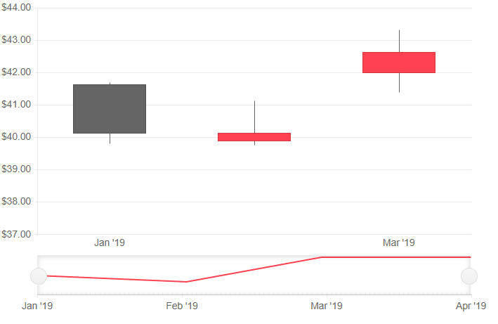

# Candlestick Stock Chart

A **Candlestick** chart shows data for the movement of the price of a financial unit. It consists of a bar (the candle), representing the open and close values, and vertical lines, the candlesticks, which illustrate the highest and lowest values.

>caption OHLC basic setup. Result from the first code snippet below.



@[template](/_contentTemplates/chart/link-to-basics.md#understand-basics-and-databinding-first)

To create a Candlestick chart:

1. set the `DateField` property of the `TelerikStockChart` to the corresponding field in the model that carry the value.
1. add a `StockChartSeries` to the `StockChartSeriesItems` collection.
1. set its `Type` property to `StockChartSeriesType.Candlestick`.
1. provide a data model collection to its `Data` property.
1. set the `OpenField`, `ClosedField`, `HighField` and `LowField` properties to the corresponding fields in the model that carry the values.


>caption A bubble chart that shows projected population change on a plot of life expectancy versus fertility rate

````CSHTML
@* Candlestick stock chart *@

<TelerikStockChart Height="450px"
                   DateField="@nameof(StockDataPoint.Date)">

    <StockChartTitle Text="My">
        <StockChartTitleBorder></StockChartTitleBorder>
        <StockChartTitleBorder></StockChartTitleBorder>
    </StockChartTitle>

    <StockChartLegend></StockChartLegend>

    <StockChartCategoryAxes>
        <StockChartCategoryAxis BaseUnit="@ChartCategoryAxisBaseUnit.Months">
        </StockChartCategoryAxis>
    </StockChartCategoryAxes>

    <StockChartSeriesItems>
        <StockChartSeries Type="StockChartSeriesType.Candlestick"
                          Name="Product 1"
                          Data="@StockChartProduct1Data"
                          OpenField="@nameof(StockDataPoint.Open)"
                          CloseField="@nameof(StockDataPoint.Close)"
                          HighField="@nameof(StockDataPoint.High)"
                          LowField="@nameof(StockDataPoint.Low)">
        </StockChartSeries>
    </StockChartSeriesItems>

</TelerikStockChart>

@code {
    public List<StockDataPoint> StockChartProduct1Data { get; set; }

    protected override async Task OnInitializedAsync()
    {
        await GenerateChartData();
    }

    public async Task GenerateChartData()
    {
        StockChartProduct1Data = new List<StockDataPoint>()
{
            new StockDataPoint(new DateTime(2019, 1, 1), (decimal)41.62, (decimal)40.12, (decimal)41.69, (decimal)39.81, 2632000),
            new StockDataPoint(new DateTime(2019, 2, 1), (decimal)39.88, (decimal)40.12, (decimal)41.12, (decimal)39.75, 3584700),
            new StockDataPoint(new DateTime(2019, 3, 1), (decimal)42, (decimal)42.62, (decimal)43.31, (decimal)41.38, 7631700),
            new StockDataPoint(new DateTime(2019, 4, 1), (decimal)42.25, (decimal)43.06, (decimal)43.31, (decimal)41.12, 4922200),
        };

        await Task.FromResult(StockChartProduct1Data);
    }

    public class StockDataPoint
    {
        public StockDataPoint() { }

        public StockDataPoint(DateTime date, decimal open, decimal close, decimal high, decimal low, int volume)
        {
            Date = date;
            Open = open;
            Close = close;
            High = high;
            Low = low;
            Volume = volume;
        }
        public DateTime Date { get; set; }

        public decimal Open { get; set; }

        public decimal Close { get; set; }

        public decimal High { get; set; }

        public decimal Low { get; set; }

        public int Volume { get; set; }
    }
}
````


## Candlestick Specific Appearance Settings

### DownColor

Set the color - a valid CSS, RGB, RGBA color - of the series when the `OpenField` is greater than the `CloseField` by setting the `DownColor` property of the `StockChartSeries`. This can be passed throught the data model and bound to the `DownColorField`. 

@[template](/_contentTemplates/chart/link-to-basics.md#configurable-nested-chart-settings)

## See Also

  * [Live Demo: Candlestick Stock Chart](https://demos.telerik.com/blazor-ui/chart/todo)
