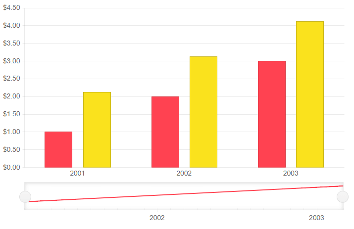

# Column Chart

A **Column** chart displays data as vertical bars whose heights vary according to their value. You can use a Column chart to show a comparison between several sets of data (for example, summaries of sales data for different time periods). Each series is automatically colored differently for easier reading.

>caption Column series in a stock chart. Results from the first code snippet below.



@[template](/_contentTemplates/stockchart/link-to-basics.md#understand-basics-and-databinding-first)

To add a `Column` chart to a stock chart component:

1. add a `StockChartSeries` to the `StockChartSeriesItems` collection
2. set its `Type` property to `ChartSeriesType.Column`
3. provide a data collection to its `Data` property
4. set the `Field` and `CategoryField` properties to the corresponding fields in the model that carry the values.


>caption A column chart that shows product revenues

````CSHTML
Column series

<TelerikStockChart Height="450px"
                   Width="700px">

    <StockChartCategoryAxes>
        <StockChartCategoryAxis BaseUnit="@ChartCategoryAxisBaseUnit.Years">
            <StockChartCategoryAxisLabels Step="1"></StockChartCategoryAxisLabels>
        </StockChartCategoryAxis>
    </StockChartCategoryAxes>

    <StockChartSeriesItems>
        <StockChartSeries Type="StockChartSeriesType.Column"
                          Name="Product 1"
                          Data="@Data"
                          Field="@nameof(ChartSeriesData.Product1Sales)"
                          CategoryField="@nameof(ChartSeriesData.Year)">
        </StockChartSeries>

        <StockChartSeries Type="StockChartSeriesType.Column"
                          Name="Product 1"
                          Data="@Data"
                          Field="@nameof(ChartSeriesData.Product2Sales)"
                          CategoryField="@nameof(ChartSeriesData.Year)">
        </StockChartSeries>
    </StockChartSeriesItems>

    <StockChartNavigator>
        <StockChartNavigatorSeriesItems>
            <StockChartNavigatorSeries Type="StockChartSeriesType.Line"
                                       Name="Product 1"
                                       Data="@Data"
                                       Field="@(nameof(ChartSeriesData.Product1Sales))"
                                       CategoryField="@(nameof(ChartSeriesData.Year))">
            </StockChartNavigatorSeries>
        </StockChartNavigatorSeriesItems>
    </StockChartNavigator>

</TelerikStockChart>

@code {
    public List<ChartSeriesData> Data { get; set; }

    protected override void OnInitialized()
    {
        Data = ChartSeriesData.GenerateData();
    }

    public class ChartSeriesData
    {
        public int Product1Sales { get; set; }
        public double Product2Sales { get; set; }
        public DateTime Year { get; set; }
        public string SegmentName { get; set; }

        public static List<ChartSeriesData> GenerateData()
        {
            List<ChartSeriesData> data = new List<ChartSeriesData>();

            for (int i = 1; i <= 3; i++)
            {
                var dataItem = new ChartSeriesData
                {
                    Product1Sales = i,
                    Product2Sales = i + 1.123,
                    Year = new DateTime(2000 + i, 3, i),
                    SegmentName = $"{i * 100}"
                };

                data.Add(dataItem);
            }

            return data;
        }
    }
}
````

## Column Chart Specific Appearance Settings

### Labels

Each data item is denoted with a label. You can control and customize them through the `<StockChartCategoryAxisLabels />` and its children tags.

* `Visible` - hide all labels by setting this parameter to `false`.
* `Step` - renders every n-th label, where n is the value(double number) passed to the parameter.
* `Skip` - skips the first n labels, where n is the value(double number) passed to the parameter.

### Color

The color of a series is controlled through the `Color` property that can take any valid CSS color (for example, `#abcdef`, `#f00`, or `blue`). The color control the fill color of the area.

@[template](/_contentTemplates/stockchart/link-to-basics.md#color-field-column-ohlc-candlestick)

@[template](/_contentTemplates/stockchart/link-to-basics.md#gap-and-spacing)

@[template](/_contentTemplates/stockchart/link-to-basics.md#configurable-nested-chart-settings)

