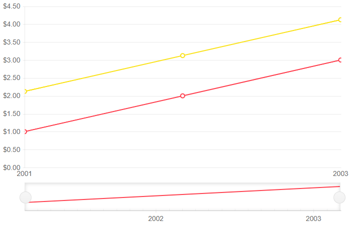

# Line Chart

A **Line** chart displays data as continuous lines that pass through points defined by the values of their items. It is useful for rendering a trend over time and comparing several sets of similar data.

>caption Line chart. Results from the first code snippet below



@[template](/_contentTemplates/stockchart/link-to-basics.md#understand-basics-and-databinding-first)

To create a line chart:

1. add a `StockChartSeries` to the `StockChartSeriesItems` collection
2. set its `Type` property to `ChartSeriesType.Line`
3. provide a data collection to its `Data` property
4. set the `Field` and `CategoryField` properties to the corresponding fields in the model that carry the values.


>caption A line chart that shows product revenues

````CSHTML
Line series

<TelerikStockChart Height="450px"
                   Width="700px">

    <StockChartCategoryAxes>
        <StockChartCategoryAxis BaseUnit="@ChartCategoryAxisBaseUnit.Years"></StockChartCategoryAxis>
    </StockChartCategoryAxes>

    <StockChartSeriesItems>
        <StockChartSeries Type="StockChartSeriesType.Line"
                          Name="Product 1"
                          Data="@Data"
                          Field="@nameof(ChartSeriesData.Product1Sales)"
                          CategoryField="@nameof(ChartSeriesData.Year)">
        </StockChartSeries>

        <StockChartSeries Type="StockChartSeriesType.Line"
                          Name="Product 1"
                          Data="@Data"
                          Field="@nameof(ChartSeriesData.Product2Sales)"
                          CategoryField="@nameof(ChartSeriesData.Year)">
        </StockChartSeries>
    </StockChartSeriesItems>

</TelerikStockChart>

@code {
    public List<ChartSeriesData> Data { get; set; }

    protected override void OnInitialized()
    {
        Data = ChartSeriesData.GenerateData();
    }

    public class ChartSeriesData
    {
        public int Product1Sales { get; set; }
        public double Product2Sales { get; set; }
        public DateTime Year { get; set; }
        public string SegmentName { get; set; }

        public static List<ChartSeriesData> GenerateData()
        {
            List<ChartSeriesData> data = new List<ChartSeriesData>();

            for (int i = 1; i <= 3; i++)
            {
                var dataItem = new ChartSeriesData
                {
                    Product1Sales = i,
                    Product2Sales = i + 1.123,
                    Year = new DateTime(2000 + i, 3, i),
                    SegmentName = $"{i * 100}"
                };

                data.Add(dataItem);
            }

            return data;
        }
    }
}
````

## Line Chart Specific Appearance Settings

@[template](/_contentTemplates/stockchart/link-to-basics.md#configurable-nested-chart-settings)

## See Also

  * [Live Demo: Line Chart](https://demos.telerik.com/blazor-ui/chart/line-chart)
