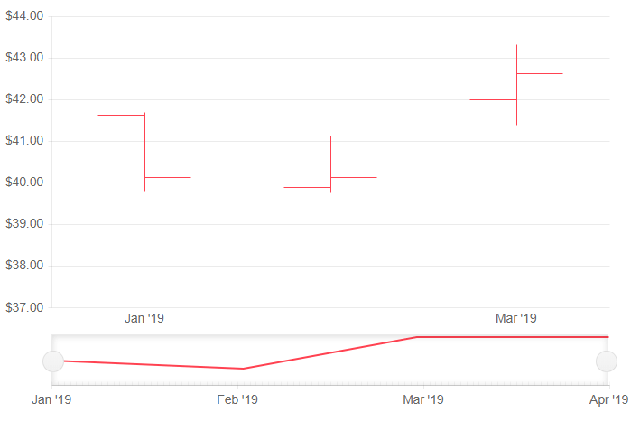

# OHLC Stock Chart

The **OHLC** (open-high-low-close) chart is typically used to illustrate movements in the price of a financial instrument over time. Each vertical line on the chart shows the price range (the highest and lowest prices) over a period of time.

>caption OHLC series in a stock chart. Results from the first code snippet below.



@[template](/_contentTemplates/stockchart/link-to-basics.md#understand-basics-and-databinding-first)

To add a `OHLC` chart to a stock chart component:

1. set the `DateField` property of the `<TelerikStockChart>` to the corresponding field in the model that carry the value.
1. add a `<StockChartSeries>` to the `<StockChartSeriesItems>` collection.
1. set its `Type` property to `StockChartSeriesType.OHLC`.
1. provide a data model collection to its `Data` property.
1. set the `OpenField`, `ClosedField`, `HighField` and `LowField` properties to the corresponding fields in the model that carry the values.

>caption An OHLC chart that shows the deviation of stocks

````CSHTML
@* OHLC stock chart *@

<TelerikStockChart Height="450px"
                   Width="700px"
                   DateField="@nameof(StockDataPoint.Date)">

    <StockChartCategoryAxes>
        <StockChartCategoryAxis BaseUnit="@ChartCategoryAxisBaseUnit.Months"></StockChartCategoryAxis>
    </StockChartCategoryAxes>

    <StockChartSeriesItems>
        <StockChartSeries Type="StockChartSeriesType.OHLC"
                          Name="Product 1"
                          Data="@StockChartProduct1Data"
                          OpenField="@nameof(StockDataPoint.Open)"
                          CloseField="@nameof(StockDataPoint.Close)"
                          HighField="@nameof(StockDataPoint.High)"
                          LowField="@nameof(StockDataPoint.Low)">
        </StockChartSeries>
    </StockChartSeriesItems>

    <StockChartNavigator>
        <StockChartNavigatorSeriesItems>
            <StockChartNavigatorSeries Type="StockChartSeriesType.Line"
                                       Name="Product 1"
                                       Data="@StockChartProduct1Data"
                                       Field="@(nameof(StockDataPoint.High))"
                                       CategoryField="@(nameof(StockDataPoint.Date))">
            </StockChartNavigatorSeries>
        </StockChartNavigatorSeriesItems>
    </StockChartNavigator>

</TelerikStockChart>

@code {
    public List<StockDataPoint> StockChartProduct1Data { get; set; }

    protected override async Task OnInitializedAsync()
    {
        await GenerateChartData();
    }

    public async Task GenerateChartData()
    {
        StockChartProduct1Data = new List<StockDataPoint>()
        {
            new StockDataPoint(new DateTime(2019, 1, 1), 41.62m, 40.12m, 41.69m, 39.81m, 2632000),
            new StockDataPoint(new DateTime(2019, 2, 1), 39.88m, 40.12m, 41.12m, 39.75m, 3584700),
            new StockDataPoint(new DateTime(2019, 3, 1), 42m, 42.62m, 43.31m, 41.38m, 7631700),
            new StockDataPoint(new DateTime(2019, 4, 1), 42.25m, 43.06m, 43.31m, 41.12m, 4922200)
        };

        await Task.FromResult(StockChartProduct1Data);
    }

    public class StockDataPoint
    {
        public StockDataPoint() { }

        public StockDataPoint(DateTime date, decimal open, decimal close, decimal high, decimal low, int volume)
        {
            Date = date;
            Open = open;
            Close = close;
            High = high;
            Low = low;
            Volume = volume;
        }
        public DateTime Date { get; set; }

        public decimal Open { get; set; }

        public decimal Close { get; set; }

        public decimal High { get; set; }

        public decimal Low { get; set; }

        public int Volume { get; set; }
    }
}
````

## OHLC Chart Specific Appearance Settings

@[template](/_contentTemplates/stockchart/link-to-basics.md#color-field-column-ohlc-candlestick)

@[template](/_contentTemplates/stockchart/link-to-basics.md#gap-and-spacing)

@[template](/_contentTemplates/chart/link-to-basics.md#configurable-nested-chart-settings)


