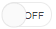
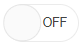
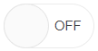
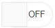
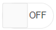
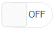

# Appearance Settings

You can control the appearance of the RadioButtonGroup button by setting the following attribute:

* [Size](#size)
* [ThumbRounded](#thumbrounded)
* [TrackRounded](#trackrounded)


## Size

You can increase or decrease the size of the Switch by setting the `Size` attribute to a member of the `Telerik.Blazor.ThemeConstants.Switch.Size` class:

| Class members | Result |
|---------------|--------|
|`Small`||
|`Medium`||
|`Large` ||

>caption The built-in sizes

````CSHTML
@{
    var fields = typeof(Telerik.Blazor.ThemeConstants.Switch.Size)
        .GetFields(System.Reflection.BindingFlags.Public | System.Reflection.BindingFlags.Static
        | System.Reflection.BindingFlags.FlattenHierarchy)
        .Where(field => field.IsLiteral && !field.IsInitOnly).ToList();


    @foreach (var field in fields)
    {
        string size = field.GetValue(null).ToString();

        <div style="float:left; margin: 20px;">
            <TelerikSwitch @bind-Value="@isSelected" Size="@size"></TelerikSwitch>
        </div>
    }
}

@code{
    private bool isSelected { get; set; }
}
````

## ThumbRounded

The `ThumbRounded` attribute applies the `border-radiums` CSS rule to the thumb of the switch to achieve curving of the edges. You can set it to a member of the `Telerik.Blazor.ThemeConstants.Switch.ThumbRounded` class:

| Class members | Result |
|------------|--------|
|`Small` ||
|`Medium`||
|`Large`||
|`Full`||

>caption The built-in values of the ThumbRounded attribute

````CSHTML
@* The built-in values of the ThumbRounded attribute.  *@

@{
    var fields = typeof(Telerik.Blazor.ThemeConstants.Button.Rounded)
        .GetFields(System.Reflection.BindingFlags.Public | System.Reflection.BindingFlags.Static
        | System.Reflection.BindingFlags.FlattenHierarchy)
        .Where(field => field.IsLiteral && !field.IsInitOnly).ToList();

    foreach (var field in fields)
    {
        string rounded = field.GetValue(null).ToString();

        <div style="float:left; margin: 20px;">
            <TelerikButton Rounded="@rounded">@rounded</TelerikButton>
        </div>
    }
}
````

## TrackRounded

The `TrackRounded` attribute applies the `border-radiums` CSS rule to the track of the switch to achieve curving of the edges. You can set it to a member of the `Telerik.Blazor.ThemeConstants.Switch.TrackRounded` class:

| Class members | Result |
|------------|--------|
|`Small` ||
|`Medium`||
|`Large`||
|`Full`||

>caption The built-in values of the ThumbRounded attribute

````CSHTML
@* The built-in values of the ThumbRounded attribute.  *@

@{
    var fields = typeof(Telerik.Blazor.ThemeConstants.Button.Rounded)
        .GetFields(System.Reflection.BindingFlags.Public | System.Reflection.BindingFlags.Static
        | System.Reflection.BindingFlags.FlattenHierarchy)
        .Where(field => field.IsLiteral && !field.IsInitOnly).ToList();

    foreach (var field in fields)
    {
        string rounded = field.GetValue(null).ToString();

        <div style="float:left; margin: 20px;">
            <TelerikButton Rounded="@rounded">@rounded</TelerikButton>
        </div>
    }
}
````

