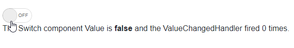
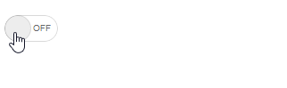

# Events

This article showcases the available events in the Telerik Switch component:

* [ValueChanged](#valuechanged)
* [OnChange](#onchange)
* [OnBlur](#onblur)

## ValueChanged

The `ValueChanged` event fires every time the `Value` parameter changes.

>caption Handle ValueChanged

````CSHTML
@* This example showcases one-way data binding by using Value and ValueChanged *@

<TelerikSwitch Value="@toggleSwitch" 
               ValueChanged="@((bool val) => ValueChangedHandler(val))">
</TelerikSwitch>

<div>
    The Switch component Value is <strong>@toggleSwitch</strong> and the ValueChangedHandler fired @Count @(Count == 1 ? "time" : "times").
</div>

@code {
    public bool toggleSwitch { get; set; }
    public int Count { get; set; }

    public bool ValueChangedHandler(bool value)
    {
        Count++;
        return toggleSwitch = value;
    }
}
````

>caption The result from the code snippet above



@[template](/_contentTemplates/common/general-info.md#event-callback-can-be-async)

@[template](/_contentTemplates/common/issues-and-warnings.md#valuechanged-lambda-required)

## OnChange

The `OnChange` event fires every time the `Value` parameter changes. The key difference between `ValueChanged` is that `OnChange` does not prevent two-way data binding (using the `@bind-Value` syntax).

>caption Handle OnChange

````CSHTML
@*This example showcases the usage of OnChange event in conjunction with two-way data binding*@

<TelerikSwitch @bind-Value="@toggleSwitch"
               OnChange="@OnChangeHandler">
</TelerikSwitch>

<div>
    @Result
</div>

@code {
    public bool toggleSwitch { get; set; }
    public string Result { get; set; }

    public void OnChangeHandler(object value)
    {
        bool userInput = (bool)value;

        Result = $"The OnChange event was fired with {userInput.ToString().ToLowerInvariant()}.";
    }
}
````

>caption The result from the code snippet above




## OnBlur

The `OnBlur` event fires when the component loses focus.

>caption Handle the OnBlur event

````CSHTML
@* You do not have to use OnChange to react to loss of focus *@

<TelerikSwitch @bind-Value="@TheValue"
                 OnBlur="@OnBlurHandler">
</TelerikSwitch>

@code{
    async Task OnBlurHandler()
    {
        Console.WriteLine($"BLUR fired, current value is {TheValue}.");
    }

    bool TheValue { get; set; }
}
````

