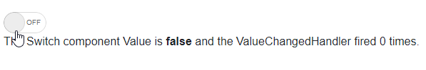
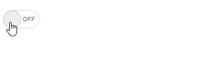

# Events

This article showcases the available events in the Telerik Switch component:

* [ValueChanged](#valuechanged)
* [OnChange](#onchange)
* [OnBlur](#onblur)

## ValueChanged

The `ValueChanged` event fires every time the `Value` parameter changes.

>caption Handle ValueChanged

<demo metaUrl="client/switch/events/value-changed/" height="250"></demo>

>caption The result from the code snippet above

@[template](/_contentTemplates/common/general-info.md#event-callback-can-be-async)

@[template](/_contentTemplates/common/issues-and-warnings.md#valuechanged-lambda-required)

## OnChange

The `OnChange` event fires every time the `Value` parameter changes. The key difference between `ValueChanged` is that `OnChange` does not prevent two-way data binding (using the `@bind-Value` syntax).

>caption Handle OnChange

<demo metaUrl="client/switch/events/on-change/" height="220"></demo>

>caption The result from the code snippet above

## OnBlur

The `OnBlur` event fires when the component loses focus.

>caption Handle the OnBlur event

<demo metaUrl="client/switch/events/on-blur/" height="220"></demo>

