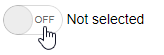
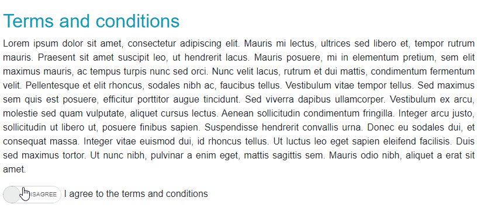

# Switch Overview

The Switch allows the user to toggle between checked and unchecked states.

To use a Telerik Switch for Blazor

1. add the `TelerikSwitch` tag
1. provide `Value` (one-way data binding) or `bind-Value` (two-way data binding) property


>caption Basic setup of the Telerik Switch using two-way data binding

````CSHTML
@* Basic setup of the Telerik Switch Component, the label is not required *@

<TelerikSwitch Id="mySwitch" @bind-Value="@isSelected" />
<label for="mySwitch">@( isSelected ? "Selected" : "Not selected" )</label>

@code {
    private bool isSelected { get; set; }
}
````

>caption The result from the code snippet above



## Features

The Switch provides the following features:

* `Class` - the CSS class that will be rendered on the main wrapping element of the Switch.

* `Enabled` - whether the component is enabled.

* `Id` - renders as the `id` attribute on the `<input />` element, so you can attach a `<label for="">` to it.

* `TabIndex` - the `tabindex` attribute rendered on the Switch.

* `Value` and `bind-Value` -  accept `bool` and `bool?` data types.

* `OnLabel` - the label of the component when the `Value` is `true`.

* `OffLabel` - the label of the component when the `Value` is `false`.

* Events - see the [Switch events]() article for more information and examples.

* Validation - see the [Input Validation]() article for more details.

## Component Reference

The Switch is a generic component and its type comes from the model field it is bound to - it is either `bool` or `bool?` (a `null` value is treated as `false`).

>caption Switch Reference

````CSHTML
@* The Switch reference type comes from its Value type *@

<TelerikSwitch @bind-Value="@toggleSwitch" @ref="@TheSwitchRef" />

@code{
    bool toggleSwitch { get; set; } // the type of this field determines the type of the reference
    TelerikSwitch<bool> TheSwitchRef { get; set; }
}
````

## Examples

This section shows the following two examples

* [Remove Labels](#remove-labels)
* [Custom Labels and Size](#custom-labels-and-size)


### Remove Labels

>caption Switch without labels

````CSHTML
@* Use a blank space to remove visible labels *@

<TelerikSwitch @bind-Value="@isSelected" OnLabel=" " OffLabel=" " />

@code {
    private bool isSelected { get; set; }
}
````

### Custom Labels and Size

The example below shows how to:

* Bind the switch to a value
* Set custom labels for its On and Off states
* Use its `Class` to set a width that can accommodate long labels

>caption Example that showcases the "I agree to the terms and conditions" basic scenario

````CSHTML
@* Use the OnLabel and OffLabel to customize the labels of the Switch. Use the Class parameter to manipulate the width of the component. *@ 

<style>
    .k-switch.mySwitchClass{
        width:100px;
    }
</style>

<h2 class="text-info">Terms and conditions</h2>

@if (hasAgreed)
{
    <div class="alert alert-success w-50">
        Thank you for agreeing to our terms and conditions!
    </div>
}
else
{
    <p class="w-50 text-justify">
        Lorem ipsum dolor sit amet, consectetur adipiscing elit. Mauris mi lectus, ultrices sed libero et, tempor rutrum mauris. Praesent sit amet suscipit leo, ut hendrerit lacus. Mauris posuere, mi in elementum pretium, sem elit maximus mauris, ac tempus turpis nunc sed orci. Nunc velit lacus, rutrum et dui mattis, condimentum fermentum velit. Pellentesque et elit rhoncus, sodales nibh ac, faucibus tellus. Vestibulum vitae tempor tellus. Sed maximus sem quis est posuere, efficitur porttitor augue tincidunt. Sed viverra dapibus ullamcorper. Vestibulum ex arcu, molestie sed quam vulputate, aliquet cursus lectus. Aenean sollicitudin condimentum fringilla. Integer arcu justo, sollicitudin ut libero ut, posuere finibus sapien. Suspendisse hendrerit convallis urna.
        Donec eu sodales dui, et consequat massa. Integer vitae euismod dui, id rhoncus tellus. Ut luctus leo eget sapien eleifend facilisis. Duis sed maximus tortor. Ut nunc nibh, pulvinar a enim eget, mattis sagittis sem. Mauris odio nibh, aliquet a erat sit amet.
    </p>
}

<TelerikSwitch @bind-Value="@hasAgreed" 
               Id="mySwitch"
               OnLabel="@myOnLabel"
               OffLabel="@myOffLabel"
               Class="mySwitchClass"></TelerikSwitch>
<label for="mySwitch">I agree to the terms and conditions</label>

@code {
    public bool hasAgreed { get; set; }
    public string myOnLabel { get; set; } = "Agree";
    public string myOffLabel { get; set; } = "Disagree";
}
````
>caption The result from the code snippet above




## See Also
* [Live Demo: Switch](https://demos.telerik.com/blazor-ui/switch/overview)
* [Switch Events]()

