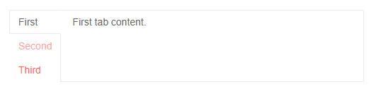

# Tab Strip Overview

This article provides information about the Tab Strip component and its core features.

The Tab Strip is defined through the `<TelerikTabStrip>` tag that accepts children of type `<TabStripTab>`. Inside the tabs you can add content like in any other container, including other components.

The tab exposes a `Title` attribute that is the text rendered in the heading. It also offers the `Disabled` attribute that allows you to disable its selection.

The `ActiveTabIndex` parameter lets you get and set the currently shown tab index through two-way binding, and also provides an event for the tab change. To deactivate all tabs, set it to `-1`.

To control the position of the tab titles, the main tab strip tag exposes the optional `TabPosition` attribute that takes a member of the `Telerik.Blazor.TabPosition` enumeration:

* `Top` (default)
* `Left`
* `Right`
* `Bottom`

>caption A Telerik Tab Strip with example reference, tab position and disabled tab

````CSHTML
@using Telerik.Blazor.Components

<TelerikTabStrip TabPosition="Telerik.Blazor.TabPosition.Left" @ref="myTabStrip">
	<TabStripTab Title="First">
		First tab content.
	</TabStripTab>
	<TabStripTab Title="Second" Disabled="true">
		Second tab content. This tab is disabled and you cannot select it.
	</TabStripTab>
	<TabStripTab Title="Third">
		Third tab content.
	</TabStripTab>
</TelerikTabStrip>

@code {
	Telerik.Blazor.Components.TelerikTabStrip myTabStrip;
}
````

>caption The result from the code snippet above



>caption Get and set the selected tab index

````CSHTML
Active Tab Index: @ActiveTabIndex

<TelerikTabStrip @bind-ActiveTabIndex="@ActiveTabIndex">
	<TabStripTab Title="First">
		First tab content.
	</TabStripTab>
	<TabStripTab Title="Second">
		Second tab content. I will be active initially due to the default value of the parameter.
        <br />
        <TelerikButton OnClick="@SelectThirdTab">Select Third Tab</TelerikButton>
	</TabStripTab>
	<TabStripTab Title="Third">
		Third tab content.
	</TabStripTab>
</TelerikTabStrip>

@code {
	public int ActiveTabIndex { get; set; } = 1;

    void SelectThirdTab()
    {
        ActiveTabIndex = 2;
    }
}
````


>caption Extract information for the currently selected tab from your model. Alter the model to affect the tab strip. Create tabs dynamically based on external data.

````CSHTML
@result

<TelerikTabStrip ActiveTabIndexChanged="@TabChangedHandler">
    @{
        foreach (MyTabModel item in tabs)
        {
            <TabStripTab Title="@item.Title" Disabled="@item.Disabled">
                Content for tab @item.Title
            </TabStripTab>
        }
    }
</TelerikTabStrip>

<TelerikButton OnClick="@( () => tabs[1].Disabled = !tabs[1].Disabled )">Toggle the Disabled state of the second tab</TelerikButton>

@code {
    MarkupString result { get; set; }
    void TabChangedHandler(int newIndex)
    {
        string tempResult = $"current tab {newIndex} selected on {DateTime.Now}";
        MyTabModel currTab = tabs[newIndex];
        tempResult += $"<br />the new tab has a title {currTab.Title}";
        result = new MarkupString(tempResult);
    }

    List<MyTabModel> tabs = new List<MyTabModel>()
    {
        new MyTabModel { Title = "One" },
        new MyTabModel { Title = "Two", Disabled = true },
        new MyTabModel { Title = "Three" }
    };

    public class MyTabModel
    {
        public string Title { get; set; }
        public bool Disabled { get; set; }
    }
}
````

>tip If you render components in the tabs created in a `foreach` loop, you may want to set their `@key` parameter to unique values, in order to ensure they will re-render. If you do not, the framework will render one instance of your custom component for all tabs and will only set its parameters, it will not initialize anew (`OnInitialized` will not fire a second time, only `OnParametersSet` will).

## See Also

  * [Live Demo: TabStrip](https://demos.telerik.com/blazor-ui/tabstrip/index)
  * [Live Demo: Tab Position](https://demos.telerik.com/blazor-ui/tabstrip/tabposition)
  * [Events]()
  * [API Reference](https://docs.telerik.com/blazor-ui/api/Telerik.Blazor.Components.TelerikTabStripBase)
