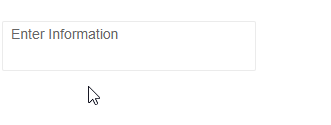

# TextArea Overview

The Telerik TextArea for Blazor is a highly customizable multi-line text input area. It provides features like auto resizing based on the user input, floating label functionality and [events]() to respond to user actions.

## Basic TextArea

To use the Telerik TextArea in your Blazor application:
* add the `<TelerikTextArea>` tag.
* set its `Value` (one and two-way data binding applicable) parameter to a string property.

>caption Basic TextArea with two-way value binding

````CSHTML
<TelerikTextArea @bind-Value="@TextAreaValue" 
                 Label="Enter Information" 
                 AutoSize="true">
</TelerikTextArea>

<br />

@TextAreaValue

@code {
    public string TextAreaValue { get; set; }
}
````



>caption Component namespace and reference

````CSHTML
<TelerikTextArea @bind-Value="@TextAreaValue" @ref="@TextAreaRef"></TelerikTextArea>


@code {
    public Telerik.Blazor.Components.TelerikTextArea TextAreaRef { get; set; }
    public string TextAreaValue { get; set; }
}
````

## Features

* `AutoComplete` - `bool`, defaults to `false` - maps to the autocomplete attribute of the HTML `<textarea>`.

* `AutoSize` - `bool`, defaults to `false` - specifies if the TextArea will adjust its height based on the user input.

* `Class` - the CSS class that will be rendered on the main wrapping element.

* `Enabled` - `bool`, defaults to `true` - whether the TextArea is enabled.

* `Id` - renders as the `id` attribute on the `<textarea>` element, so you can attach a `<label for="">`.

* `Label` - the `label` element rendered next to the `<textarea>` to provide the user with information on its purpose. It covers the input in a fashion similar to a placeholder, and floating animation upwards on focus. If you don't want this effect or the height increase it causes, use the `Id` parameter to attach your own `<label>` tag.

* `Name` - the `name` attribute of the HTML element. It is usually required so the `AutoComplete` will be honored by the browser.

* `PlaceHolder` - a `string` that maps to the `placeholder` attribute of the HTML element. If a `Label` is defined, it will be shown instead of the placeholder when the input is not focused.

* `TabIndex` - maps to the `tabindex` attribute of the HTML element. You can use it to customize the order in which the inputs in your form focus with the `Tab` key.

* `Title` - maps to the `title` attribute of the HTML element. You can use it to add a [tooltip]().

* `Value` - get/set the value of the input, can be used for binding.

* `Width` - the width of the `<textarea>`. You can find more information in the [Dimensions]() article.

* Events - see the [Events]() article for more information.

* Validation - see the [Input Validation]() article.

>caption TextArea with its most common features and symbols counter

````CSHTML
<label for="myCustomTextAreaId">My Telerik TextArea</label>
<TelerikTextArea @bind-Value="@TextAreaValue"
                 Id="myCustomTextAreaId"
                 Name="myCustomTextAreaId"
                 PlaceHolder="Enter some Information"
                 AutoComplete="true"
                 TabIndex="2"
                 AutoSize="true">
</TelerikTextArea>

<div class="k-counter-container">
    <span>@TextAreaValue.Count()</span><span>/200</span>
</div>

<br />

@TextAreaValue

@code {
    public string TextAreaValue { get; set; } = String.Empty;
}
````

## See Also

  * [Live Demo: TextArea](https://demos.telerik.com/blazor-ui/textarea/index)
  * [Live Demo: TextArea Validation](https://demos.telerik.com/blazor-ui/textarea/validation)
  * [Input Validation]()
  * [API Reference](https://docs.telerik.com/blazor-ui/api/Telerik.Blazor.Components.TextArea)
