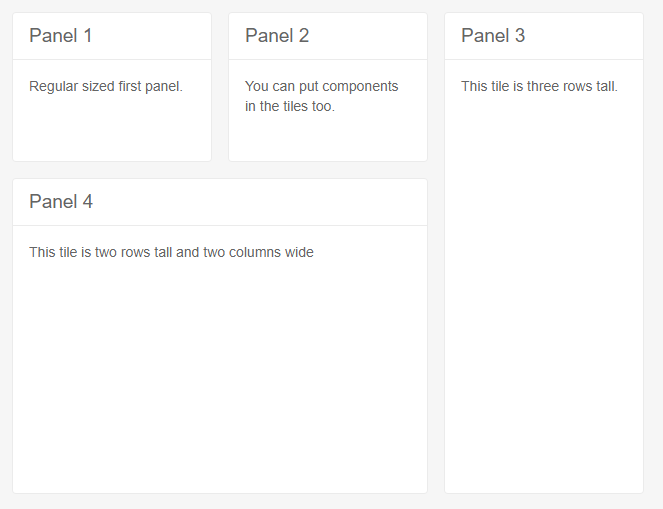
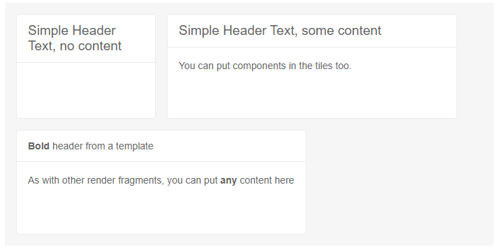
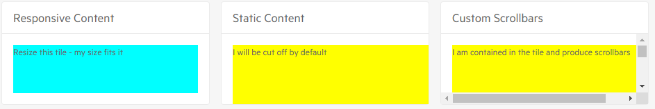

# TileLayout Overview

The <a href = "https://www.telerik.com/blazor-ui/tilelayout" target="_blank">Blazor TileLayout</a> is based on the two-dimensional <a href="https://css-tricks.com/snippets/css/complete-guide-grid/" target="_blank">CSS grid</a> and is able to display content in tiles. They can be dragged around and [rearranged]() as desired by the user. The tiles can be [resized]() to change the way they span across the rows and columns too. This allows you to build customizable dashboards for your end users whose [state]() they can save.

#### This article contains the following sections:

- [TileLayout Overview](#tilelayout-overview)
      - [This article contains the following sections:](#this-article-contains-the-following-sections)
  - [First Steps](#first-steps)
  - [Component Reference](#component-reference)
  - [Appearance Settings](#appearance-settings)
    - [Main Element](#main-element)
    - [Individual Tiles](#individual-tiles)
  - [Tile Contents](#tile-contents)
    - [Content Scrollbars](#content-scrollbars)
  - [See Also](#see-also)

## First Steps

To create a basic dashboard with the TileLayout component:

1. Add the `TelerikTileLayout` tag.

1. Set the desired number of `Columns` for the layout.

    * Optionally, configure the `Width`, `Height`, `ColumnWidth` and/or `RowHeight` to define the desired dimensions for the layout and the base size for the individual tiles. Read more in the [Appearance Settings](#appearance-settings) section below.

1. Under its `TileLayoutItems` tag, add `TileLayoutItem` instances whose `Content` tag you can populate with the desired [content](#tile-contents).

    * Optionally, set the `RowSpan` and `ColSpan` parameters of the tiles to values larger than `1` to increase their size in the grid.

1. Optionally, set the `Resizable` and `Reorderable` parameters to `true` to allow the user to alter the layout. Read more about storing it in the [State]() article.

>caption Basic Tile Layout with its core features

````CSHTML
<TelerikTileLayout Columns="3"
                   ColumnWidth="200px"
                   RowHeight="150px"
                   Resizable="true"
                   Reorderable="true">
    <TileLayoutItems>
        <TileLayoutItem HeaderText="Panel 1">
            <Content>Regular sized first panel.</Content>
        </TileLayoutItem>
        <TileLayoutItem HeaderText="Panel 2">
            <Content>You can put components in the tiles too.</Content>
        </TileLayoutItem>
        <TileLayoutItem HeaderText="Panel 3" RowSpan="3">
            <Content>This tile is three rows tall.</Content>
        </TileLayoutItem>
        <TileLayoutItem HeaderText="Panel 4" RowSpan="2" ColSpan="2">
            <Content>This tile is two rows tall and two columns wide</Content>
        </TileLayoutItem>
    </TileLayoutItems>
</TelerikTileLayout>
````

>caption The result from the code snippet above



## Component Reference

You can use the component reference to get or set its [state]().

````CSHTML
<TelerikTileLayout @ref="@TileLayoutRef"
                   Columns="3">
    <TileLayoutItems>
        <TileLayoutItem HeaderText="Panel 1">
            <Content>Regular sized first panel.</Content>
        </TileLayoutItem>
        <TileLayoutItem HeaderText="Panel 2">
            <Content>You can put components in the tiles too.</Content>
        </TileLayoutItem>
        <TileLayoutItem HeaderText="Panel 3" RowSpan="3">
            <Content>This tile is three rows tall.</Content>
        </TileLayoutItem>
        <TileLayoutItem HeaderText="Panel 4" RowSpan="2" ColSpan="2">
            <Content>This tile is two rows tall and two columns wide</Content>
        </TileLayoutItem>
    </TileLayoutItems>
</TelerikTileLayout>

@code{
    TelerikTileLayout TileLayoutRef { get; set; }
}
````

## Appearance Settings

We recommend that you get familiar with the concept of a [CSS Grid Layout](https://css-tricks.com/snippets/css/complete-guide-grid/) first - the TileLayout component is based on it as underlying implementation and core properties.

The main feature that the component exposes are divided into two levels:

* [Main Element](#main-element)
* [Individual Tiles](#individual-tiles)

### Main Element

The main element defines the number of `Columns`, the `Width` and `Height` of the layout, as well as the `ColumnWidth` and `RowHeight`. 

The `ColumnWidth` and `RowHeight` define the maximum dimensions for each column and row of the main layout. As the overall component dimensions change (e.g., because of different viewports), the column and row heights might decrease to provide even distribution. A single tile can span more than one column or row.

Generally, you should use settings that allow the desired number of columns and rows (depending on their width and height) to fit in the set width and height of the entire component.

You do not, however, have to set `Width` and `Height` - the main measure is the `Columns` and it will suffice to create a layout.

Since the Tile Layout is a block element, its width defaults to `auto` in the browser, and the actual width is distributed evenly between the number of `Columns`. Setting `Height="100%"` can let the component take up its parent dimensions in terms of height as well.

If the width and height dimensions are insufficient to accommodate the defined row height and column width that the current tiles create, the actual row height and/or column width will decrease so that the appointed number of columns fit in the available width and the existing number of rows fit in the available height.

`Columns`, `Width` and `Height`  have no default values.

`ColumnWidth` and `RowHeight` default to `1fr`. Thus, you may want to omit setting a `ColumnWidth` in order to get a more responsive (fluid) layout - all columns will then have the same width - a fraction of the total width.

There are two other settings you should take into account if you set explicit dimensions to the main element - the `ColumnSpacing` and `RowSpacing` - they are CSS units that define the gaps between the individual columns and rows and count towards the total dimensions of the component. They default to `16px`.

Lastly, you can also set the `Class` parameter that renders at the main wrapping element of the tile layout so you can cascade custom CSS rules through it.

### Individual Tiles

Each tile provides settings that define how many columns and rows its takes up - the `ColSpan` and `RowSpan` parameters. It also provides a `Class` parameter so you can cascade CSS rules through it.

The largest `ColSpan` any tile has determines the lowest number of `Columns` the entire layout will actually have - for example, if you have a tile with `ColSpan=2` and `Columns=1`, there will still be two columns.

@[template](/_contentTemplates/tilelayout/basics.md#resizing-reordering-logic)

## Tile Contents

To set the tile contents, you have the following options:

* The `HeaderText` is a parameter on the individual tile that renders a simple string in its header portion.

* The `HeaderTemplate` tag lets you define custom content, including components, in the header portion of the tile.

* The `Content` is a `RenderFragment` where you put the content of the tiles - it can range from simple text, to comlex components.

>caption Examples of setting content in tiles

````CSHTML
<TelerikTileLayout ColumnWidth="200px"
                   RowHeight="150px"
                   Width="700px"
                   Columns="3"
                   Resizable="true"
                   Reorderable="true">
    <TileLayoutItems>
        <TileLayoutItem HeaderText="Simple Header Text, no content">
        </TileLayoutItem>
        <TileLayoutItem HeaderText="Simple Header Text, some content" ColSpan="2">
            <Content>You can put components in the tiles too.</Content>
        </TileLayoutItem>
        <TileLayoutItem ColSpan="2">
            <HeaderTemplate>
                <strong>Bold</strong> header from a template
            </HeaderTemplate>
            <Content><p>As with other render fragments, you can put <strong>any</strong> content here</p></Content>
        </TileLayoutItem>
    </TileLayoutItems>
</TelerikTileLayout>
````

>caption The result from the code snippet above




### Content Scrollbars

The Tile Layout component targets modern web development and thus - responsive dimensions for the content. Therefore, we expect that most content will have `width: 100%; height: 100%;` so that it can stretch according to the size of the tile that the end user chooses.

If you want to change that (for example, because you have certain content that requires dimensions set in `px`), you can use the `Class` of the individual tile and choose the required setting for the `overflow` CSS rule of the `.k-card-body` element in that particular tile.

>caption Content scrollbars and overflow behavior in the Tile Layout

````CSHTML
<TelerikTileLayout ColumnWidth="300px"
                   RowHeight="150px"
                   Columns="3"
                   Resizable="true"
                   Reorderable="true">
    <TileLayoutItems>
        <TileLayoutItem HeaderText="Responsive Content">
            <Content>
                <div style="width: 100%; height: 100%; background: cyan;">Resize this tile - my size fits it</div>
            </Content>
        </TileLayoutItem>
        <TileLayoutItem HeaderText="Static Content">
            <Content>
                <div style="width: 300px; height: 300px; background: yellow;">I will be cut off by default</div>
            </Content>
        </TileLayoutItem>
        <TileLayoutItem HeaderText="Custom Scrollbars" Class="tile-with-overflow">
            <Content>
                <div style="width: 300px; height: 300px; background: yellow;">I am contained in the tile and produce scrollbars</div>
            </Content>
        </TileLayoutItem>
    </TileLayoutItems>
</TelerikTileLayout>

<style>
    .tile-with-overflow .k-card-body {
        overflow: scroll; /* choose a value that fits your needs */
    }
</style>
````

>caption The result from the code snippet above



## See Also

  * [Live Demo: TileLayout](https://demos.telerik.com/blazor-ui/tilelayout/overview)
  * [Events]()
  * [State]()
  * [API Reference](https://docs.telerik.com/blazor-ui/api/Telerik.Blazor.Components.TelerikTileLayout)
   
