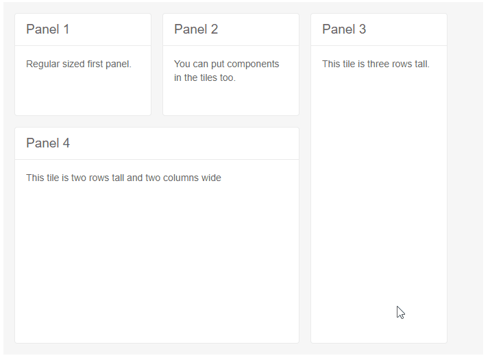

# TileLayout Resize

You can resize the tiles by dragging their bottom and right-hand side borders to change the dashboard to your liking.

To enable resizing, set the `Resizable` parameter of the main `TelerikTileLayout` tag to `true`.

@[template](/_contentTemplates/tilelayout/basics.md#resizing-reordering-logic)

>caption Resizing tiles in the TileLayout



````CSHTML
<TelerikTileLayout ColumnWidth="200px"
                   RowHeight="150px"
                   Width="700px"
                   Columns="3"
                   Resizable="true">
    <TileLayoutItems>
        <TileLayoutItem HeaderText="Panel 1">
            <Content>Regular sized first panel.</Content>
        </TileLayoutItem>
        <TileLayoutItem HeaderText="Panel 2">
            <Content>You can put components in the tiles too.</Content>
        </TileLayoutItem>
        <TileLayoutItem HeaderText="Panel 3" RowSpan="3">
            <Content>This tile is three rows tall.</Content>
        </TileLayoutItem>
        <TileLayoutItem HeaderText="Panel 4" RowSpan="2" ColSpan="2">
            <Content>This tile is two rows tall and two columns wide</Content>
        </TileLayoutItem>
    </TileLayoutItems>
</TelerikTileLayout>
````


## See Also

  * [TileLayout Overview]()
