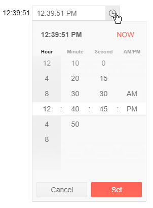

# Steps

The TimePicker for Blazor can display intervals larger than one second or minute, or hour. You could make the step for incrementing or decrementing the values vary for each segment of the date.

The steps you define control the list of options in the dropdown element and the value change from the keyboard when the user presses the Up or Down arrows.

To set the steps for the time picker, use its nested `<TimePickerSteps>` tag and its parameters:

* `Hour` - every n-th hour will be available.
* `Minute` - every n-th minute will be available.
* `Second` - every n-th second will be available.

All values default to `1` to provide every possible option. If you set a value larger than the available options in the time portion (such as Minute=70) the tumblers in the dropdown will show the `0` option and the component will increment the date with the designated value (1 hour and 10 minutes in this example).

>caption Change the steps (intervals) in the time picker

````CSHTML
@* Show every 4th hour, every 10th minute, every 15th second *@

@selectedTime.ToLongTimeString()

<TelerikTimePicker Format="hh:mm:ss tt" @bind-Value="@selectedTime">
    <TimePickerSteps Hour="4" Minute="10" Second="15" />
</TelerikTimePicker>

@code {
    DateTime selectedTime { get; set; } = DateTime.Now;
}
````

>caption Show only every 4th hour, every 10th minute, every 15th second in the time picker




## See Also

* [TimePicker Overview]()

