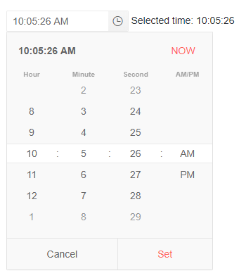

# Time Picker Overview

The Time Picker component allows the user to choose a time from a visual list in a dropdown, or to type it into a [date input]() that can accept only DateTime values. You can control the format shown in the input and respond to [events]().

To use a Telerik Time Picker for Blazor, add the `TelerikTimePicker` tag.

>caption Basic time picker with custom format, min and max

````CSHTML
Selected time: @selectedTime?.ToLongTimeString()
<br />

<TelerikTimePicker Min="@Min" Max="@Max" Format="hh:mm:ss tt" @bind-Value="@selectedTime"></TelerikTimePicker>

@code  {
    private DateTime? selectedTime = DateTime.Now;

    // only the time portions are used
    public DateTime Min = new DateTime(1900, 1, 1, 8, 15, 0);
    public DateTime Max = new DateTime(1900, 1, 1, 19, 30, 45);
}
````



>caption Component namespace and reference

````CSHTML
@using Telerik.Blazor.Components

<TelerikTimePicker @bind-Value="@theTimePickerValue"></TelerikTimePicker>
@theTimePickerValue

@code {
    DateTime? theTimePickerValue { get; set; }
    
    // the time picker is a generic component and its type comes from the value field type
    Telerik.Blazor.Components.TelerikTimePicker<DateTime?> theTimePicker;
}
````

The Time Picker component exposes the following features:

* `Enabled` - Specifies whether typing in the input and opening the dropdown are allowed.
* `Format` - Specifies the format of the DateInput of the TimePicker. Read more in the [Supported Formats]() article. Note that format specifiers for non-time portions will only be editable in the input and will not have a representation in the time picker dropdown.
* `Id` - renders as the `id` attribute on the `<input />` element, so you can attach a `<label for="">` to the input.
* `Min` - The earliest time that the user can select.
* `Max` - The latest time that the user can select.
* `Value` - The current value of the input. Can be used for binding.
* `Width` - Defines the width of the TimePicker.
* Validation - see the [Input Validation]() article.

The `Min` and `Max` properties require a `DateTime` object, but will only use the time portion from it. Thus, the date itself is not important. The hours, minutes, seconds and AM/PM portions control the range of the tumblers in the time picker dropdown. They do not impose validation/limitations on the input editing.

When using the dropdown to edit dates, you must click the "Set" button to commit the date. Clicking "Cancel", or outside of the dropdown without clicking "Set", will revert the time to the original value. You can also commit a date by clicking the "NOW" button which will choose the current time.

The time format specifiers in the `Format` control the tumblers available in the dropdown. For example, the `HH` specifier will result in a hour selector in a 24 hour format. If you also add the `tt` specifier, you will also get the AM/PM tumbler, but the 24 hour format will still be used. This means that you can also add several tumblers for the same time portion if the format string repeats them.

The Time Picker component supports `DateTime`, `DateTime?`, `DateTimeOffset` and `DateTimeOffset?` types.


## See Also

  * [Live Demo: Time Picker](https://demos.telerik.com/blazor-ui/timepicker/index)
  * [Input Validation]()
  * [Supported Input Date Formats]()
