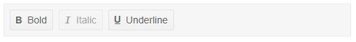
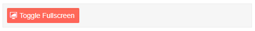
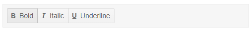

# Built-in Tools

The Telerik ToolBar for Blazor allows you to use built-in buttons and button groups or to add a [custom tool](). The available built-in tools are:

* [ToolBarButton](#toolbarbutton)
* [ToolBarToggleButton](#toolbartogglebutton)
* [ToolbarButtonGroup](#toolbarbuttongroup)

## ToolBarButton

A toolbar button is a plain button that you can click and it raises an event so the application can respond to that.

You can add multiple buttons to the Telerik Toolbar. To do that you should add the `<ToolBarButton>` to the `<TelerikToolBar>`.

You can customize the buttons using the following features:

* `Enabled` - `bool`, defaults to `true` - specifies if the button is clickable.

* `Visible` - `bool`, defaults to `true` - specifies if the button will be visible in the toolbar.

* `Title` - `string` - maps to the `title` HTML attribute for the `<button>`.

* `Class` - `string` - the CSS class that will be rendered on the main wrapping element of the ToolbarButton. You could use that class to cascade styles.

* `OnClick` - `EventCallback` - allows you to execute a method upon the click of the button. For more information see the [Events]() article.

* `Icon` - `string` - adds a font icon to the button. You can find more information on adding a font icon to a Telerik Component in [Telerik Font Icons article](#icon-in-telerik-component).

* `ImageURL` - `string` - adds an image to the button. You can provide an image url to this parameter.

* `SpriteClass` - `string` - add a sprite class image to the button. Set this attribute to `k-icon MySpriteClass` where `MySpriteClass` defines the CSS rules for the sprite.

* `IconClass` - `string` - allows you to set a CSS class that provides the required font name, font size and content for the `::before` pseudo-element.

>caption The Telerik ToolBar with ToolBarButtons



````CSHTML
@*This example shows the TelerikToolBar with ToolBarButtons and their features*@

<TelerikToolBar>
    <ToolBarButton Icon="@IconName.Bold" Class="myBoldButton" Enabled="@true" Visible="true" Title="Bold Button" OnClick="@OnBold">Bold</ToolBarButton>
    <ToolBarButton Icon="@IconName.Italic" Class="myItalicButton" Enabled="@false" Visible="true" Title="Italic Button" OnClick="@OnItalic">Italic</ToolBarButton>
    <ToolBarButton Icon="@IconName.Underline" Class="myUnderlineButton" Enabled="@true" Visible="true" Title="Underline Button" OnClick="@OnUnderline">Underline</ToolBarButton>
</TelerikToolBar>

@code {
    public void OnBold()
    {
        Console.WriteLine("The user clicked on the bold button");
    }

    public void OnItalic()
    {
        Console.WriteLine("The user clicked on the italic button");
    }

    public void OnUnderline()
    {
        Console.WriteLine("The user clicked on the underline button");
    }
}
````

## ToolBarToggleButton

A toolbar toggle button has two states - normal and selected - and clicking it can toggle between them through two-way binding or an event.

You can add multiple toggle  buttons to the Telerik Toolbar. To do that you should add the `<ToolBarToggleButton>` to the `<TelerikToolBar>`.

You can customize the toggle buttons using the following features:

* `Selected` - `bool` - specifies whether the button is in selected state. You can use it with one and two-way data binding with the `SelectedChanged` event. For more information on how to handle the `SelectedChanged` event see the [Events]() article.

* `Enabled` - `bool`, defaults to `true` - specifies if the button is clickable.

* `Visible` - `bool`, defaults to `true` - specifies if the button will be visible in the toolbar.

* `Title` - `string` - maps to the `title` HTML attribute for the `<button>`.

* `Class` - `string` - the CSS class that will be rendered on the main wrapping element of the ToolbarButton. You could use that class to cascade styles.

* `OnClick` - `EventCallback` - allows you to execute an method upon the click of the button. For more information read the [Events]() article.

* `Icon` - `string` - adds a font icon to the button. You can find more information on adding a font icon to a Telerik Component in [Telerik Font Icons article](#icon-in-telerik-component).

* `ImageURL` - `string` - adds an image to the button. You can provide an image url to this parameter.

* `SpriteClass` - `string` - add a sprite class image to the button. Set this attribute to `k-icon MySpriteClass` where `MySpriteClass` defines the CSS rules for the sprite.

* `IconClass` - `string` - allows you to set a CSS class that provides the required font name, font size and content for the `::before` pseudo-element.

>caption The Telerik ToolBar with ToolBarToggleButtons



````CSHTML
@*This example shows the TelerikToolBar with ToolBarToggleButton and its available features*@

<TelerikToolBar>
    <ToolBarToggleButton @bind-Selected="@Selected" 
                         Enabled="true" 
                         Class="myToggleFullScreenButton" 
                         Icon="@IconName.ToggleFullScreenMode" 
                         OnClick="@ToggleFullScreen">
                            Toggle Fullscreen
    </ToolBarToggleButton>
</TelerikToolBar>

@code {
    public bool Selected { get; set; } = true;

    public void ToggleFullScreen()
    {
        if (Selected)
        {
            Console.WriteLine("The user is in full screen");
        }
        else
        {
            Console.WriteLine("The user exited full screen");
        }
    }
}
````

## ToolBarButtonGroup

The button group is a container for one or more buttons that renders them together and spaces them out from the adacent buttons or groups.

You can add one or more group of buttons to the Toolbar. To do that you should add the `<ToolBarButtonGroup>` to the `<TelerikToolBar>`. In the button group you can place either the `ToolBarButton` or the `ToolBarToggleButton`.

You can customize the groups using the following features:

* `Visible` - `bool`, defaults to `true` - specifies if the group will be visible in the toolbar.

* `SelectionMode` - `enum` - specifies whether you can select one or multiple buttons from the group at the same time (applicable for `ToolBarToggleButton` instances inside it). It takes a member of the `ButtonGroupSelectionMode` enum:

    * Single - this is the default value
    * Multiple
    
* `Enabled` - `bool`, defaults to `true` - specifies if the group is clickable.

* `Class` - `string` - the CSS class that will be rendered on the main wrapping element of the ToolBarButtonGroup. You could use that class to cascade styles.

* `Width` - `string` - allows you to control the width of the group.

>caption The Telerik ToolBar with grouped buttons



````CSHTML
@*This example shows the TelerikToolBar with grouped ToolBarButtons*@

<TelerikToolBar>
    <ToolBarButtonGroup Visible="true" 
                        SelectionMode="@ButtonGroupSelectionMode.Multiple" 
                        Class="formattingButtons" 
                        Enabled="true">
        <ToolBarButton Icon="@IconName.Bold">Bold</ToolBarButton>
        <ToolBarButton Icon="@IconName.Italic">Italic</ToolBarButton>
        <ToolBarButton Icon="@IconName.Underline">Underline</ToolBarButton>
    </ToolBarButtonGroup>
</TelerikToolBar>
````

## See Also

  * [Live Demo: ToolBar Overview](https://demos.telerik.com/blazor-ui/toolbar/overview)
  * [ToolBar Overview]()
