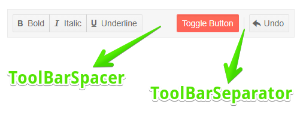

# Separators

You can visually separate the items in the Telerik ToolBar for Blazor. Depending on the needs of your application you can use of the following, or a combination of them:

* `ToolBarSeparator` - to separate two items with a solid line you should add the `<ToolBarSeparator>` tag between them. 

* `ToolBarSpacer` - defines empty space in the toolbar which separates the items. The space between the items is automatically calculated to fit the width of the ToolBar.

>caption Use The ToolBarSeparator and ToolBarSpace to separate items in the ToolBar



````CSHTML
@* Use the ToolBarSpacer to add space between the button group and the rest and the separator to separate the toggle button and the undo button *@

<TelerikToolBar>
    <ToolBarButtonGroup>
        <ToolBarButton Icon="@IconName.Bold">Bold</ToolBarButton>
        <ToolBarButton Icon="@IconName.Italic">Italic</ToolBarButton>
        <ToolBarButton Icon="@IconName.Underline">Underline</ToolBarButton>
    </ToolBarButtonGroup>
    <ToolBarSpacer />
    <ToolBarToggleButton @bind-Selected="@Selected">Toggle Button</ToolBarToggleButton>
    <ToolBarSeparator />
    <ToolBarButton Icon="@IconName.Undo">Undo</ToolBarButton>
</TelerikToolBar>


@code {
    public bool Selected { get; set; } = true;
}
````

## See Also

  * [Live Demo: ToolBar Overview](https://demos.telerik.com/blazor-ui/toolbar/overview)
  * [ToolBar Overview]()
